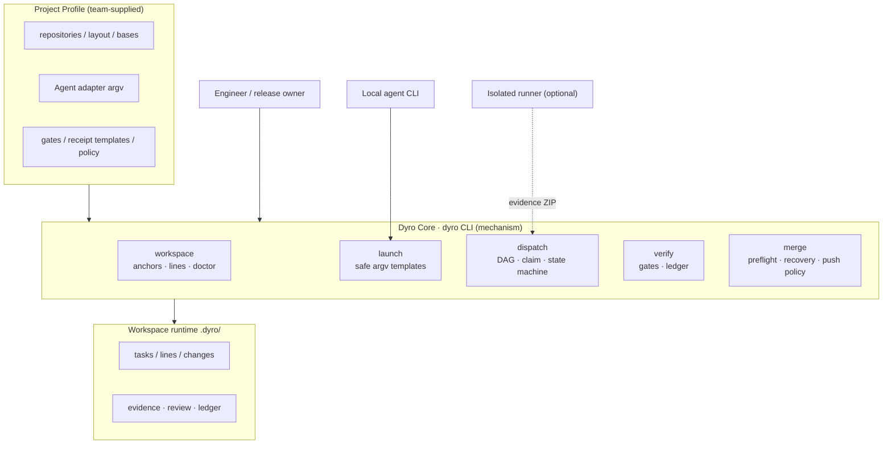
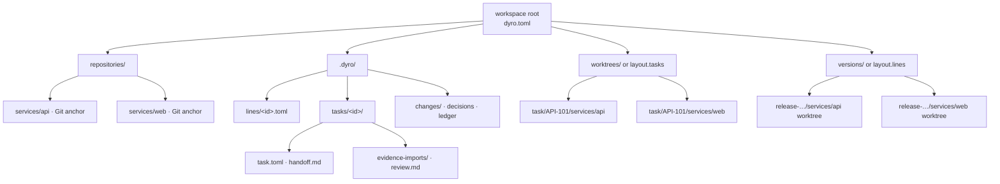
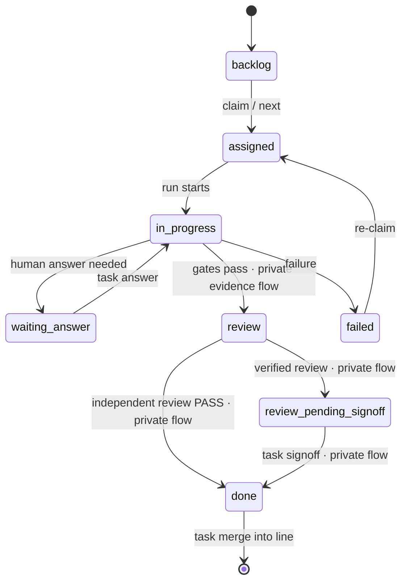
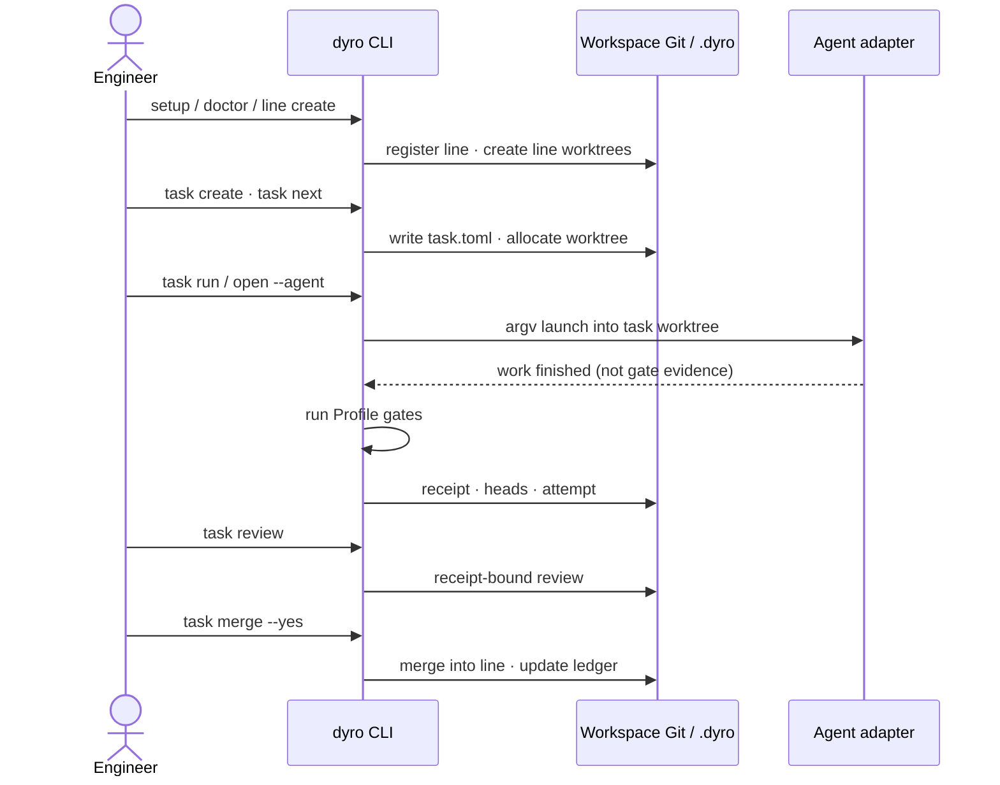
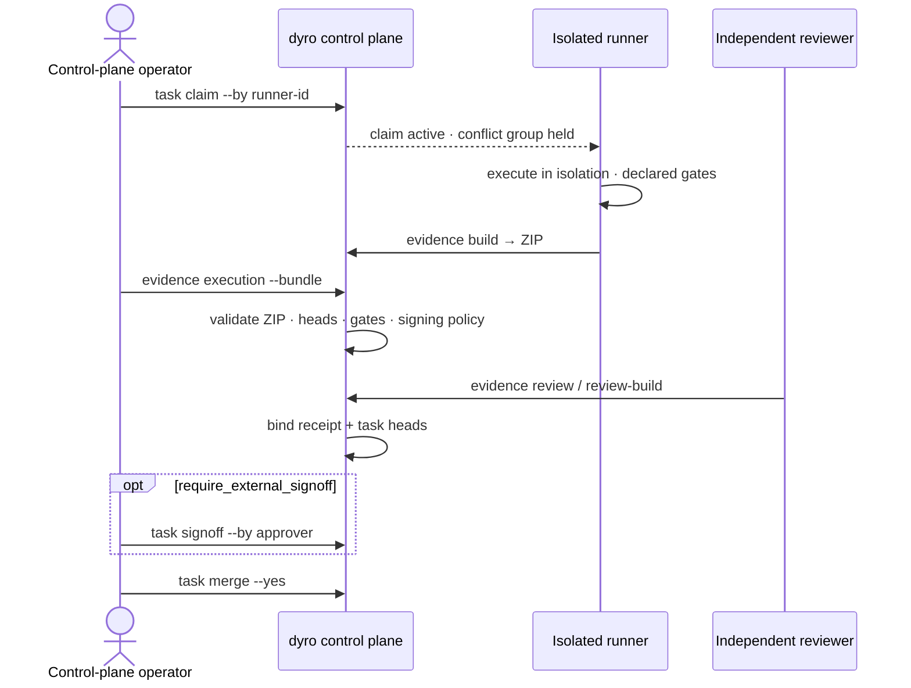
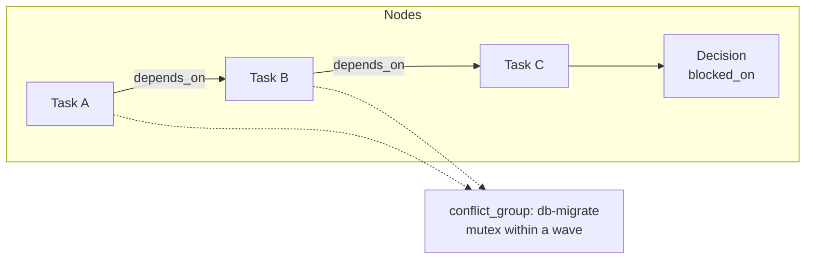
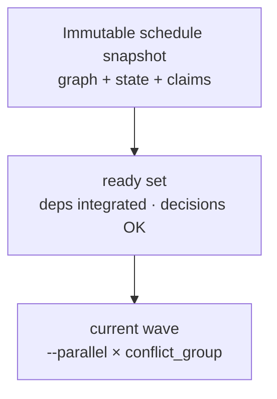
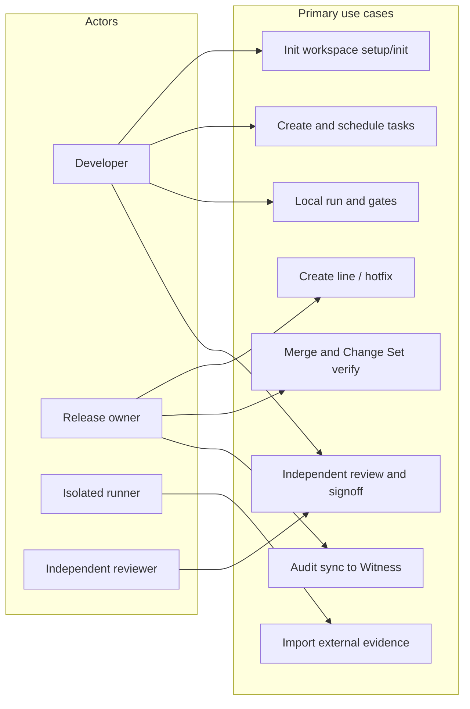
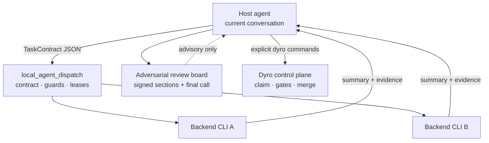
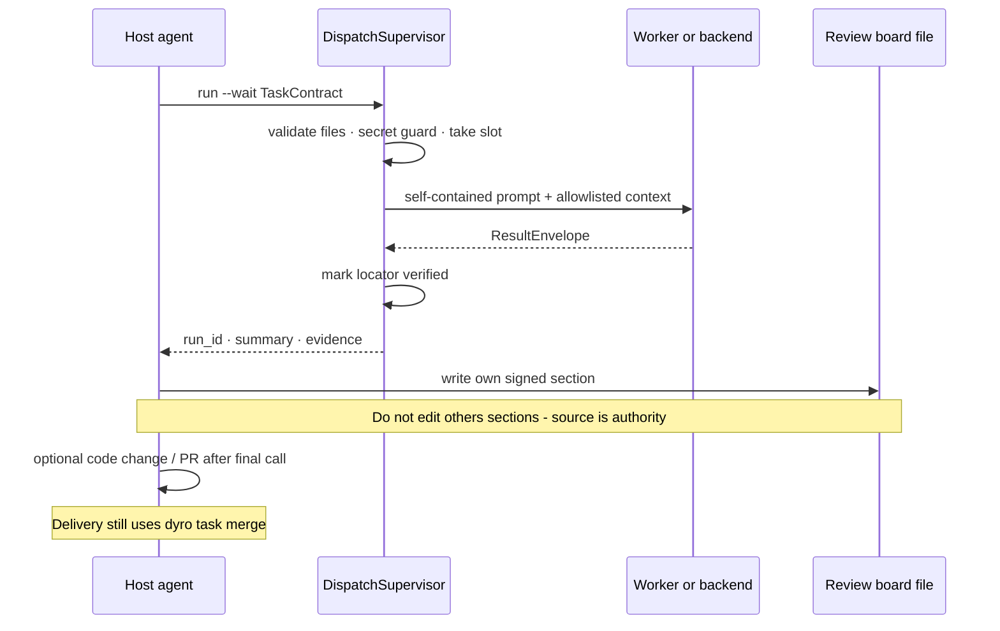

# DyroEngineeringFlow

[English](README.md) | [简体中文](README.zh-CN.md) | [한국어](README.ko.md) | [Español](README.es.md) | [Français](README.fr.md) | [Deutsch](README.de.md) | [Português (Brasil)](README.pt-BR.md) | [Русский](README.ru.md)

**DyroEngineeringFlow · `dyro` CLI** ist eine local-first Plattform für Engineering-Automatisierung und Delivery-Steuerung in Multi-Repository-Teams. Sie vereint Entwicklungslinien, Git-Worktrees, Agent-Launcher, Task-Gates, unabhängige Reviews und Merge-Audit in einer versionierten Workspace-Konfiguration.

**Engineering von der Aufgabe bis zur Auslieferung in Bewegung halten.**

Nicht an Codex, Claude oder eine Fachdomäne gekoppelt. Jedes Team liefert ein `dyro.toml`-Profile für Repositories, Layouts, Agent-Adapter und Delivery-Policy; Geschäftsregeln, Modellkosten und Release-Praktiken bleiben im Profile.

## Was erzwungen wird

- Ein Task gehört genau einer Entwicklungslinie—niemals ein gemischter Feature-/Hotfix-Workspace.
- Jeder Task läuft in einem eigenen `git worktree` auf Branch `task/<id>`.
- Gates führt der Orchestrator aus; der Selbstbericht eines Agents ist kein Erfolgsnachweis.
- Review ist an Execution-Receipt und exakte Task-HEADs pro Repository gebunden; Quelldrift invalidiert ihn.
- Unabhängiges Review ist nötig vor `done`; Merge und Push erfordern standardmäßig explizite Bestätigung.
- Eine fertige Abhängigkeit gibt Downstream erst frei, wenn ihre exakten Task-HEADs in die besitzende Linie integriert sind.
- Ausführbare Konfiguration sind argv-Arrays. Der Core führt keine Shell-Strings aus dem TOML aus.

## Architektur- und Flussdiagramme

Die folgenden Diagramme werden auf GitHub **direkt als Mermaid** gerendert (keine Bild-Links). Die Control Plane trennt **Team-Profile** von **Dyro Core**. Laufzeitstatus unter `.dyro/`. Diagramm-Beschriftungen sind englisch (CLI/Config-Keys).

### Schichtenarchitektur



### Multi-Repo-Workspace-Layout



### Task-Zustandsautomat



### Lokale Delivery-Sequenz



### Externe Evidence-Sequenz



### Task-Graph



### Scheduling-Welle



### Use-Case-Überblick



### Multi-Agent-Schichten (optionales Experiment)



Im `dyro`-Wheel enthalten (`dyro dispatch …`). Dispatch nur beratend; Delivery weiter über Dyro gates/merge.

### Multi-Agent-Sequenz (optionales Experiment)



## Schnellstart

Für den täglichen CLI-Einsatz `dyro` aus PyPI in einer isolierten `pipx`-Umgebung installieren (Python 3.11+):

```bash
python3 -m pip install --user --upgrade pipx
python3 -m pipx ensurepath
# Nach ensurepath ein neues Terminal öffnen, dann:
pipx install dyro
dyro --version
```

Zum Aktualisieren: `pipx upgrade dyro`. Nutzt das Team `pip`:

```bash
python3 -m pip install --user --upgrade dyro
```

Interaktives `dyro setup` kann das Control-Plane-Skill installieren. Nach
Paket-Updates synchronisieren sich bereits verwaltete Skills automatisch;
interaktive Starts reparieren auch ein veraltetes managed Skill. Die
Erstinstallation bleibt opt-in über Setup oder
`dyro integration install skill --yes` (Alias: `codex`).

Interaktive Starts mit `dyro`, `dyro home` oder `dyro start` prüfen höchstens einmal pro lokalem Tag den offiziellen PyPI-Endpunkt. Fehler blockieren den Arbeitsbereich nicht. Standardmäßig bleibt jede Aktualisierung bestätigt:

```bash
dyro update              # entspricht dyro update check
dyro update check
dyro update now
dyro update auto on      # automatische Patch-Updates aktivieren
dyro update auto off
dyro update disable
dyro update enable
```

Automatische Updates wechseln nie die Neben- oder Hauptversion und überschreiben keine editierbare Quellinstallation. `DYRO_NO_UPDATE_CHECK=1` überspringt die Startprüfung. Siehe [sichere Updates](docs/updates.md).

Für die Entwicklung von Dyro selbst die gesperrte Toolchain des Repositories und den tatsächlichen Test-Einstieg verwenden; die folgenden Project-Gate-Beispiele sind keine Dyro-Tests.

```bash
uv sync --locked --all-extras --dev
uv run python -m unittest discover -s tests -t . -v
uv run ruff check src tests experiments
```

Beim ersten Einsatz in ein Verzeichnis mit Repositories oder in ein bestehendes Git-Projekt wechseln und ausführen:

```bash
dyro setup
```

Der Assistent zeigt seinen Plan vor jeder Änderung. An der Wurzel eines Git-Projekts schlägt er einen benachbarten Dyro-Workspace vor und klont von `origin`; er schreibt keinen Kontrollzustand in das Originalprojekt. Er erkennt übliche Agent-Befehle, registriert aber nur Adapter mit geprüftem Core-argv-Vertrag. `n` oder Beenden erzeugt nichts. Danach:

```bash
dyro next
```

Für Skripte und CI explizite Optionen verwenden:

```bash
dyro setup . --name my-workspace --line dev --yes --non-interactive
```

Sichere Vorschauen unterstützen beide Formen:

```bash
dyro --dry-run setup . --name my-workspace --no-line
dyro setup . --name my-workspace --no-line --dry-run
```

Später ein Repository hinzufügen ohne `dyro.toml` zu öffnen:

```bash
dyro repo add repositories/services/payments
dyro repo list
```

Übliche Delivery-Policy und Agent-Adapter ohne `dyro.toml` verwalten:

```bash
dyro config set policy.execution_mode external
dyro config get policy.execution_mode
dyro agent add ci-runner --preset noop
dyro agent test ci-runner
```

Enthält das Profile Remotes, können fehlende Repository-Anchors sicher erzeugt werden:

```bash
dyro --dry-run bootstrap
dyro bootstrap --yes
dyro doctor
```

Nach der Einrichtung empfiehlt `dyro next` den nächsten sicheren Schritt. Wenn eine Line und ein konfigurierter Agent ausgewählt werden sollen:

```bash
dyro start
```

## Delivery-Workflow

Explizite Befehle beim Skripten oder Führen eines Releases:

```bash
dyro doctor
dyro line create release-2026-10 --base origin/main --yes
# Verifizierte Base nur für Repositories überschreiben, die es brauchen.
dyro line create release-2026-10 --base origin/main --repo-base web=v2026.10.0 --yes
dyro open release-2026-10 --agent codex
dyro task create API-101 --title "Implement API contract" --line release-2026-10 --repository api
dyro task graph check --line release-2026-10
dyro task graph --line release-2026-10 --format mermaid
dyro task explain API-101
dyro task next
dyro task next --run --yes
dyro task attempts API-101
dyro task binding API-101
dyro task review API-101
dyro task merge API-101 --yes
dyro changeset create release-2026-10-ready --line release-2026-10
dyro changeset verify release-2026-10-ready
```

Ein Produktions-Hotfix muss seine verifizierte Produktions-Base angeben; er erbt nie implizit einen Default-Branch:

```bash
dyro hotfix create incident-123 --base v2026.09.7 --repos api,web --yes
```

Wenn Ausführung und Freigabe ein separates vertrauenswürdiges System übernimmt: `policy.execution_mode = "external"` und `policy.require_external_signoff = true`. Lokales Dyro erlaubt dann nur Planung; ein an Receipt und exakte Task-HEADs gebundenes Review muss vor `done` explizit signiert werden:

```bash
dyro task claim API-101 --by isolated-runner-1 --key-id runner-2026 \
  --output /secure-transfer/API-101.core-claim.json
# Langlaufende Arbeit muss den begrenzten Claim vor Ablauf erneuern.
dyro task claim-renew API-101 --by isolated-runner-1 --lease-seconds 3600
# Im isolierten Runner: deklarierte Gates ausführen und Receipt, Logs sowie exakte HEADs packen.
dyro task evidence build API-101 --workspace /runner/workspace --receipt /runner/out/receipt.md --output /runner/out/API-101.zip
# In der Control Plane: das eine portable Paket validieren und importieren.
dyro task evidence execution API-101 --bundle /runner/out/API-101.zip
dyro task evidence review API-101 --file /review/out/review.md
dyro task signoff API-101 --by release-manager
# Eine aufgegebene Zuweisung kann explizit freigegeben werden.
dyro task claim-release API-101 --by isolated-runner-1
```

Neue Evidence-Bundles müssen `provenance.json` enthalten. Import älterer Bundles ohne Provenance ist bewusst und braucht `--allow-legacy`. Liefert der Runner `QUESTION`, Antwort mit `dyro task answer API-101 --text "..."` speichern; Claim bleibt, Task kehrt zu `assigned` zurück.

Unveränderliche Evidence-Generationen prüfen und sicher behalten:

```bash
dyro task evidence generations API-101
dyro --dry-run task evidence generations API-101 --prune --older-than-days 30 --keep 10
dyro task evidence generations API-101 --prune --older-than-days 30 --keep 10 --yes
```

Kryptographische Runner-/Approver-Identität: Schlüssel außerhalb des Workspace erzeugen und nur Public Keys in zweckgetrennte Trust Stores installieren:

```bash
dyro config set policy.execution_mode external
dyro config set policy.require_signed_execution true
dyro config set policy.require_signed_review true
dyro config set policy.require_external_signoff true
dyro config set policy.require_signed_signoff true

dyro key generate runner-2026 --private-key /secure/runner.pem --public-key /secure/runner.pub.pem
dyro key trust runner-2026 --purpose execution --public-key /secure/runner.pub.pem   --not-after 2027-01-01T00:00:00+00:00
dyro task claim API-101 --by isolated-runner-1 --key-id runner-2026 \
  --output /secure-transfer/API-101.core-claim.json
dyro task evidence build API-101 --workspace /runner/workspace --receipt /runner/out/receipt.md   --output /runner/out/API-101.zip --claim /runner/in/claim.json   --signing-key /secure/runner.pem --key-id runner-2026

dyro key generate reviewer-2026 --private-key /secure/reviewer.pem --public-key /secure/reviewer.pub.pem
dyro key trust reviewer-2026 --purpose review --public-key /secure/reviewer.pub.pem
dyro task evidence review-build API-101 --file /review/out/review.md --reviewer independent-reviewer   --output /review/out/review.json --signing-key /secure/reviewer.pem --key-id reviewer-2026
dyro task evidence review API-101 --file /review/out/review.json

dyro key generate approver-2026 --private-key /secure/approver.pem --public-key /secure/approver.pub.pem
dyro key trust approver-2026 --purpose signoff --public-key /secure/approver.pub.pem
dyro task signoff API-101 --by release-manager --signing-key /secure/approver.pem --key-id approver-2026

dyro key list --purpose execution --show-status
dyro key revoke runner-2026 --purpose execution --reason "runner retired"
dyro key audit
```

Lokale Trust-Audit-Kette mit einem unabhängigen Witness synchronisieren:

```bash
dyro key generate audit-client-2026   --private-key /secure/audit-client.pem   --public-key /secure/audit-client.pub.pem
# audit-client.pub.pem über einen sicheren Out-of-Band-Kanal auf dem Witness installieren.
dyro key trust witness-2026   --purpose audit-receipt   --public-key witness-2026.pub.pem
dyro key trust witness-recovery   --purpose audit-recovery   --public-key witness-recovery.pub.pem

DYRO_AUDIT_TOKEN=... dyro key audit-sync   --witness primary   --endpoint https://audit.example.com/v1/dyro/batches   --signing-key /secure/audit-client.pem   --key-id audit-client-2026   --witness-key-id witness-2026   --witness-recovery-key-id witness-recovery
```

Auch ohne neue Events sendet der Befehl einen signierten Checkpoint; bei verlorener Antwort wird der bereits persistierte Pending-Batch unverändert erneut gesendet. Der Witness muss die Event-Kette unabhängig neu berechnen, Sequenz-/Head-Forks ablehnen, ein verifizierbares Receipt ausstellen und Batches/Receipts in unveränderlichen Storage mit Retention schreiben. Siehe [Audit Witness protocol](docs/audit-witness-protocol.md).

Mitgeliefert: `dyro witness serve`. Standard: Bearer-Token und TLS; Checkpoint erst nach `records/<batch-sha256>.json`. Produktion: mutable Checkpoints und immutable `records` trennen. Siehe [Witness deployment](docs/witness-deployment.md).

Signaturpflicht steuern `policy.require_signed_execution`, `policy.require_signed_review` und `policy.require_signed_signoff`; alle Trust-Keys zu löschen deaktiviert keine aktive Policy. Signierte Execution-Claims binden `claim_id`, Generation, Runner und Execution-Key-ID. Signaturnachrichten und Plan-Hashes nutzen RFC 8785 JCS. Unabhängige Reviewer erzeugen mit `dyro task evidence review-build` ein signiertes JSON-Envelope. Rotation ohne Unterbrechung: neuen Key-ID zuerst vertrauen, alten in der Überlappung behalten, dann kontrolliert widerrufen.

Minimaler TypeScript-Referenzsigner und Python/Node-Interop-Vektor: `examples/typescript-runner/`.

Jede schreibfähige Operation hat einen Planungsmodus:

```bash
dyro --dry-run line create release-2026-10 --base origin/main
dyro --dry-run task run API-101
```

## Befehlskarte

| Befehl | Zweck |
| --- | --- |
| `setup` / `init --discover` / `init --wizard` / `repo add/list` / `bootstrap` / `start` | Onboarding ohne TOML, Anchors verwalten, Line und Agent wählen. |
| `doctor` / `status` | Control-Plane-Status prüfen und anzeigen. |
| `line create/list` | Feature-Linien erzeugen, registrieren und inspizieren. |
| `hotfix create` | Hotfix-Linie von expliziter Produktions-Base. |
| `changeset create/list/verify` | Exakte saubere Git-HEADs einer Multi-Repo-Delivery pinnen und prüfen. |
| `config get/set` / `agent list/add/test` / `open` | Policy und Adapter sicher verwalten, Executable prüfen oder Agent in der richtigen Line öffnen. |
| `task create/list/board/status/next/graph/explain/attempts/binding` | Task-Manifeste und -Status, Graph, Scheduling, Provenance und exakte Review-Bindung. |
| `task run/answer/gates/review/signoff` | Tasks ausführen, Fragen klären, Gates, unabhängiges Review und externes Sign-off bei Bedarf. |
| `task claim --output` / `task evidence build/execution/review` | Einmal-Claim mit nur neu anlegbarer Übergabedatei, portable Execution-Evidence build/import und receipt-gebundener Review-Import. |
| `task merge` | Reviewten Task-Branch in die besitzende Line mergen. |
| `task loop/daemon/stats/decisions` | Kontrollierte Batches, Scheduling, Ledger und Decision-Gates. |
| `dispatch` | Optionales lokales Multi-Agent-Dispatch (L0–L4); nur beratend — kein Ersatz für Gates/Merge. |

Details: [Architektur und Profile](docs/architecture.md), [Diagramme](docs/diagrams.en.md), [Migration](docs/migrating-existing-control-planes.md), [PyPI-Publishing](docs/publishing.md) (Maintainers).

## Sprachen und Dokumentation

Dieses README wird in Englisch, vereinfachtem Chinesisch, Koreanisch, Spanisch, Französisch, Deutsch, brasilianischem Portugiesisch und Russisch gepflegt. Befehle, Konfigurationsschlüssel, Verzeichnisnamen und Sicherheitsregeln sind in allen Übersetzungen identisch. CLI-Meldungen und erweiterte technische Guides sind derzeit vorwiegend chinesisch; mehrsprachige READMEs bedeuten keine Runtime-Sprachumschaltung.

## Aktuelle Grenzen

DyroEngineeringFlow bietet einen vollständigen lokalen Workflow und Policy-Steuerung für Teams im Planungsmodus. Es erstellt keine Remote-Repositories, transportiert keine SaaS-Zugangsdaten und provisioniert keine externen Runner; für externe Ausführung bleibt ein portabler Evidence-Package-Vertrag erhalten. Der optionale lokale Agent-Dispatch wird als `experiments.local_agent_dispatch` mit `dyro` ausgeliefert und über `dyro dispatch …` genutzt; er ist nur beratend und ersetzt weder Gates noch Review, Signoff oder Merge. Lokale Multi-Repo-Merges werden als eine Operation vorgeprüft und wiederhergestellt; Remote-Git-Server bieten keinen atomaren Multi-Repo-Push, daher wird ein Teilfehler protokolliert. Automatischer Merge braucht die Erlaubnis in Task-Manifest und lokaler Policy. [MIT License](LICENSE) und [`dyro` auf PyPI](https://pypi.org/project/dyro/).
