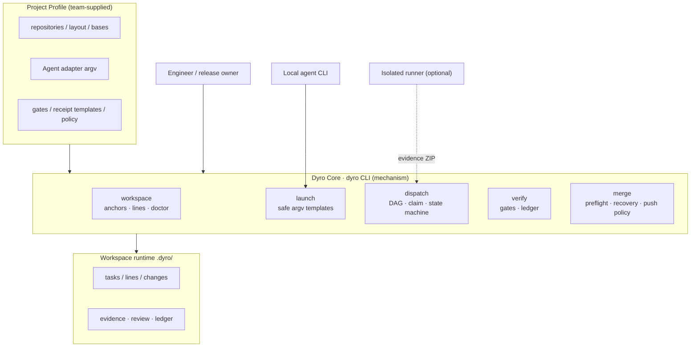
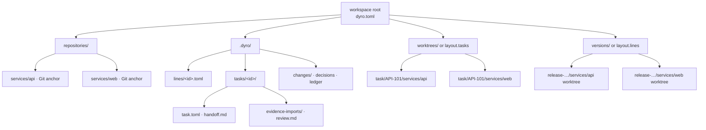
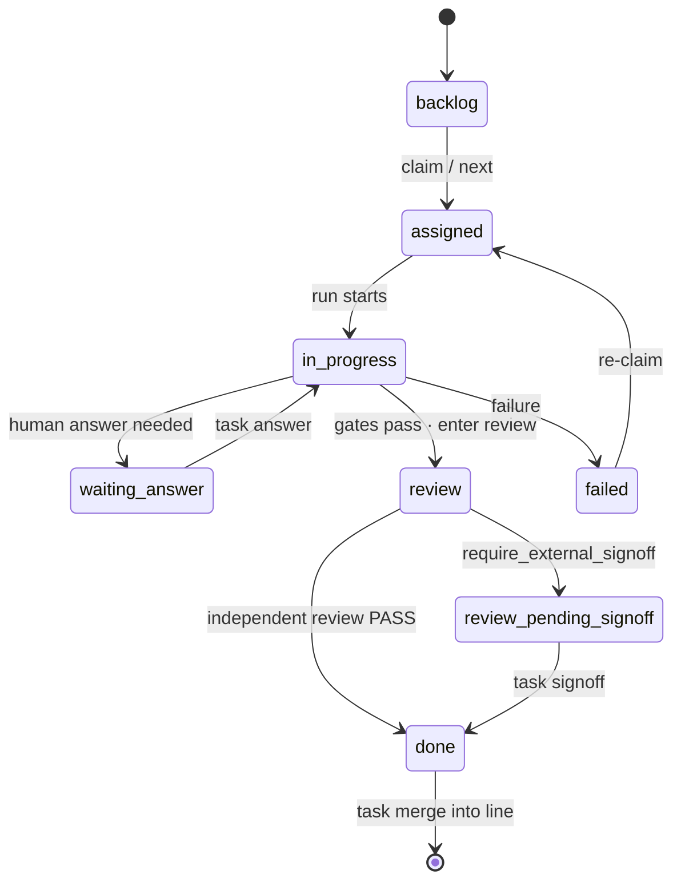
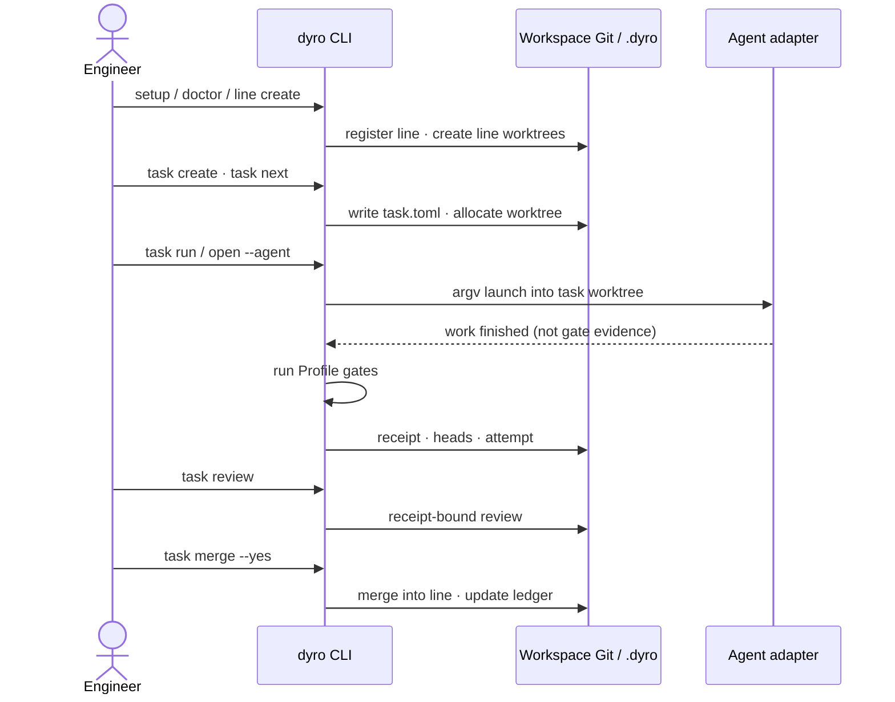
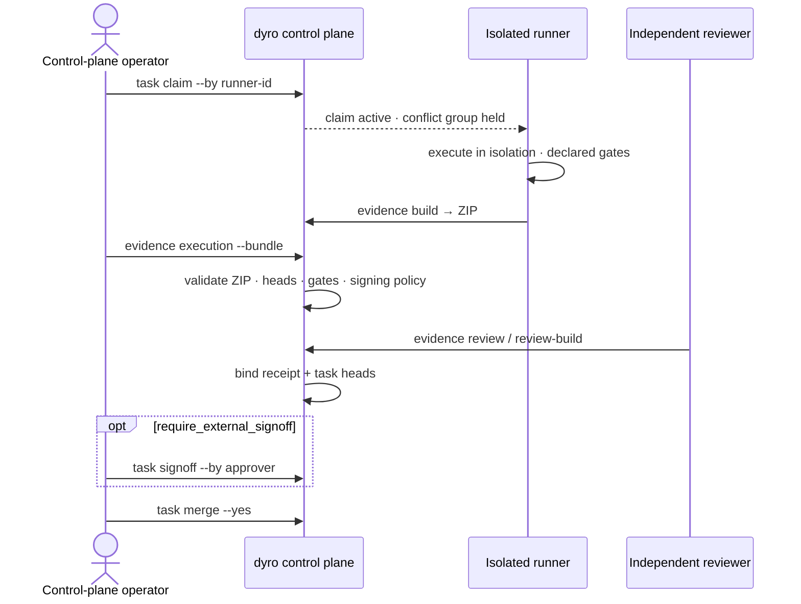
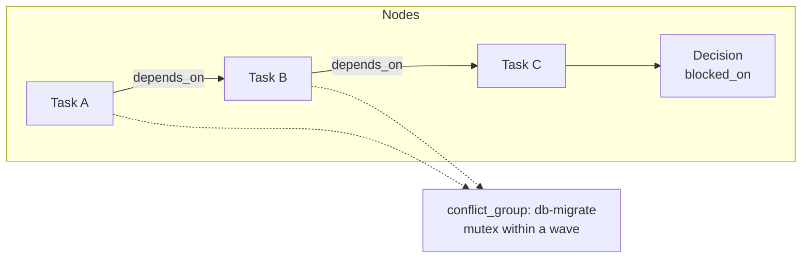
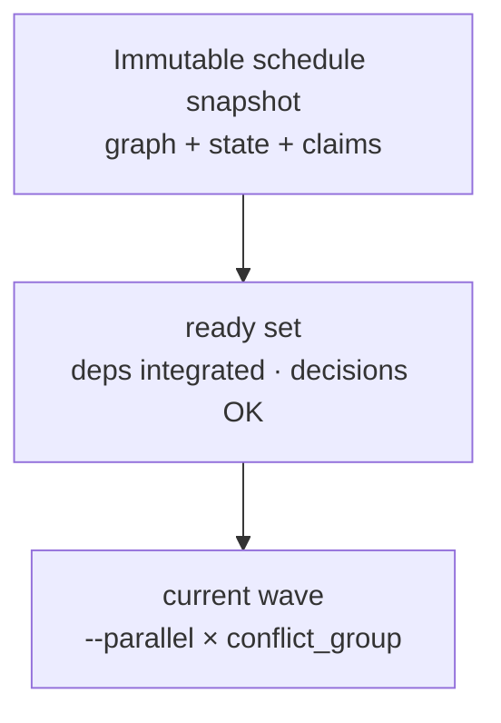
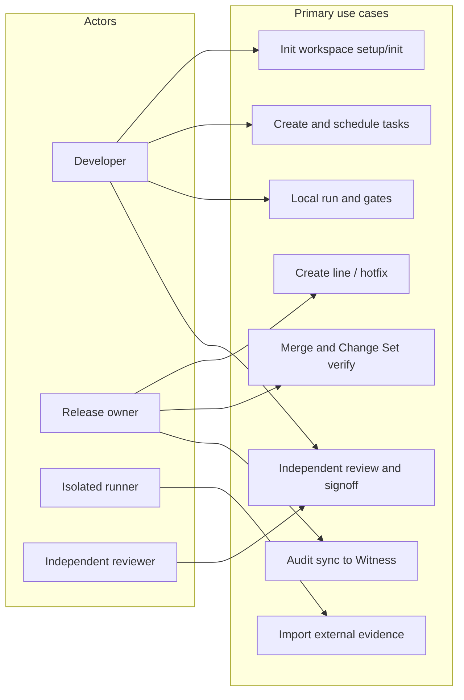
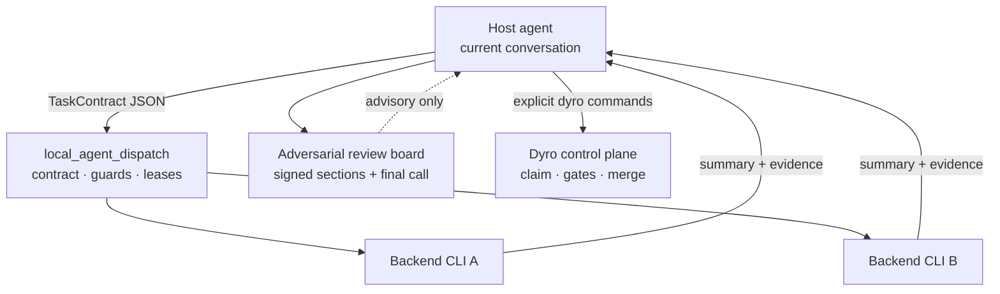
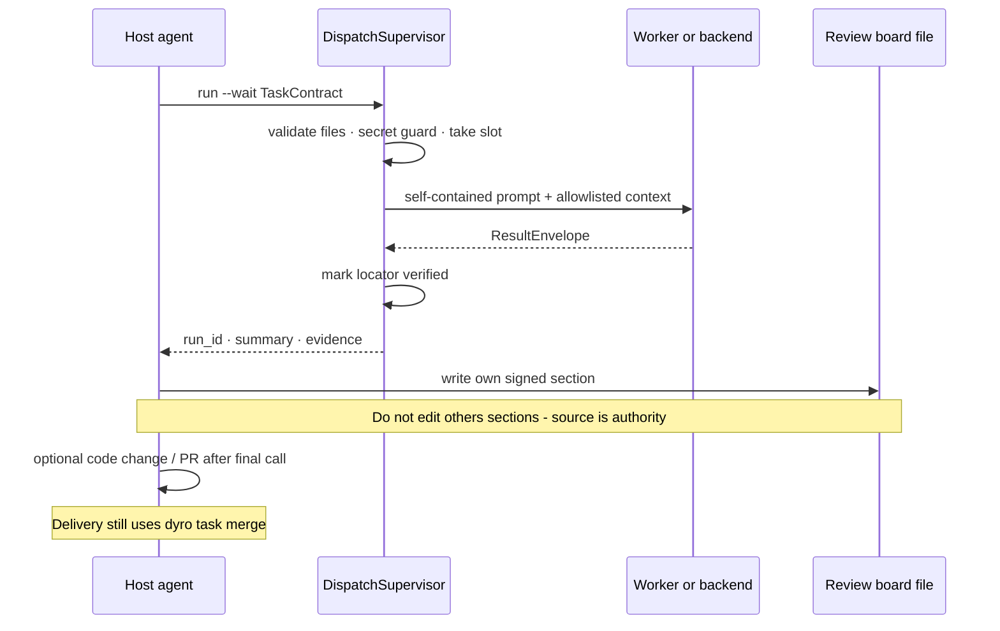

# DyroEngineeringFlow

[English](README.md) | [简体中文](README.zh-CN.md) | [한국어](README.ko.md) | [Español](README.es.md) | [Français](README.fr.md) | [Deutsch](README.de.md) | [Português (Brasil)](README.pt-BR.md) | [Русский](README.ru.md)

**DyroEngineeringFlow · `dyro` CLI** es una plataforma local-first de automatización de ingeniería y control de entrega para equipos multi-repositorio. Integra líneas de desarrollo, Git worktrees, lanzadores de agentes, puertas de tarea, revisión independiente y auditoría de merge en una configuración de workspace versionada.

**Mantén la ingeniería en movimiento de la tarea a la entrega.**

No está acoplado a Codex, Claude ni a ningún dominio de negocio. Cada equipo aporta un Profile `dyro.toml` para repositorios, layouts, adaptadores de agente y política de entrega; las reglas de negocio, el coste de modelos y las prácticas de release permanecen en ese Profile.

## Lo que impone

- Una tarea pertenece a exactamente una línea de desarrollo—nunca un workspace mezclado de feature y hotfix.
- Cada tarea se ejecuta en su propio `git worktree` en la rama `task/<id>`.
- Las puertas las ejecuta el orquestador; el autoinforme de un agente no es evidencia de éxito.
- La revisión se vincula al recibo de ejecución y a los HEAD exactos por repositorio; el desfase del código la invalida.
- Una tarea necesita revisión independiente antes de `done`; merge y push requieren confirmación explícita por defecto.
- Una dependencia completada solo libera el trabajo aguas abajo cuando sus HEAD de tarea exactos están integrados en la línea propietaria.
- La configuración ejecutable son arrays argv. El núcleo nunca ejecuta cadenas shell del TOML.

## Arquitectura y diagramas de flujo

Los siguientes diagramas se renderizan **directamente en GitHub** con Mermaid (no son enlaces a imágenes). El plano de control separa el **Profile del equipo** de **Dyro Core**. El estado de ejecución vive en `.dyro/`. Las etiquetas del diagrama están en inglés (alineadas con CLI y claves de configuración).

### Arquitectura por capas



### Layout multi-repositorio



### Máquina de estados de tareas



### Secuencia de entrega local



### Secuencia de evidencia externa



### Grafo de tareas



### Ola de planificación



### Casos de uso



### Capas multi-agente (experimento opcional)



Se incluye con `dyro` (`dyro dispatch …`). El dispatch es solo consultivo; la entrega sigue gates/merge de Dyro.

### Secuencia multi-agente (experimento opcional)



## Inicio rápido

Para el uso diario del CLI, instala `dyro` desde PyPI en un entorno `pipx` aislado (Python 3.11 o posterior):

```bash
python3 -m pip install --user --upgrade pipx
python3 -m pipx ensurepath
# Abre un terminal nuevo tras ensurepath, luego:
pipx install dyro
dyro --version
```

Para actualizar, ejecuta `pipx upgrade dyro`. Si el equipo gestiona paquetes Python con `pip`:

```bash
python3 -m pip install --user --upgrade dyro
```

Coloca los repositorios en un workspace y usa la ruta de incorporación para descubrirlos, crear directorios de estado seguros y la primera línea de desarrollo en un comando:

```bash
mkdir my-workspace && cd my-workspace
# Clona o mueve primero tus repositorios Git bajo este directorio.
dyro setup . --name my-workspace --line dev --yes
```

`setup` escanea repositorios Git locales, registra rutas relativas al workspace, deriva montajes de línea y lee `origin` cuando está disponible—sin editar TOML. `--yes` solo es necesario porque la primera línea crea Git worktrees. Usa `--no-line` si quieres el Profile primero. Si aún no hay repositorios, usa el asistente:

```bash
dyro init . --wizard --name my-workspace
```

Añade un repositorio después sin abrir `dyro.toml`:

```bash
dyro repo add repositories/services/payments
dyro repo list
```

Gestiona la política de entrega habitual y los adaptadores de Agent sin abrir `dyro.toml`:

```bash
dyro config set policy.execution_mode external
dyro config get policy.execution_mode
dyro agent add ci-runner --preset noop
dyro agent test ci-runner
```

Si el Profile tiene remotes, se pueden crear de forma segura los anchors de repositorio que falten:

```bash
dyro --dry-run bootstrap
dyro bootstrap --yes
dyro doctor
```

Para un nuevo compañero, el punto de entrada habitual es un comando. Comprueba el workspace y elige línea y agente local:

```bash
dyro start
```

## Flujo de entrega

Usa comandos explícitos al automatizar o liderar un release:

```bash
dyro doctor
dyro line create release-2026-10 --base origin/main --yes
# Sobrescribe la base verificada solo en los repositorios que lo necesiten.
dyro line create release-2026-10 --base origin/main --repo-base web=v2026.10.0 --yes
dyro open release-2026-10 --agent codex
dyro task create API-101 --title "Implement API contract" --line release-2026-10 --repository api
dyro task graph check --line release-2026-10
dyro task graph --line release-2026-10 --format mermaid
dyro task explain API-101
dyro task next
dyro task next --run --yes
dyro task attempts API-101
dyro task binding API-101
dyro task review API-101
dyro task merge API-101 --yes
dyro changeset create release-2026-10-ready --line release-2026-10
dyro changeset verify release-2026-10-ready
```

Un hotfix de producción debe declarar su base de producción verificada; nunca hereda una rama por defecto de forma implícita:

```bash
dyro hotfix create incident-123 --base v2026.09.7 --repos api,web --yes
```

Si la ejecución y la aprobación las realiza un sistema de confianza separado, configura `policy.execution_mode = "external"` y `policy.require_external_signoff = true`. Dyro local solo permitirá planificar; la revisión vinculada al recibo y a los HEAD exactos debe firmarse de forma explícita antes de `done`:

```bash
dyro task claim API-101 --by isolated-runner-1 --key-id runner-2026 \
  --output /secure-transfer/API-101.core-claim.json
# El trabajo de larga duración debe renovar su claim acotado antes del vencimiento.
dyro task claim-renew API-101 --by isolated-runner-1 --lease-seconds 3600
# En el runner aislado: ejecuta las gates declaradas y empaqueta recibo, logs y HEAD exactos.
dyro task evidence build API-101 --workspace /runner/workspace --receipt /runner/out/receipt.md --output /runner/out/API-101.zip
# En el plano de control: valida e importa el paquete portable único.
dyro task evidence execution API-101 --bundle /runner/out/API-101.zip
dyro task evidence review API-101 --file /review/out/review.md
dyro task signoff API-101 --by release-manager
# Una asignación abandonada puede liberarse de forma explícita.
dyro task claim-release API-101 --by isolated-runner-1
```

Los nuevos paquetes de evidencia deben incluir `provenance.json`. Importar un paquete legado sin provenance es una migración deliberada y requiere `--allow-legacy`. Si el runner externo devuelve `QUESTION`, registra la respuesta con `dyro task answer API-101 --text "..."`; se conserva el claim y la tarea vuelve a `assigned`.

Inspecciona y retiene con seguridad las generaciones de evidencia inmutables:

```bash
dyro task evidence generations API-101
dyro --dry-run task evidence generations API-101 --prune --older-than-days 30 --keep 10
dyro task evidence generations API-101 --prune --older-than-days 30 --keep 10 --yes
```

Para la identidad criptográfica de runner y aprobador, genera claves fuera del workspace e instala solo claves públicas en almacenes de confianza separados por propósito:

```bash
dyro config set policy.execution_mode external
dyro config set policy.require_signed_execution true
dyro config set policy.require_signed_review true
dyro config set policy.require_external_signoff true
dyro config set policy.require_signed_signoff true

dyro key generate runner-2026 --private-key /secure/runner.pem --public-key /secure/runner.pub.pem
dyro key trust runner-2026 --purpose execution --public-key /secure/runner.pub.pem   --not-after 2027-01-01T00:00:00+00:00
dyro task claim API-101 --by isolated-runner-1 --key-id runner-2026 \
  --output /secure-transfer/API-101.core-claim.json
dyro task evidence build API-101 --workspace /runner/workspace --receipt /runner/out/receipt.md   --output /runner/out/API-101.zip --claim /runner/in/claim.json   --signing-key /secure/runner.pem --key-id runner-2026

dyro key generate reviewer-2026 --private-key /secure/reviewer.pem --public-key /secure/reviewer.pub.pem
dyro key trust reviewer-2026 --purpose review --public-key /secure/reviewer.pub.pem
dyro task evidence review-build API-101 --file /review/out/review.md --reviewer independent-reviewer   --output /review/out/review.json --signing-key /secure/reviewer.pem --key-id reviewer-2026
dyro task evidence review API-101 --file /review/out/review.json

dyro key generate approver-2026 --private-key /secure/approver.pem --public-key /secure/approver.pub.pem
dyro key trust approver-2026 --purpose signoff --public-key /secure/approver.pub.pem
dyro task signoff API-101 --by release-manager --signing-key /secure/approver.pem --key-id approver-2026

dyro key list --purpose execution --show-status
dyro key revoke runner-2026 --purpose execution --reason "runner retired"
dyro key audit
```

Sincroniza la cadena de auditoría de confianza local con un Witness independiente:

```bash
dyro key generate audit-client-2026   --private-key /secure/audit-client.pem   --public-key /secure/audit-client.pub.pem
# Instala audit-client.pub.pem en el Witness por un canal seguro fuera de banda.
dyro key trust witness-2026   --purpose audit-receipt   --public-key witness-2026.pub.pem
dyro key trust witness-recovery   --purpose audit-recovery   --public-key witness-recovery.pub.pem

DYRO_AUDIT_TOKEN=... dyro key audit-sync   --witness primary   --endpoint https://audit.example.com/v1/dyro/batches   --signing-key /secure/audit-client.pem   --key-id audit-client-2026   --witness-key-id witness-2026   --witness-recovery-key-id witness-recovery
```

Aunque no haya eventos nuevos, el comando envía un checkpoint firmado; si se pierde la respuesta, se reenvía el batch pendiente ya persistido. El Witness debe recomputar la cadena, rechazar forks de secuencia o cabecera, emitir un recibo verificable y escribir batches y recibos en almacenamiento inmutable con retención. Protocolo y despliegue: [Audit Witness protocol](docs/audit-witness-protocol.md).

El proyecto incluye el servicio Witness de biblioteca estándar desplegable: `dyro witness serve`. Por defecto exige bearer token y TLS, y solo avanza el checkpoint tras crear `records/<batch-sha256>.json`. En producción, separa el checkpoint mutable de los archivos `records` inmutables. Guía: [Witness deployment](docs/witness-deployment.md).

La firma obligatoria se controla con `policy.require_signed_execution`, `policy.require_signed_review` y `policy.require_signed_signoff`; borrar todas las claves de confianza no desactiva una política activa. Los claims de ejecución firmados enlazan `claim_id`, generación, runner e ID de clave. Los mensajes firmados y los hashes de plan usan RFC 8785 JCS. Los revisores independientes producen un sobre JSON firmado con `dyro task evidence review-build`. La rotación no es disruptiva: confía el nuevo key ID, mantén el antiguo en la ventana de solape y revócalo con el proceso controlado del workspace.

Un firmante TypeScript de referencia y el vector de interoperabilidad Python/Node están en `examples/typescript-runner/`.

Toda operación con escritura tiene modo de planificación:

```bash
dyro --dry-run line create release-2026-10 --base origin/main
dyro --dry-run task run API-101
```

## Mapa de comandos

| Comando | Propósito |
| --- | --- |
| `setup` / `init --discover` / `init --wizard` / `repo add/list` / `bootstrap` / `start` | Incorporar sin editar TOML, gestionar anchors y elegir línea y agente. |
| `doctor` / `status` | Validar y mostrar el estado del plano de control. |
| `line create/list` | Crear, registrar e inspeccionar líneas de feature. |
| `hotfix create` | Crear una línea hotfix desde una base de producción explícita. |
| `changeset create/list/verify` | Fijar y verificar los HEAD Git limpios exactos de una entrega multi-repo. |
| `config get/set` / `agent list/add/test` / `open` | Gestionar política y adaptadores, validar ejecutables o abrir un agente en la línea correcta. |
| `task create/list/board/status/next/graph/explain/attempts/binding` | Manifiestos y estado, grafo, planificación, provenance y enlace exacto de revisión. |
| `task run/answer/gates/review/signoff` | Ejecutar tareas, responder, gates, revisión independiente y sign-off externo si aplica. |
| `task claim --output` / `task evidence build/execution/review` | Claim único con archivo de entrega de creación exclusiva, build/import de evidencia portable e import de revisión ligada al recibo. |
| `task merge` | Fusionar la rama de tarea revisada en su línea propietaria. |
| `task loop/daemon/stats/decisions` | Lotes controlados, programación, ledger y puertas de decisión. |
| `dispatch` | Despacho multi-agente local opcional (L0–L4); solo consultivo — no sustituye gates/merge. |

Detalle: [arquitectura y Profile](docs/architecture.md), [diagramas](docs/diagrams.en.md), [migración](docs/migrating-existing-control-planes.md), [publicación PyPI](docs/publishing.md) (maintainers).

## Idiomas y documentación

Este README se mantiene en inglés, chino simplificado, coreano, español, francés, alemán, portugués de Brasil y ruso. Comandos, claves de configuración, nombres de directorio y reglas de seguridad son idénticos en todas las traducciones. Los mensajes del CLI y las guías técnicas extendidas son principalmente en chino; el README multilingüe no implica cambio de idioma en el runtime.

## Límites actuales

DyroEngineeringFlow ofrece un flujo local completo y controles de política para equipos en modo de planificación. No crea repositorios remotos, no transporta credenciales SaaS ni aprovisiona runners externos; conserva un contrato portable de paquetes de evidencia para ejecución externa. El despacho local opcional de agentes se distribuye como `experiments.local_agent_dispatch` y se usa con `dyro dispatch …`; es solo consultivo y nunca sustituye gates, review, signoff ni merge. Los merges locales multi-repo se prevalidan y recuperan como una operación; los servidores Git remotos no ofrecen push atómico multi-repo, por lo que se registra un fallo parcial. El merge automático requiere permiso en el manifiesto de tarea y la política local. [MIT License](LICENSE) y [`dyro` en PyPI](https://pypi.org/project/dyro/).
