# DyroEngineeringFlow

[English](README.md) | [简体中文](README.zh-CN.md) | [한국어](README.ko.md) | [Español](README.es.md) | [Français](README.fr.md) | [Deutsch](README.de.md) | [Português (Brasil)](README.pt-BR.md) | [Русский](README.ru.md)

**DyroEngineeringFlow · `dyro` CLI** est une plateforme local-first d'automatisation d'ingénierie et de contrôle de livraison pour les équipes multi-dépôts. Elle regroupe lignes de développement, Git worktrees, lanceurs d'agents, portes de tâches, revue indépendante et audit de fusion dans une configuration d'espace de travail versionnée.

**Faire avancer l'ingénierie de la tâche à la livraison.**

Non couplé à Codex, Claude ou un domaine métier. Chaque équipe fournit un Profile `dyro.toml` pour les dépôts, layouts, adaptateurs d'agent et politique de livraison ; les règles métier, le coût des modèles et les pratiques de release restent dans ce Profile.

## Ce qu'il impose

- Une tâche appartient à exactement une ligne de développement—jamais un workspace feature/hotfix mélangé.
- Chaque tâche s'exécute dans son propre `git worktree` sur la branche `task/<id>`.
- Les portes sont exécutées par l'orchestrateur ; l'auto-rapport d'un agent n'est pas une preuve de succès.
- La revue est liée au reçu d'exécution et aux HEAD exacts par dépôt ; une dérive du code l'invalide.
- Une revue indépendante est requise avant `done` ; merge et push exigent une confirmation explicite par défaut.
- Une dépendance terminée ne libère l'aval qu'après intégration de ses HEAD de tâche exacts dans la ligne propriétaire.
- La configuration exécutable est des tableaux argv. Le noyau n'exécute jamais de chaînes shell issues du TOML.

## Architecture et diagrammes de flux

Les diagrammes suivants s'affichent **directement sur GitHub** en Mermaid (pas de liens d'images). Le plan de contrôle sépare le **Profile d'équipe** de **Dyro Core**. L'état d'exécution est sous `.dyro/`. Les libellés des diagrammes sont en anglais (alignés CLI / clés de config).

### Architecture en couches

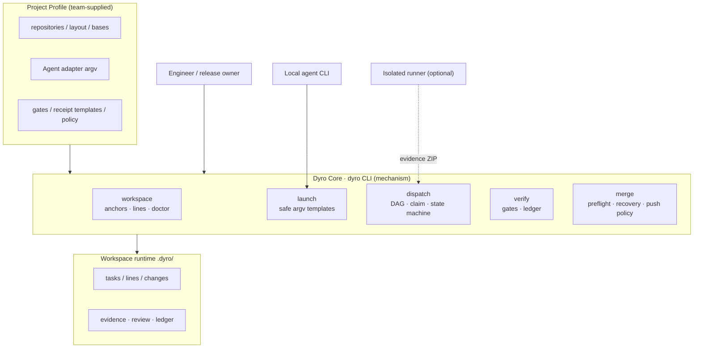

### Layout multi-dépôts

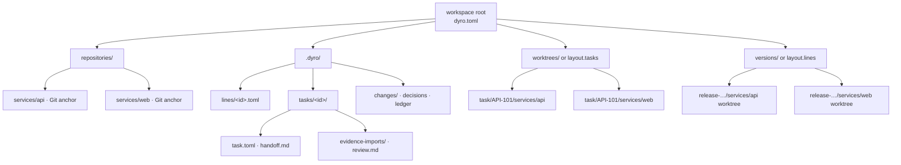

### Machine à états des tâches

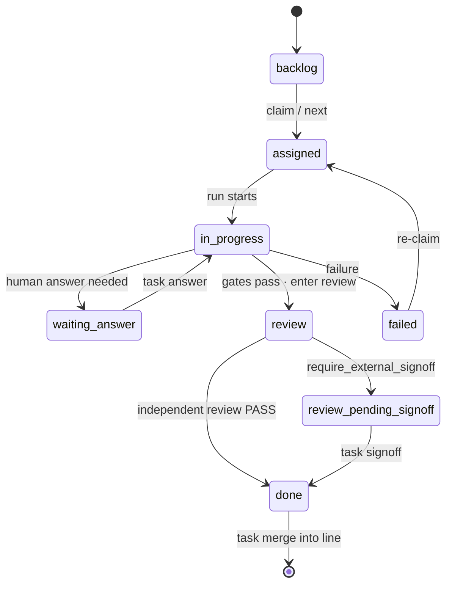

### Séquence de livraison locale

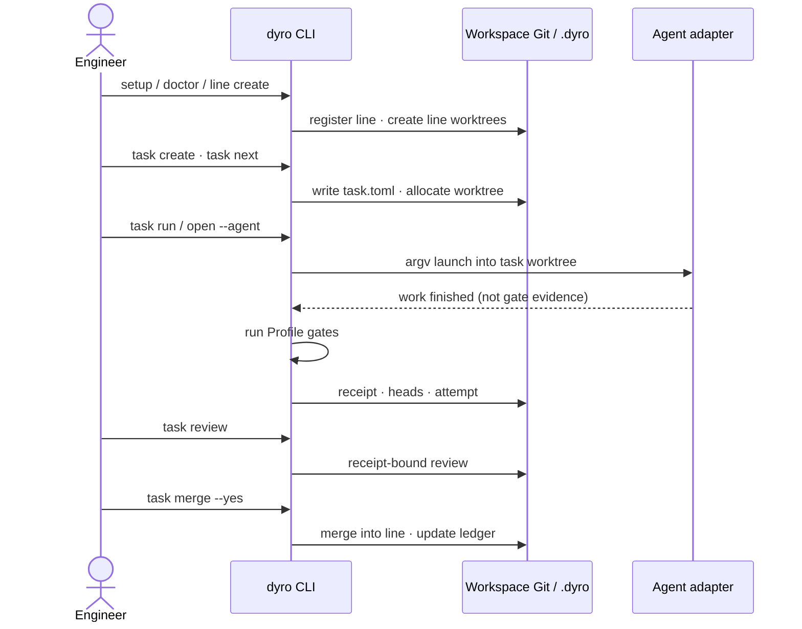

### Séquence de preuve externe

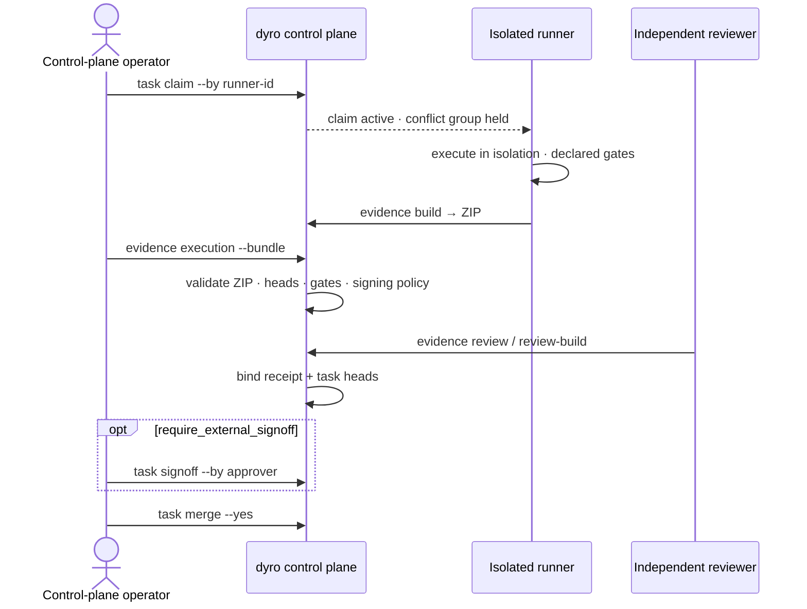

### Graphe de tâches

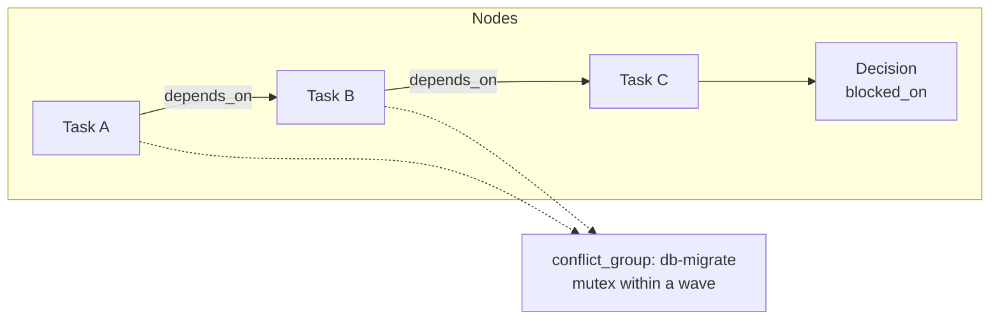

### Vague de planification

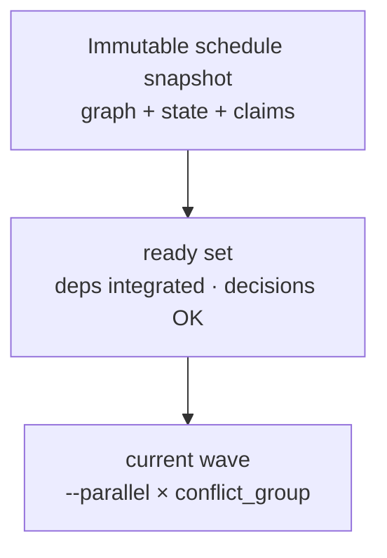

### Cas d'usage

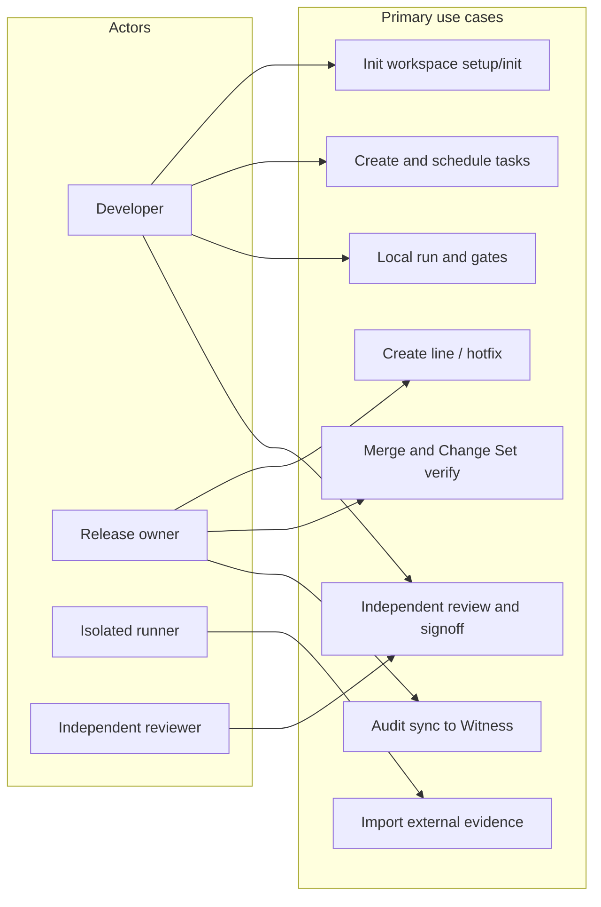

### Couches multi-agents (expérience optionnelle)

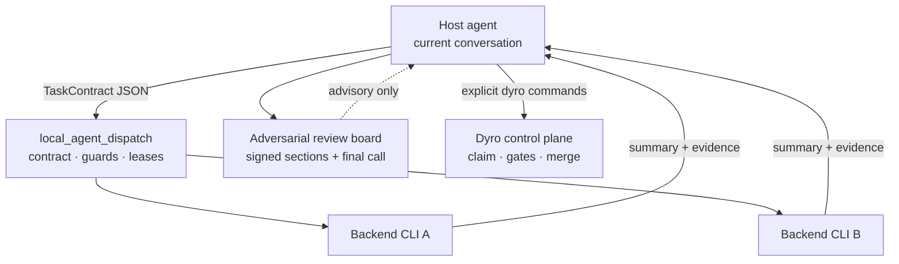

Hors du paquet installé `dyro`. Le dispatch est consultatif.

### Séquence multi-agents (expérience optionnelle)

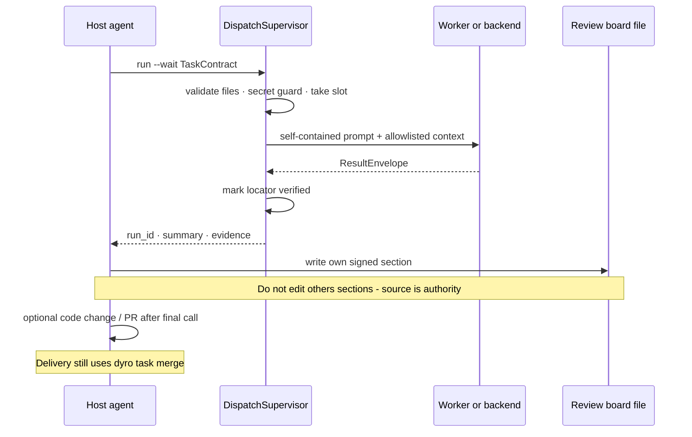

### Runtime sémantique externe (expérience optionnelle)

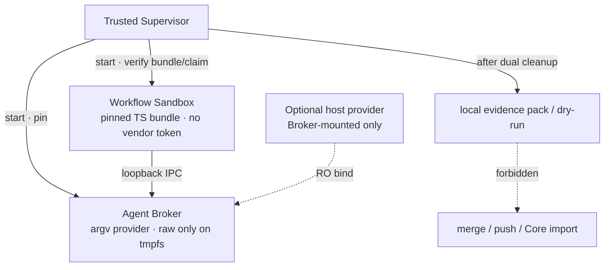

Pas Core. `experiments/external_workflow_runner/`. Stage5 `NOT_READY`.

### Séquence runtime sémantique (expérience optionnelle)

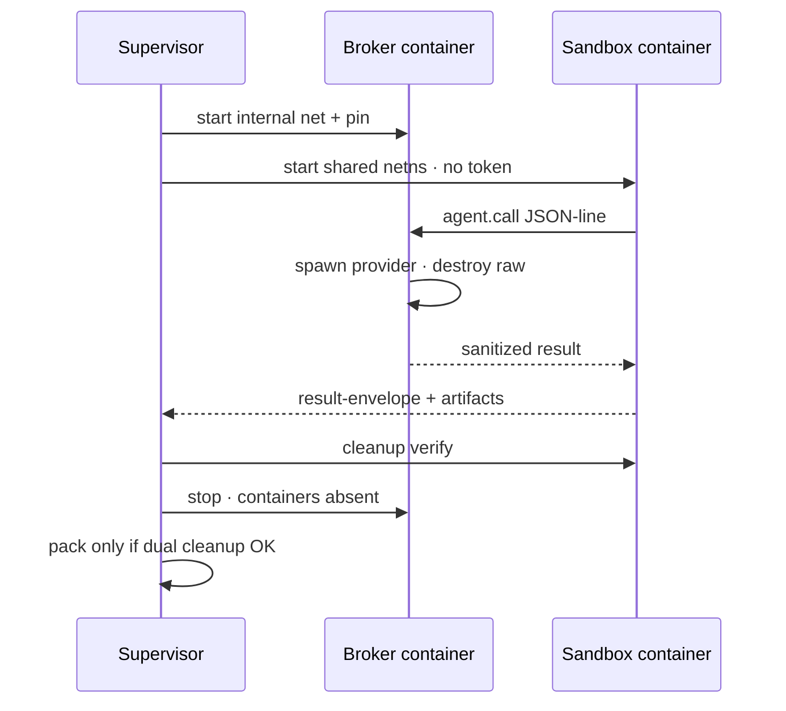

## Démarrage rapide

Pour un usage quotidien du CLI, installez `dyro` depuis PyPI dans un environnement `pipx` isolé (Python 3.11 ou plus) :

```bash
python3 -m pip install --user --upgrade pipx
python3 -m pipx ensurepath
# Ouvrez un nouveau terminal après ensurepath, puis :
pipx install dyro
dyro --version
```

Pour mettre à jour : `pipx upgrade dyro`. Si l'équipe gère Python avec `pip` :

```bash
python3 -m pip install --user --upgrade dyro
```

Placez les dépôts dans un workspace, puis utilisez le parcours d'accueil pour les découvrir, créer les répertoires d'état sûrs et la première ligne de développement en une commande :

```bash
mkdir my-workspace && cd my-workspace
# Clonez ou déplacez d'abord vos dépôts Git sous ce répertoire.
dyro setup . --name my-workspace --line dev --yes
```

`setup` analyse les dépôts Git locaux, enregistre les chemins relatifs, dérive les montages de ligne et lit `origin` si disponible—sans éditer le TOML. `--yes` n'est requis que parce que la première ligne crée des Git worktrees. Utilisez `--no-line` pour le Profile seul. Sans dépôts, utilisez l'assistant :

```bash
dyro init . --wizard --name my-workspace
```

Ajoutez un dépôt plus tard sans ouvrir `dyro.toml` :

```bash
dyro repo add repositories/services/payments
dyro repo list
```

Gérez la politique de livraison courante et les adaptateurs d'Agent sans ouvrir `dyro.toml` :

```bash
dyro config set policy.execution_mode external
dyro config get policy.execution_mode
dyro agent add ci-runner --preset noop
dyro agent test ci-runner
```

Si le Profile contient des remotes, les anchors manquants peuvent être créés en toute sécurité :

```bash
dyro --dry-run bootstrap
dyro bootstrap --yes
dyro doctor
```

Pour un nouveau coéquipier, le point d'entrée habituel est une commande. Elle vérifie le workspace puis choisit une ligne et un agent local :

```bash
dyro start
```

## Flux de livraison

Utilisez des commandes explicites pour scripter ou piloter une release :

```bash
dyro doctor
dyro line create release-2026-10 --base origin/main --yes
# Ne remplacez la base vérifiée que pour les dépôts qui en ont besoin.
dyro line create release-2026-10 --base origin/main --repo-base web=v2026.10.0 --yes
dyro open release-2026-10 --agent codex
dyro task create API-101 --title "Implement API contract" --line release-2026-10 --repository api
dyro task graph check --line release-2026-10
dyro task graph --line release-2026-10 --format mermaid
dyro task explain API-101
dyro task next
dyro task next --run --yes
dyro task attempts API-101
dyro task binding API-101
dyro task review API-101
dyro task merge API-101 --yes
dyro changeset create release-2026-10-ready --line release-2026-10
dyro changeset verify release-2026-10-ready
```

Un hotfix de production doit déclarer sa base de production vérifiée ; il n'hérite jamais implicitement d'une branche par défaut :

```bash
dyro hotfix create incident-123 --base v2026.09.7 --repos api,web --yes
```

Si l'exécution et l'approbation sont gérées par un système de confiance séparé, définissez `policy.execution_mode = "external"` et `policy.require_external_signoff = true`. Dyro local n'autorise alors que la planification ; une revue liée au reçu et aux HEAD exacts doit être signée explicitement avant `done` :

```bash
dyro task claim API-101 --by isolated-runner-1 --key-id runner-2026
# Un travail long doit renouveler son claim borné avant expiration.
dyro task claim-renew API-101 --by isolated-runner-1 --lease-seconds 3600
# Dans le runner isolé : exécutez les gates déclarées et empaquetez reçu, logs et HEAD exacts.
dyro task evidence build API-101 --workspace /runner/workspace --receipt /runner/out/receipt.md --output /runner/out/API-101.zip
# Sur le plan de contrôle : validez et importez le paquet portable unique.
dyro task evidence execution API-101 --bundle /runner/out/API-101.zip
dyro task evidence review API-101 --file /review/out/review.md
dyro task signoff API-101 --by release-manager
# Une affectation abandonnée peut être libérée explicitement.
dyro task claim-release API-101 --by isolated-runner-1
```

Les nouveaux paquets de preuve doivent inclure `provenance.json`. Importer un paquet legacy sans provenance est une migration délibérée (`--allow-legacy`). Si le runner renvoie `QUESTION`, enregistrez la réponse avec `dyro task answer API-101 --text "..."` ; le claim est conservé et la tâche repasse en `assigned`.

Inspectez et conservez en sécurité les générations de preuves immuables :

```bash
dyro task evidence generations API-101
dyro --dry-run task evidence generations API-101 --prune --older-than-days 30 --keep 10
dyro task evidence generations API-101 --prune --older-than-days 30 --keep 10 --yes
```

Pour l'identité cryptographique du runner et de l'approbateur, générez les clés hors workspace et n'installez que les clés publiques dans des magasins de confiance séparés par usage :

```bash
dyro config set policy.execution_mode external
dyro config set policy.require_signed_execution true
dyro config set policy.require_signed_review true
dyro config set policy.require_external_signoff true
dyro config set policy.require_signed_signoff true

dyro key generate runner-2026 --private-key /secure/runner.pem --public-key /secure/runner.pub.pem
dyro key trust runner-2026 --purpose execution --public-key /secure/runner.pub.pem   --not-after 2027-01-01T00:00:00+00:00
dyro task claim API-101 --by isolated-runner-1 --key-id runner-2026
dyro task evidence build API-101 --workspace /runner/workspace --receipt /runner/out/receipt.md   --output /runner/out/API-101.zip --claim /runner/in/claim.json   --signing-key /secure/runner.pem --key-id runner-2026

dyro key generate reviewer-2026 --private-key /secure/reviewer.pem --public-key /secure/reviewer.pub.pem
dyro key trust reviewer-2026 --purpose review --public-key /secure/reviewer.pub.pem
dyro task evidence review-build API-101 --file /review/out/review.md --reviewer independent-reviewer   --output /review/out/review.json --signing-key /secure/reviewer.pem --key-id reviewer-2026
dyro task evidence review API-101 --file /review/out/review.json

dyro key generate approver-2026 --private-key /secure/approver.pem --public-key /secure/approver.pub.pem
dyro key trust approver-2026 --purpose signoff --public-key /secure/approver.pub.pem
dyro task signoff API-101 --by release-manager --signing-key /secure/approver.pem --key-id approver-2026

dyro key list --purpose execution --show-status
dyro key revoke runner-2026 --purpose execution --reason "runner retired"
dyro key audit
```

Synchronisez la chaîne d'audit de confiance locale vers un Witness indépendant :

```bash
dyro key generate audit-client-2026   --private-key /secure/audit-client.pem   --public-key /secure/audit-client.pub.pem
# Installez audit-client.pub.pem sur le Witness via un canal sécurisé hors bande.
dyro key trust witness-2026   --purpose audit-receipt   --public-key witness-2026.pub.pem
dyro key trust witness-recovery   --purpose audit-recovery   --public-key witness-recovery.pub.pem

DYRO_AUDIT_TOKEN=... dyro key audit-sync   --witness primary   --endpoint https://audit.example.com/v1/dyro/batches   --signing-key /secure/audit-client.pem   --key-id audit-client-2026   --witness-key-id witness-2026   --witness-recovery-key-id witness-recovery
```

Même sans nouvel événement, la commande envoie un checkpoint signé ; en cas de réponse perdue, le batch pending déjà persisté est rejoué tel quel. Le Witness doit recalculer la chaîne, rejeter les forks de séquence ou de tête, émettre un reçu vérifiable et écrire batches et reçus en stockage immuable avec rétention. Voir [Audit Witness protocol](docs/audit-witness-protocol.md).

Service Witness livré : `dyro witness serve`. Par défaut : bearer token + TLS ; le checkpoint n'avance qu'après `records/<batch-sha256>.json`. En production, séparez checkpoint mutable et archives `records` immuables. Voir [Witness deployment](docs/witness-deployment.md).

L'obligation de signature est contrôlée par `policy.require_signed_execution`, `policy.require_signed_review` et `policy.require_signed_signoff` ; supprimer toutes les clés de confiance ne désactive pas une politique active. Les claims d'exécution signés lient `claim_id`, génération, runner et ID de clé. Messages et hashs de plan utilisent RFC 8785 JCS. Les relecteurs indépendants produisent une enveloppe JSON signée via `dyro task evidence review-build`. Rotation non disruptive : faire confiance au nouvel ID, conserver l'ancien pendant le chevauchement, puis révoquer.

Un signataire TypeScript de référence et un vecteur d'interop Python/Node se trouvent dans `examples/typescript-runner/`.

Toute opération d'écriture a un mode planification :

```bash
dyro --dry-run line create release-2026-10 --base origin/main
dyro --dry-run task run API-101
```

## Carte des commandes

| Commande | Rôle |
| --- | --- |
| `setup` / `init --discover` / `init --wizard` / `repo add/list` / `bootstrap` / `start` | Onboarding sans TOML, gestion des anchors, choix de ligne et d'agent. |
| `doctor` / `status` | Valider et afficher l'état du plan de contrôle. |
| `line create/list` | Créer, enregistrer et inspecter les lignes feature. |
| `hotfix create` | Créer une ligne hotfix depuis une base de production explicite. |
| `changeset create/list/verify` | Figer et vérifier les HEAD Git propres exacts d'une livraison multi-dépôts. |
| `config get/set` / `agent list/add/test` / `open` | Gérer politique et adaptateurs, valider un exécutable ou ouvrir un agent sur la bonne ligne. |
| `task create/list/board/status/next/graph/explain/attempts/binding` | Manifestes et état, graphe, planification, provenance et liaison de revue exacte. |
| `task run/answer/gates/review/signoff` | Exécuter, répondre, gates, revue indépendante et sign-off externe si requis. |
| `task claim` / `task evidence build/execution/review` | Claim unique, build/import de preuve portable et import de revue liée au reçu. |
| `task merge` | Fusionner la branche de tâche revue dans sa ligne propriétaire. |
| `task loop/daemon/stats/decisions` | Lots contrôlés, ordonnancement, ledger et portes de décision. |

Détail : [architecture et Profile](docs/architecture.md), [diagrammes](docs/diagrams.en.md), [migration](docs/migrating-existing-control-planes.md), [publication PyPI](docs/publishing.md) (mainteneurs).

## Langues et documentation

Ce README est maintenu en anglais, chinois simplifié, coréen, espagnol, français, allemand, portugais brésilien et russe. Commandes, clés de configuration, noms de répertoires et règles de sécurité sont identiques dans toutes les traductions. Les messages CLI et guides techniques étendus sont surtout en chinois ; le README multilingue n'implique pas de bascule de langue runtime.

## Limites actuelles

DyroEngineeringFlow fournit une boucle de workflow locale complète et des contrôles de politique pour les équipes plus strictes en mode planification seule. Il ne crée pas de dépôts distants, n'embarque pas d'identifiants SaaS et ne provisionne pas de runner externe ; il fournit un contrat de paquet de preuve portable. Les expériences optionnelles sous `experiments/` (workflow runner Stage0–5, local agent dispatch L0–L4) ne font **pas** partie du paquet installé `dyro`—voir les ADR dans `docs/adr/`. Les merges multi-dépôts locaux sont prévolés et récupérés comme une opération ; les serveurs Git distants n'offrent pas de push atomique multi-dépôts, donc un push partiel est journalisé pour récupération. Le merge automatique exige l'autorisation du manifeste de tâche et de la politique locale. [MIT License](LICENSE) et [`dyro` sur PyPI](https://pypi.org/project/dyro/).
