# DyroEngineeringFlow

[English](README.md) | [简体中文](README.zh-CN.md) | [한국어](README.ko.md) | [Español](README.es.md) | [Français](README.fr.md) | [Deutsch](README.de.md) | [Português (Brasil)](README.pt-BR.md) | [Русский](README.ru.md)

**DyroEngineeringFlow · `dyro` CLI**는 여러 저장소를 사용하는 팀을 위한 로컬 우선 엔지니어링 자동화 및 배포 제어 플랫폼입니다. 개발 라인, Git worktree, Agent 실행, 작업 게이트, 독립 검토, 병합 감사를 버전 관리 가능한 워크스페이스 설정으로 통합합니다.

**작업에서 배포까지 엔지니어링이 계속 흐르게 합니다.**

Codex, Claude 또는 특정 비즈니스 도메인에 종속되지 않습니다. 각 팀은 `dyro.toml` Profile에서 저장소, 레이아웃, Agent adapter, 배포 정책을 정의하며, 비즈니스 규칙·모델 비용·릴리스 관행은 Profile에 둡니다.

## 강제하는 것

- 하나의 작업은 정확히 하나의 개발 라인에만 속하며 기능 버전과 Hotfix 워크스페이스를 혼합하지 않습니다.
- 모든 작업은 `task/<id>` 브랜치의 독립된 `git worktree`에서 실행됩니다.
- 게이트는 오케스트레이터가 실행하며 Agent의 자체 보고만으로 성공을 판단하지 않습니다.
- 검토는 실행 receipt와 저장소별 정확한 작업 HEAD에 함께 연결되며 소스 변경 시 무효가 됩니다.
- 독립 검토를 통과한 작업만 `done`이 되며, 병합과 push는 기본적으로 명시적 확인이 필요합니다.
- 완료된 의존성은 정확한 작업 HEAD가 소유 개발 라인에 통합된 뒤에야 하위 작업을 해제합니다.
- 실행 가능한 설정은 argv 배열입니다. 코어는 TOML에서 제공한 shell 문자열을 실행하지 않습니다.

## 아키텍처 및 흐름 다이어그램

아래 다이어그램은 GitHub에서 **Mermaid로 직접 렌더링**됩니다(이미지 링크 아님). 제어 평면은 **팀 Profile**과 **Dyro Core**를 분리하며 런타임 상태는 `.dyro/`에 있습니다. 다이어그램 라벨은 영어(CLI·설정 키와 동일)입니다.

### 계층 아키텍처

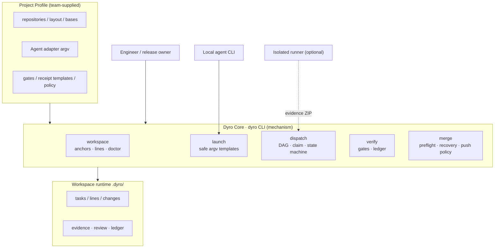

### 멀티 리포 워크스페이스 레이아웃

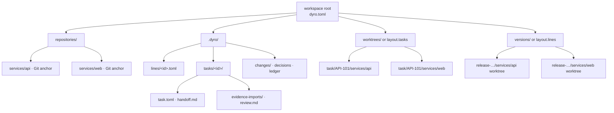

### 작업 상태 머신

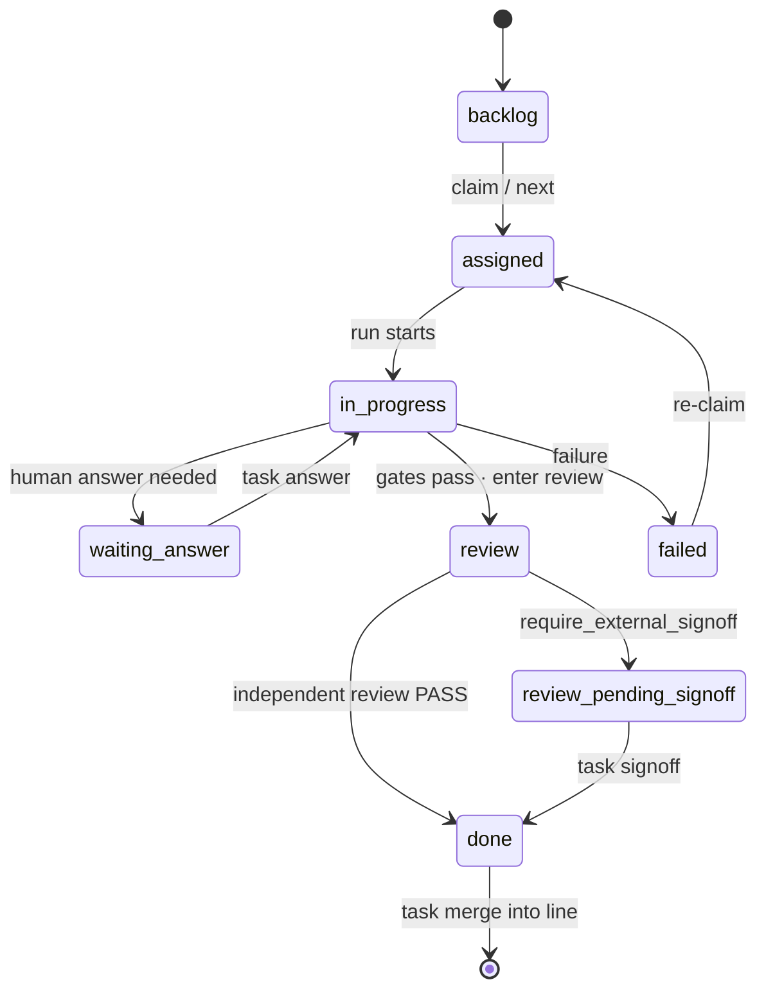

### 로컬 전달 시퀀스

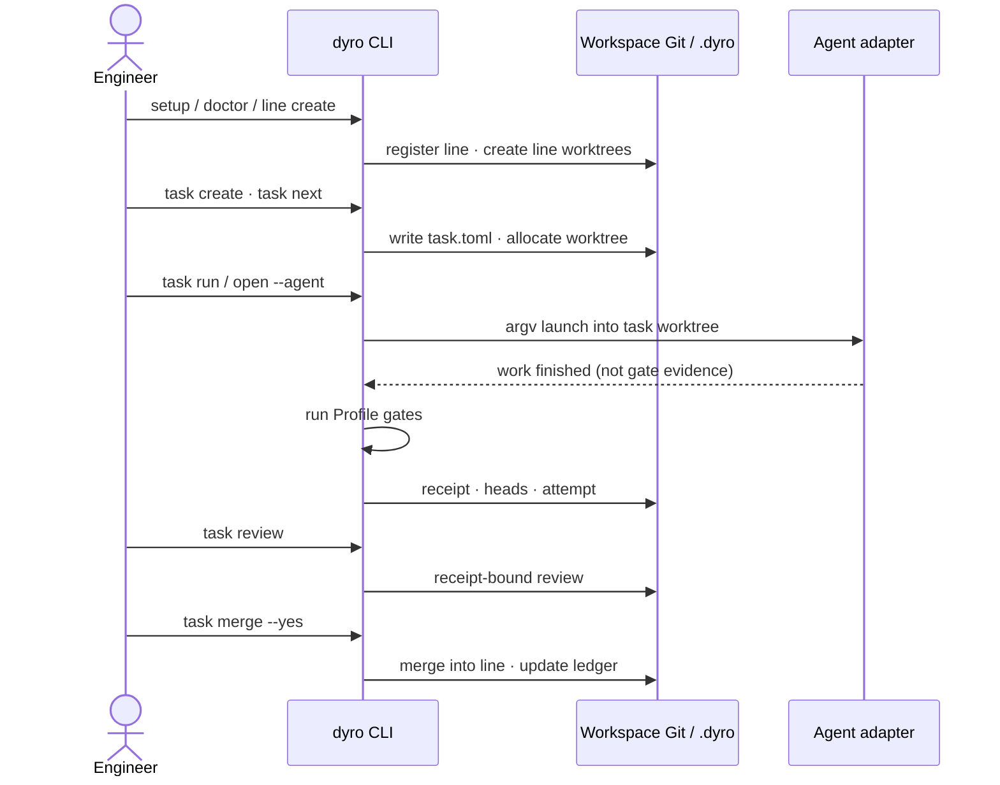

### 외부 증거 시퀀스

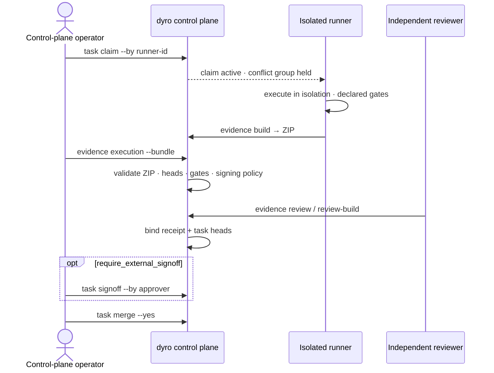

### 작업 그래프

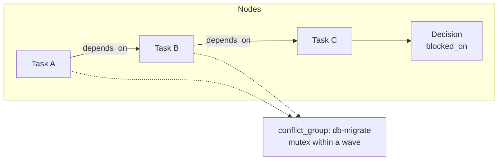

### 스케줄링 wave

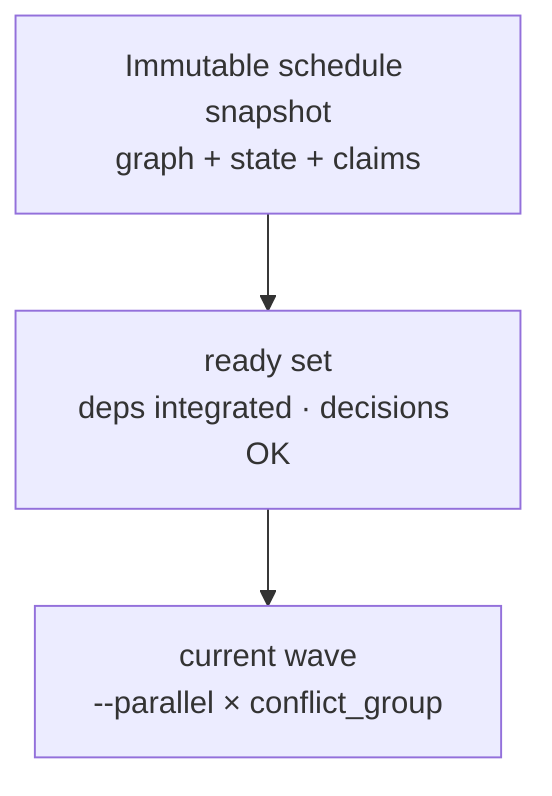

### 유스케이스 개요

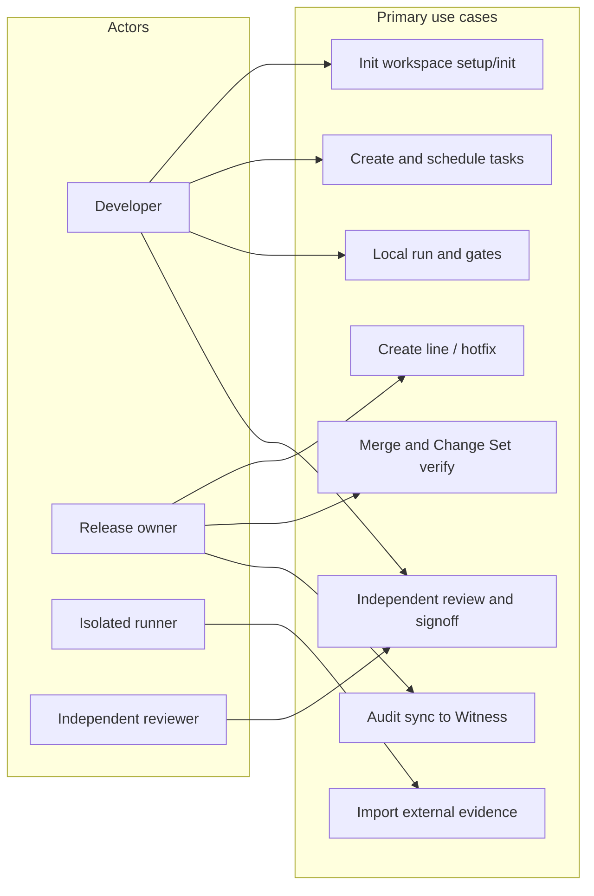

### 멀티 에이전트 계층 (선택 실험)

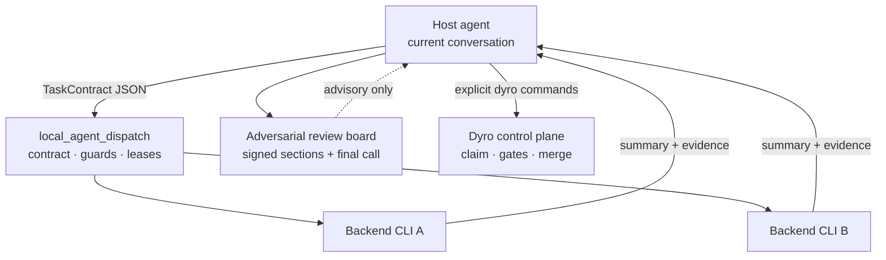

`dyro`와 함께 제공됩니다(`dyro dispatch …`). Dispatch 결과는 권고이며 전달은 Dyro gates/merge를 따릅니다.

### 멀티 에이전트 시퀀스 (선택 실험)

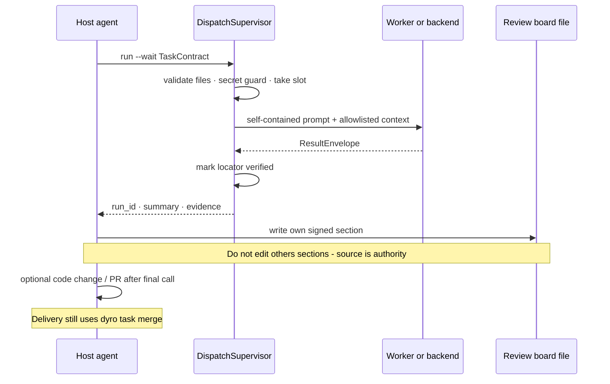

### 외부 시맨틱 런타임 (선택 실험)

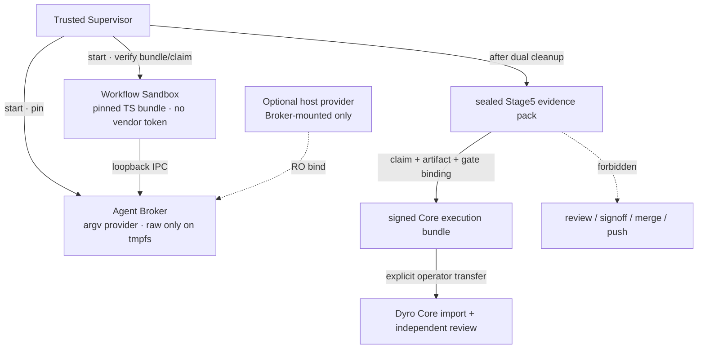

Core가 아닙니다. 경로: `experiments/external_workflow_runner/`. 현재
**Production Candidate**이며, multi-host·실제 provider fleet·writable mount
quota를 검증하기 전까지 production 상태는 `NOT_READY`입니다.

```bash
dyro runtime status
dyro runtime doctor
dyro runtime plan
dyro runtime production-gate  # NOT_READY exits 3
```

### 시맨틱 런타임 시퀀스 (선택 실험)

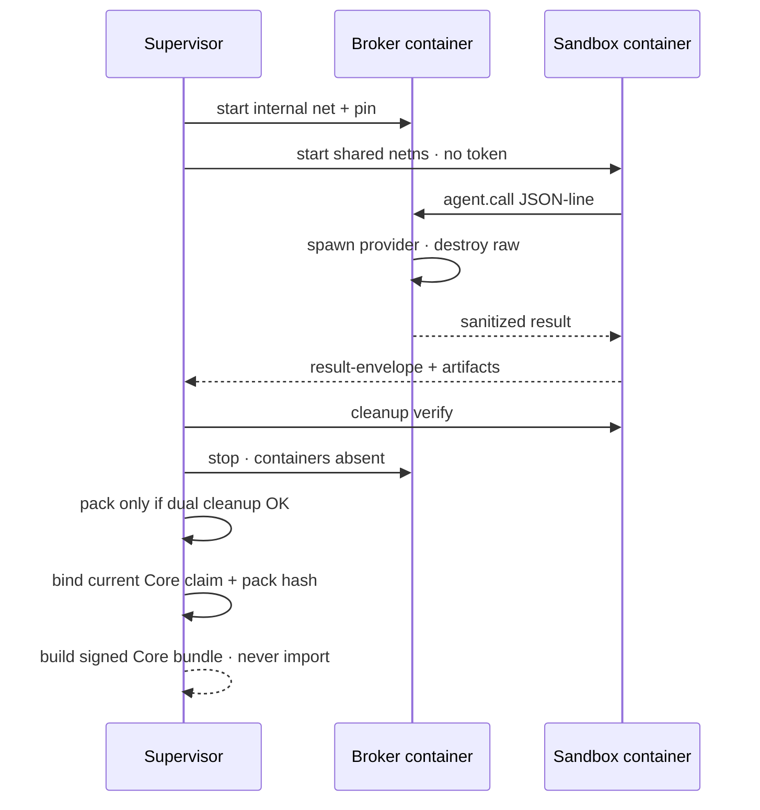

## 빠른 시작

일상적인 CLI 사용에는 격리된 `pipx` 환경에서 PyPI의 `dyro`를 설치하세요. Python 3.11 이상이 필요합니다.

```bash
python3 -m pip install --user --upgrade pipx
python3 -m pipx ensurepath
# ensurepath 실행 후 새 터미널을 연 다음:
pipx install dyro
dyro --version
```

업데이트할 때는 `pipx upgrade dyro`를 실행합니다. 팀에서 `pip`로 Python 패키지를 관리한다면 다음을 사용할 수 있습니다.

```bash
python3 -m pip install --user --upgrade dyro
```

저장소를 워크스페이스에 넣은 뒤, 새 구성원용 한 명령으로 검색, 상태 디렉터리 생성, 첫 개발 라인 생성을 수행합니다.

```bash
mkdir my-workspace && cd my-workspace
# 먼저 Git 저장소를 이 디렉터리 아래에 clone하거나 옮깁니다.
dyro setup . --name my-workspace --line dev --yes
```

`setup`은 로컬 Git 저장소를 검색해 워크스페이스 상대 경로와 개발 라인 내 위치를 자동 등록하고, 가능하면 `origin`도 읽습니다. TOML을 직접 편집할 필요가 없습니다. `--yes`는 Git worktree를 만드는 첫 개발 라인에만 필요합니다. Profile만 먼저 만들려면 `--no-line`을 사용하세요. 아직 저장소가 없다면 대화형 대안을 사용하세요.

```bash
dyro init . --wizard --name my-workspace
```

나중에 저장소를 추가할 때도 `dyro.toml`을 열 필요가 없습니다.

```bash
dyro repo add repositories/services/payments
dyro repo list
```

일반적인 배포 정책과 Agent adapter도 `dyro.toml` 없이 관리합니다.

```bash
dyro config set policy.execution_mode external
dyro config get policy.execution_mode
dyro agent add ci-runner --preset noop
dyro agent test ci-runner
```

Profile에 remote가 있으면 누락된 저장소 anchor를 안전하게 채울 수 있습니다.

```bash
dyro --dry-run bootstrap
dyro bootstrap --yes
dyro doctor
```

새 팀원의 일반 진입점은 한 명령입니다. 워크스페이스를 확인한 뒤 개발 라인과 로컬 agent를 선택합니다.

```bash
dyro start
```

## 배포 워크플로

스크립트나 릴리스 리드시 명시적 명령을 사용합니다.

```bash
dyro doctor
dyro line create release-2026-10 --base origin/main --yes
# 필요한 저장소에만 검증된 기준을 덮어씁니다.
dyro line create release-2026-10 --base origin/main --repo-base web=v2026.10.0 --yes
dyro open release-2026-10 --agent codex
dyro task create API-101 --title "Implement API contract" --line release-2026-10 --repository api
dyro task graph check --line release-2026-10
dyro task graph --line release-2026-10 --format mermaid
dyro task explain API-101
dyro task next
dyro task next --run --yes
dyro task attempts API-101
dyro task binding API-101
dyro task review API-101
dyro task merge API-101 --yes
dyro changeset create release-2026-10-ready --line release-2026-10
dyro changeset verify release-2026-10-ready
```

프로덕션 hotfix는 검증된 프로덕션 기준을 명시해야 하며, 기본 브랜치를 암시적으로 상속하지 않습니다.

```bash
dyro hotfix create incident-123 --base v2026.09.7 --repos api,web --yes
```

실행과 승인이 별도의 신뢰 시스템에서 이뤄지는 Profile은 `policy.execution_mode = "external"` 과 `policy.require_external_signoff = true` 를 설정합니다. 로컬 Dyro는 계획만 허용하며, receipt와 정확한 작업 HEAD에 묶인 검토 후 명시적 signoff 로 `done` 이 됩니다.

```bash
dyro task claim API-101 --by isolated-runner-1 --key-id runner-2026 \
  --output /secure-transfer/API-101.core-claim.json
# 장기 작업은 만료 전에 bounded claim을 갱신해야 합니다.
dyro task claim-renew API-101 --by isolated-runner-1 --lease-seconds 3600
# 격리 runner에서 선언된 gates를 실행하고 receipt·로그·정확한 HEAD를 패키징합니다.
dyro task evidence build API-101 --workspace /runner/workspace --receipt /runner/out/receipt.md --output /runner/out/API-101.zip
# 제어 평면에서 이식 가능한 패키지 하나를 검증·가져옵니다.
dyro task evidence execution API-101 --bundle /runner/out/API-101.zip
dyro task evidence review API-101 --file /review/out/review.md
dyro task signoff API-101 --by release-manager
# 포기한 할당은 명시적으로 해제할 수 있습니다.
dyro task claim-release API-101 --by isolated-runner-1
```

새 증거 번들은 `provenance.json`을 포함해야 합니다. provenance 이전 레거시 번들 가져오기는 의도적 마이그레이션이며 `... --allow-legacy`가 필요합니다. 외부 runner가 `QUESTION`을 반환하면 `dyro task answer API-101 --text "..."`로 기록합니다. 기존 claim은 유지되고 작업은 다음 증거 제출을 위해 `assigned`로 돌아갑니다.

불변 증거 세대를 검사하고 안전하게 유지합니다.

```bash
dyro task evidence generations API-101
dyro --dry-run task evidence generations API-101 --prune --older-than-days 30 --keep 10
dyro task evidence generations API-101 --prune --older-than-days 30 --keep 10 --yes
```

암호학적 runner/승인자 신원: 워크스페이스 밖에서 키를 생성하고, 용도별 trust store에 공개키만 설치합니다.

```bash
dyro config set policy.execution_mode external
dyro config set policy.require_signed_execution true
dyro config set policy.require_signed_review true
dyro config set policy.require_external_signoff true
dyro config set policy.require_signed_signoff true

dyro key generate runner-2026 --private-key /secure/runner.pem --public-key /secure/runner.pub.pem
dyro key trust runner-2026 --purpose execution --public-key /secure/runner.pub.pem   --not-after 2027-01-01T00:00:00+00:00
dyro task claim API-101 --by isolated-runner-1 --key-id runner-2026 \
  --output /secure-transfer/API-101.core-claim.json
dyro task evidence build API-101 --workspace /runner/workspace --receipt /runner/out/receipt.md   --output /runner/out/API-101.zip --claim /runner/in/claim.json   --signing-key /secure/runner.pem --key-id runner-2026

dyro key generate reviewer-2026 --private-key /secure/reviewer.pem --public-key /secure/reviewer.pub.pem
dyro key trust reviewer-2026 --purpose review --public-key /secure/reviewer.pub.pem
dyro task evidence review-build API-101 --file /review/out/review.md --reviewer independent-reviewer   --output /review/out/review.json --signing-key /secure/reviewer.pem --key-id reviewer-2026
dyro task evidence review API-101 --file /review/out/review.json

dyro key generate approver-2026 --private-key /secure/approver.pem --public-key /secure/approver.pub.pem
dyro key trust approver-2026 --purpose signoff --public-key /secure/approver.pub.pem
dyro task signoff API-101 --by release-manager --signing-key /secure/approver.pem --key-id approver-2026

dyro key list --purpose execution --show-status
dyro key revoke runner-2026 --purpose execution --reason "runner retired"
dyro key audit
```

로컬 trust 감사 체인을 독립 Witness에 동기화합니다.

```bash
dyro key generate audit-client-2026   --private-key /secure/audit-client.pem   --public-key /secure/audit-client.pub.pem
# 대역 외 보안 채널로 Witness에 audit-client.pub.pem을 설치합니다.
dyro key trust witness-2026   --purpose audit-receipt   --public-key witness-2026.pub.pem
dyro key trust witness-recovery   --purpose audit-recovery   --public-key witness-recovery.pub.pem

DYRO_AUDIT_TOKEN=... dyro key audit-sync   --witness primary   --endpoint https://audit.example.com/v1/dyro/batches   --signing-key /secure/audit-client.pem   --key-id audit-client-2026   --witness-key-id witness-2026   --witness-recovery-key-id witness-recovery
```

새 이벤트가 없어도 서명된 체크포인트를 보냅니다. 응답이 유실되면 이미 저장된 pending batch를 그대로 재전송합니다. Witness는 이벤트 체인을 독립 재계산하고, 시퀀스/체인 헤드 포크를 거부하며, 검증 가능한 receipt를 발급하고, 보존 잠금이 있는 불변 저장소에 batch와 receipt를 기록해야 합니다. 프로토콜·키 로테이션·배포 경계는 [Audit Witness protocol](docs/audit-witness-protocol.md)을 참고하세요.

프로젝트는 배포 가능한 표준 라이브러리 Witness 서비스 `dyro witness serve`를 제공합니다. 기본적으로 bearer token과 TLS가 필요하며 `records/<batch-sha256>.json` 생성 후에만 체크포인트를 전진합니다. 크래시 복구는 미완료 레코드를 복원합니다. 프로덕션에서는 가변 체크포인트와 불변 `records` 아카이브를 분리하세요. 키 로테이션·컨테이너·S3 Object Lock은 [Witness deployment guide](docs/witness-deployment.md)를 참고하세요.

서명 강제는 `policy.require_signed_execution`, `policy.require_signed_review`, `policy.require_signed_signoff`로 명시 제어됩니다. 신뢰 키를 모두 삭제해도 켜진 정책은 비활성화되지 않습니다. 서명된 실행 claim은 `claim_id`, generation, runner, execution key ID를 묶습니다. 서명 메시지와 실행 계획 해시는 RFC 8785 JCS 바이트를 사용해 비 Python runner도 동일 페이로드를 재현할 수 있습니다. 독립 검토자는 `dyro task evidence review-build`로 서명 JSON 엔벨로프를 만듭니다. 로테이션은 무중단: 새 key ID를 먼저 신뢰하고, 겹치는 동안 옛 키를 유지한 뒤, 워크스페이스의 통제된 키 관리 절차로 폐기합니다.

최소 TypeScript 참조 서명기와 Python/Node 상호운용 벡터는 `examples/typescript-runner/`에 있으며, 제어 평면이 기대하는 정규 바이트·서명 도메인·Ed25519 호출·서명 엔벨로프를 보여 줍니다.

쓰기 가능한 모든 작업에는 계획 모드가 있습니다.

```bash
dyro --dry-run line create release-2026-10 --base origin/main
dyro --dry-run task run API-101
```

## 명령 지도

| 명령 | 목적 |
| --- | --- |
| `setup` / `init --discover` / `init --wizard` / `repo add/list` / `bootstrap` / `start` | TOML 편집 없이 온보딩, anchor 관리, 라인·agent 선택. |
| `doctor` / `status` | 제어 평면 상태 검증 및 표시. |
| `line create/list` | 기능 개발 라인 생성·등록·조회. |
| `hotfix create` | 명시적 프로덕션 기준으로 hotfix 라인 생성. |
| `changeset create/list/verify` | 다중 저장소 배포를 구성하는 깨끗한 정확한 Git head 고정 및 검증. |
| `config get/set` / `agent list/add/test` / `open` | 공통 정책·adapter 안전 관리, 실행 파일 검증, 올바른 개발 라인에서 agent 열기. |
| `task create/list/board/status/next/graph/explain/attempts/binding` | 작업 매니페스트·상태, 그래프 컴파일/검증, 스케줄 설명, provenance, 정확한 검토 바인딩. |
| `task run/answer/gates/review/signoff` | 작업 실행, 질문 해결, 게이트, 독립 검토, 필요 시 외부 sign-off. |
| `task claim --output` / `task evidence build/execution/review` | create-only 전달 파일을 쓰는 1회 claim, 이식 가능 실행 증거 빌드/가져오기, receipt 바인딩 검토 가져오기. |
| `task merge` | 검토된 작업 분기를 소유 개발 라인에 병합. |
| `task loop/daemon/stats/decisions` | 통제된 배치, 스케줄링, 원장 보고, 의사결정 게이트. |
| `dispatch` | 선택적 로컬 멀티 에이전트 파견(L0–L4); 권고만 — gates/merge 대체 아님. |
| `runtime status/doctor/plan/claim/handoff/production-gate` | Production Candidate 진단, Stage5 lease와 Core claim 결합, 서명 Core bundle 빌드(가져오기는 금지), **NOT_READY** 시 fail-closed. |

구현 세부사항: [architecture and Profile contract](docs/architecture.md), [diagram guide](docs/diagrams.en.md), [migration guide](docs/migrating-existing-control-planes.md), 유지자용 [PyPI publishing](docs/publishing.md).

## 언어 및 문서

이 README는 영어, 중국어 간체, 한국어, 스페인어, 프랑스어, 독일어, 브라질 포르투갈어, 러시아어로 유지됩니다. 명령·설정 키·디렉터리 이름·안전 규칙은 모든 번역에서 동일합니다. CLI 메시지와 확장 기술 가이드는 현재 주로 중국어이며, 다국어 README가 런타임 언어 전환을 의미하지는 않습니다.

## 현재 경계

DyroEngineeringFlow는 완전한 로컬 워크플로 루프와, 더 엄격한 팀이 로컬에서 계획 전용 모드를 유지하도록 하는 정책 제어를 제공합니다. 원격 저장소를 만들거나 SaaS 자격 증명을 실어 보내거나 외부 runner를 프로비저닝하지 않으며, 이식 가능한 증거 패키지 계약은 제공합니다. `experiments/` 아래 선택 모듈(외부 workflow runner Stage0–5, local agent dispatch L0–L4)은 **`dyro` wheel에 포함**되어 설치 후 사용할 수 있습니다(`dyro dispatch …`, `dyro runtime …`, `import experiments…`). Core 대비 **선택 면**이며 gates/review/signoff/merge를 대체하지 않습니다. Semantic runtime은 이제 서명된 Core bundle 전달을 갖춘 Production Candidate이지만, 실제 release 환경에서 `PROD-01`, `PROD-02`, `PROD-09`를 입증하기 전까지 production은 `NOT_READY`입니다. 로컬 다중 저장소 merge는 하나의 작업으로 사전 점검·복구됩니다. 원격 Git 서버는 원자적 교차 저장소 push를 제공하지 않으므로 부분 push 실패는 복구를 위해 기록됩니다. 자동 merge는 작업 매니페스트와 로컬 정책 모두의 허가가 필요합니다. [MIT License](LICENSE) 및 [PyPI `dyro`](https://pypi.org/project/dyro/).
