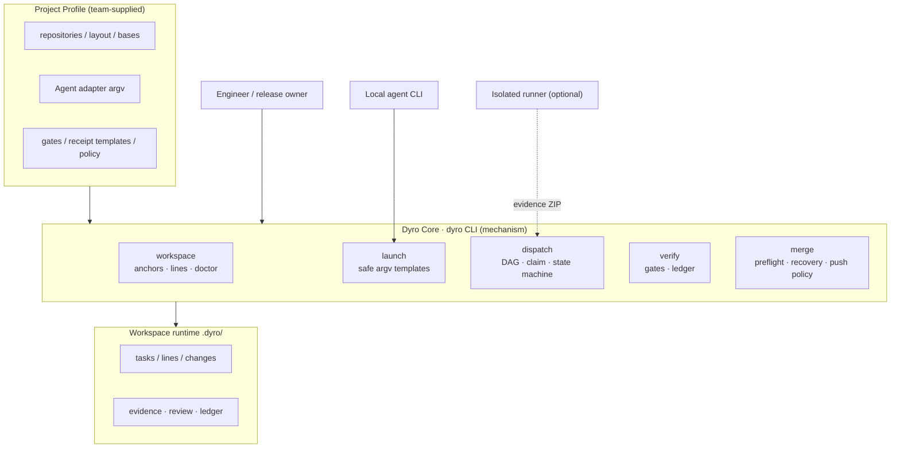
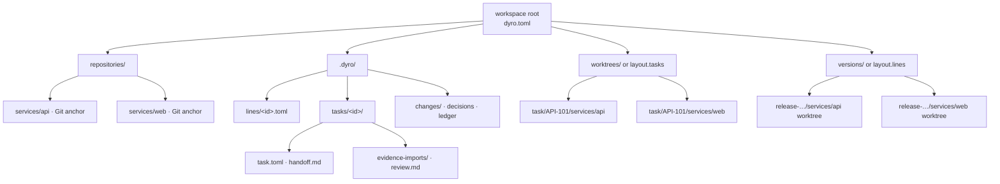
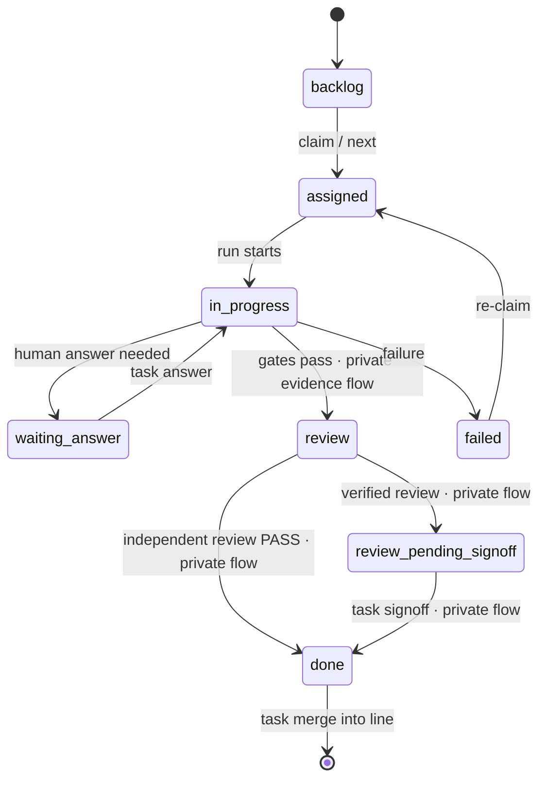
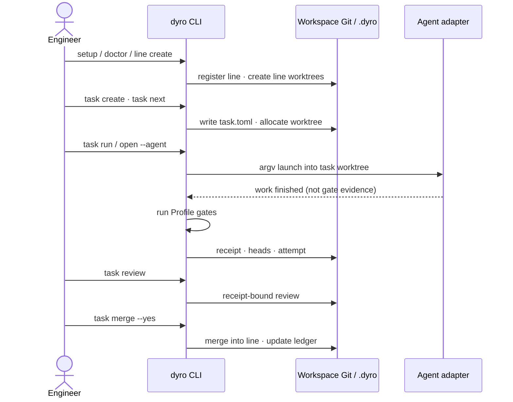
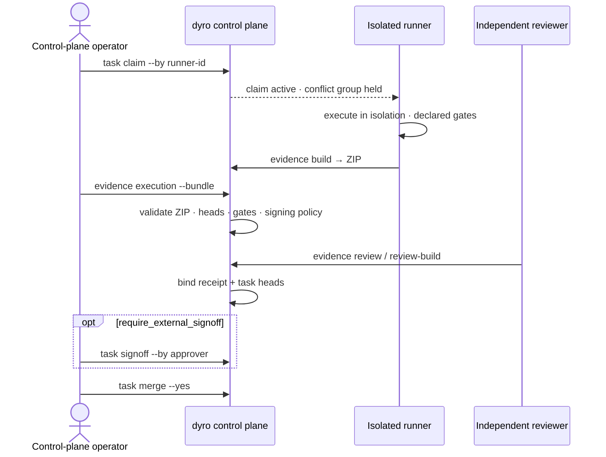
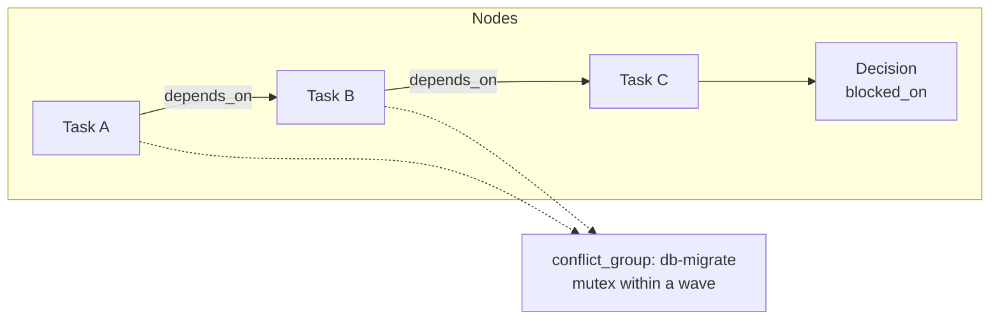
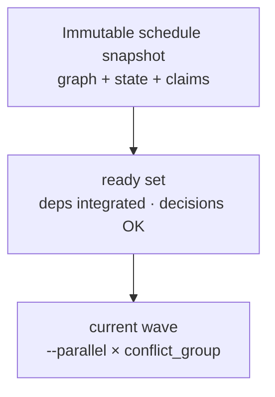
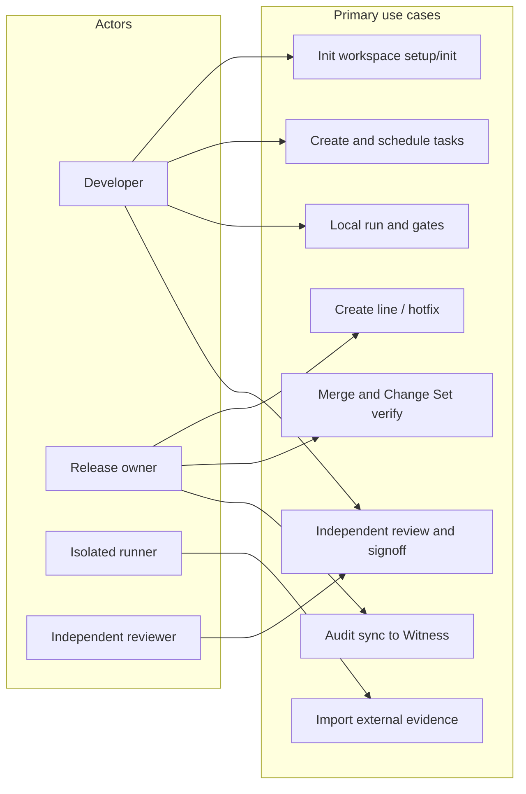
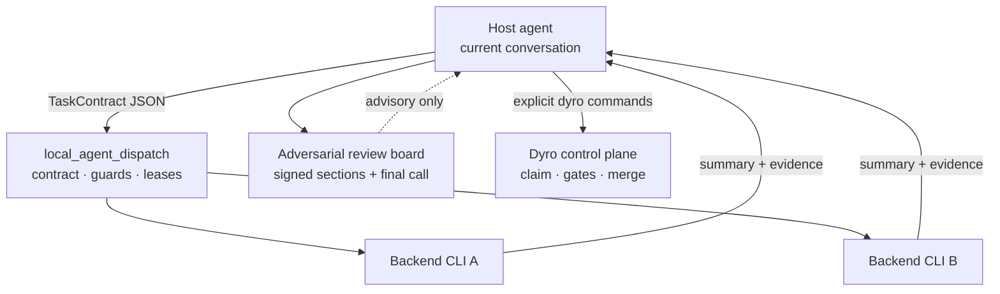
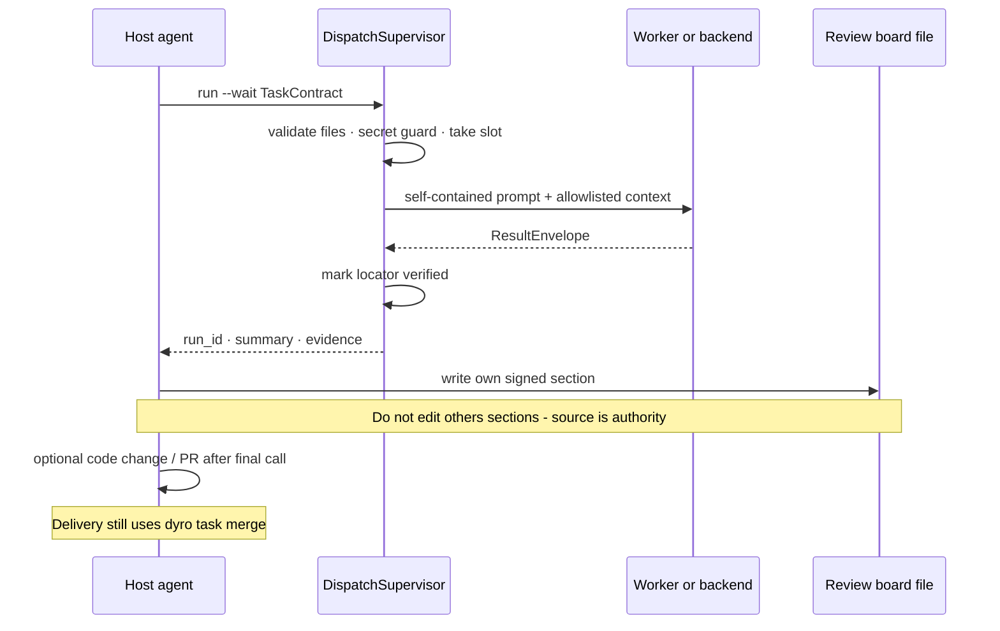

# DyroEngineeringFlow

[English](README.md) | [简体中文](README.zh-CN.md) | [한국어](README.ko.md) | [Español](README.es.md) | [Français](README.fr.md) | [Deutsch](README.de.md) | [Português (Brasil)](README.pt-BR.md) | [Русский](README.ru.md)

**DyroEngineeringFlow · `dyro` CLI** is a local-first engineering automation and delivery control platform for multi-repository teams. It brings development lines, Git worktrees, agent launchers, task gates, independent review, and merge audit into versioned workspace configuration.

**Keep engineering moving from task to delivery.**

DyroEngineeringFlow is not coupled to Codex, Claude, or any business domain. Each team supplies a `dyro.toml` Profile for repositories, layouts, agent adapters, and delivery policy; business rules, model cost, and release practices stay in that Profile.

## What it enforces

- A task belongs to exactly one development line—never a mixed feature or hotfix workspace.
- Each task runs in its own `git worktree` on a `task/<id>` branch.
- Gates are executed by the orchestrator; an agent's self-report is not evidence of success.
- Review is bound to the execution receipt and exact per-repository task HEADs; source drift invalidates it.
- A task needs independent review before it becomes `done`; merge and push require explicit confirmation by default.
- A completed dependency releases downstream work only after its exact task HEADs are integrated into the owning development line.
- Executable configuration is represented as argv arrays. The core never runs TOML-provided shell strings.

## Architecture and flow diagrams

The following diagrams render **directly on GitHub** as Mermaid (no image links). The control plane separates **team Profile** (repositories, adapters, gates, policy) from **Dyro Core** (workspace, launch, dispatch, verify, merge). Runtime state lives under `.dyro/`.

### Layered architecture



### Multi-repo workspace layout



### Task state machine



### Local delivery sequence



### External evidence sequence



### Task graph



### Scheduling wave



### Use-case overview



### Multi-agent layers (optional experiment)



Shipped with `dyro` (`dyro dispatch …`). Dispatch output is advisory; delivery still uses Dyro gates/merge. See `docs/agent-orchestration-discipline.md`.

### Multi-agent sequence (optional experiment)



## Quick start

For daily CLI use, install `dyro` from PyPI in an isolated `pipx` environment (Python 3.11 or later):

```bash
python3 -m pip install --user --upgrade pipx
python3 -m pipx ensurepath
# Open a new terminal after ensurepath, then:
pipx install dyro
dyro --version
```

To upgrade later, run `pipx upgrade dyro`. If your team manages Python packages through `pip` instead, use:

```bash
python3 -m pip install --user --upgrade dyro
```

To develop Dyro itself, use the repository's locked toolchain and its actual
test entry point (not the per-repository gate examples below):

```bash
uv sync --locked --all-extras --dev
uv run python -m unittest discover -s tests -t . -v
uv run ruff check src tests experiments
```

The checked-in Ruff baseline deliberately selects `E4`, `E7`, `E9`, and `F`.
Running a broader one-off selector such as `--select E,W,F` is an optional
style audit, not the project's configured CI contract.

For a first run, enter either a directory that contains repositories or an existing Git project, then run:

```bash
dyro setup
```

The first-run guide previews its plan before it writes anything. It scans repositories beneath the current directory and derives safe workspace-relative paths and development-line mounts. When invoked from a Git repository root, it offers to create a separate sibling Dyro workspace and clone from `origin`; it never moves, overwrites, or writes Dyro control state into the original project. In an empty directory it can accept an explicit Git remote.

If a team already publishes a workspace blueprint, a new teammate does not
need to reconstruct its repository layout or branch rules. Validate, preview,
and join it directly:

```bash
dyro blueprint validate git@github.com:acme/platform-blueprints.git --ref main
dyro join git@github.com:acme/platform-blueprints.git --ref main --dry-run
dyro join git@github.com:acme/platform-blueprints.git --ref main
```

`join` defaults to `~/DyroProjects/<suggested_directory>`, lets an interactive
user choose a development line, and asks for one final confirmation. Every
repository base in the blueprint is a full immutable commit SHA; anchors stay
detached and development lines receive isolated linked worktrees. Team-specific
URLs and rules live in the team's blueprint, never in Dyro Core. See the
[workspace blueprint contract](docs/workspace-blueprints.md).

Before the final confirmation, the guide shows whether it will create a Profile, clone missing repositories, create the first `dev` line, or register a detected supported Agent. It probes common local Agent commands, but registers only an adapter whose Core argv contract is audited; detected-but-unintegrated commands remain untouched. Entering `n` or leaving the guide creates nothing. Afterwards, run:

```bash
dyro next
```

This prints the one safe next action for the current state: create a line, configure an Agent, or start a ready line. Scripts and CI retain explicit flags and confirmation:

```bash
dyro setup . --name my-workspace --line dev --yes --non-interactive
```

Safe previews work both before and after the command, so the intuitive form is valid:

```bash
dyro --dry-run setup . --name my-workspace --no-line
dyro setup . --name my-workspace --no-line --dry-run
```

Add a repository later without opening `dyro.toml`:

```bash
dyro repo add repositories/services/payments
dyro repo list
```

Manage common delivery policy and Agent adapters without opening `dyro.toml`:

```bash
dyro config set policy.execution_mode external
dyro config get policy.execution_mode
dyro agent add ci-runner --preset noop
dyro agent test ci-runner
```

If a Profile contains remotes, missing repository anchors can be created safely:

```bash
dyro --dry-run bootstrap
dyro bootstrap --yes
dyro doctor
```

After setup, run `dyro`. The first run inside a project registers it in a reversible global home. From then on, the same command can resume a recent development line, hotfix, or existing task worktree from any directory—without remembering `--root`:

```bash
dyro
```

Interactive home always asks which coding tool to use before launching one,
even when only a single Profile adapter is configured. Configured adapters
remain eligible for Dyro execution contracts; supported commands detected only
on the local machine are labeled `open workspace only` and receive no gate,
review, merge, or push authority. Explicit commands such as
`dyro open dev --agent codex` continue to launch directly for scripts.

Projects can also be registered, selected, and inspected explicitly. These commands manage global entry points only; they never move or delete a project:

```bash
dyro workspace add /path/to/workspace --name my-project --default
dyro workspace list
dyro --workspace my-project open dev --agent codex
dyro --workspace my-project task open API-101 --agent codex
dyro status --all
dyro agent discover
```

`task open` only enters an existing task worktree after validating its anchor and branch topology. It does not execute the task or change task state. `agent discover` distinguishes configured launchable adapters from commands that were merely detected, and never bypasses Profile authorization. The existing `dyro start` line-and-agent selector remains available.

## Delivery workflow

Use explicit commands when scripting or leading a release:

```bash
dyro doctor
dyro line create release-2026-10 --base origin/main --yes
# Override the verified base only for repositories that need one.
dyro line create release-2026-10 --base origin/main --repo-base web=v2026.10.0 --yes
dyro open release-2026-10 --agent codex
dyro task create API-101 --title "Implement API contract" --line release-2026-10 --repository api
dyro task graph check --line release-2026-10
dyro task graph --line release-2026-10 --format mermaid
dyro task explain API-101
dyro task next
dyro task next --run --yes
dyro task attempts API-101
dyro task binding API-101
dyro task review API-101
dyro task merge API-101 --yes
dyro changeset create release-2026-10-ready --line release-2026-10
dyro changeset verify release-2026-10-ready
```

A production hotfix must state its verified production base; it never inherits a default branch implicitly:

```bash
dyro hotfix create incident-123 --base v2026.09.7 --repos api,web --yes
```

For a Profile whose execution and approval are run by a separate trusted system, set `policy.execution_mode = "external"` and `policy.require_external_signoff = true`. Local Dyro will then allow only planning; a review bound to the receipt and exact task HEADs must be signed explicitly before a task becomes `done`:

```bash
dyro task claim API-101 --by isolated-runner-1 --key-id runner-2026 \
  --output /secure-transfer/API-101.core-claim.json
# Long-running work must renew its bounded claim before expiry.
dyro task claim-renew API-101 --by isolated-runner-1 --lease-seconds 3600
# In the isolated runner: run declared gates and package receipt, logs, and exact HEADs.
dyro task evidence build API-101 --workspace /runner/workspace --receipt /runner/out/receipt.md --output /runner/out/API-101.zip
# In the control plane: validate and import the one portable package.
dyro task evidence execution API-101 --bundle /runner/out/API-101.zip
dyro task evidence review API-101 --file /review/out/review.md
dyro task signoff API-101 --by release-manager
# An abandoned assignment can be released explicitly.
dyro task claim-release API-101 --by isolated-runner-1
```

New evidence bundles must include `provenance.json`. Importing a pre-provenance legacy bundle is a deliberate migration action and requires `dyro task evidence execution API-101 --bundle ... --allow-legacy`. If an external runner returns `QUESTION`, record the answer with `dyro task answer API-101 --text "..."`; the existing claim is preserved and the task returns to `assigned` for the next evidence submission.

Inspect and safely retain immutable evidence generations:

```bash
dyro task evidence generations API-101
dyro --dry-run task evidence generations API-101 --prune --older-than-days 30 --keep 10
dyro task evidence generations API-101 --prune --older-than-days 30 --keep 10 --yes
```

For cryptographic runner and approver identity, generate keys outside the workspace, then install only public keys into purpose-separated trust stores:

```bash
dyro config set policy.execution_mode external
dyro config set policy.require_signed_execution true
dyro config set policy.require_signed_review true
dyro config set policy.require_external_signoff true
dyro config set policy.require_signed_signoff true

dyro key generate runner-2026 --private-key /secure/runner.pem --public-key /secure/runner.pub.pem
dyro key trust runner-2026 --purpose execution --public-key /secure/runner.pub.pem \
  --not-after 2027-01-01T00:00:00+00:00
dyro task claim API-101 --by isolated-runner-1 --key-id runner-2026 \
  --output /secure-transfer/API-101.core-claim.json
dyro task evidence build API-101 --workspace /runner/workspace --receipt /runner/out/receipt.md \
  --output /runner/out/API-101.zip --claim /runner/in/claim.json \
  --signing-key /secure/runner.pem --key-id runner-2026

dyro key generate reviewer-2026 --private-key /secure/reviewer.pem --public-key /secure/reviewer.pub.pem
dyro key trust reviewer-2026 --purpose review --public-key /secure/reviewer.pub.pem
dyro task evidence review-build API-101 --file /review/out/review.md --reviewer independent-reviewer \
  --output /review/out/review.json --signing-key /secure/reviewer.pem --key-id reviewer-2026
dyro task evidence review API-101 --file /review/out/review.json

dyro key generate approver-2026 --private-key /secure/approver.pem --public-key /secure/approver.pub.pem
dyro key trust approver-2026 --purpose signoff --public-key /secure/approver.pub.pem
dyro task signoff API-101 --by release-manager --signing-key /secure/approver.pem --key-id approver-2026

dyro key list --purpose execution --show-status
dyro key revoke runner-2026 --purpose execution --reason "runner retired"
dyro key audit
```

Sync the local trust audit chain to an independent Witness:

```bash
dyro key generate audit-client-2026 \
  --private-key /secure/audit-client.pem \
  --public-key /secure/audit-client.pub.pem
# Install audit-client.pub.pem on the Witness over an out-of-band secure channel.
dyro key trust witness-2026 \
  --purpose audit-receipt \
  --public-key witness-2026.pub.pem
dyro key trust witness-recovery \
  --purpose audit-recovery \
  --public-key witness-recovery.pub.pem

DYRO_AUDIT_TOKEN=... dyro key audit-sync \
  --witness primary \
  --endpoint https://audit.example.com/v1/dyro/batches \
  --signing-key /secure/audit-client.pem \
  --key-id audit-client-2026 \
  --witness-key-id witness-2026 \
  --witness-recovery-key-id witness-recovery
```

Even with no new events the command still sends a signed checkpoint; if a response is lost, the already-persisted pending batch is replayed as-is. The Witness must independently recompute the event chain, reject sequence or chain-head forks, issue a verifiable receipt, and write batches and receipts to immutable storage with retention lock. Protocol, key rotation, and deployment boundaries are documented in [Audit Witness protocol](docs/audit-witness-protocol.md).

The project ships a deployable standard-library Witness service: `dyro witness serve`. By default it requires a bearer token and TLS, and only advances the checkpoint after creating `records/<batch-sha256>.json`; crash recovery restores unfinished records. In production, separate mutable checkpoint storage from immutable `records` archives: use WORM/Object Lock only for the records archive, and durable mutable storage for the checkpoint. Key rotation, containers, and S3 Object Lock operations are covered in the [Witness deployment guide](docs/witness-deployment.md).

Signature enforcement is controlled explicitly by `policy.require_signed_execution`, `policy.require_signed_review`, and `policy.require_signed_signoff`; deleting every trusted key never disables an enabled policy. Signed execution claims bind `claim_id`, generation, runner, and execution key ID. Signature messages and execution plan hashes use RFC 8785 JSON Canonicalization Scheme bytes, so non-Python runners can reproduce the exact signed payload. Independent reviewers produce a signed JSON envelope with `dyro task evidence review-build`. Rotation is non-disruptive: trust the new key ID before switching signers, retain the old key during the overlap window, then revoke it through the workspace's controlled key-management process.

A minimal TypeScript reference signer and Python/Node interoperability vector live in `examples/typescript-runner/`. It demonstrates the exact canonical bytes, signature domain, Ed25519 call, and signature envelope expected by the control plane.

Every write-capable operation has a planning mode:

```bash
dyro --dry-run line create release-2026-10 --base origin/main
dyro --dry-run task run API-101
```

## Command map

| Command | Purpose |
| --- | --- |
| bare `dyro` / `home` / `workspace add/list/default/remove` | Resume recent work from any directory or manage reversible global project entries. |
| `blueprint validate` / `join` | Validate a team-owned generic blueprint and create a resumable isolated multi-repository workspace. |
| `setup` / `init --discover` / `init --wizard` / `repo add/list` / `bootstrap` / `start` | Onboard a teammate without TOML edits, manage anchors, and choose a line and agent. |
| `doctor` / `status` / `status --all` | Validate and display one or every registered workspace. |
| `line create/list` | Create, register, and inspect feature development lines. |
| `hotfix create` | Create a hotfix line from an explicit production base. |
| `changeset create/list/verify` | Pin and verify the exact clean Git heads that make up a multi-repository delivery. |
| `config get/set` / `agent list/add/test/discover` / `open` | Safely manage policy and adapters, discover or validate local commands, or open an agent in the correct line. |
| `task create/open/list/board/status/next/graph/explain/attempts/binding` | Create or enter tasks, manage state, validate the task graph, explain scheduling, inspect provenance, and output review bindings. |
| `task run/answer/gates/review/signoff` | Run tasks, resolve questions, execute gates, request independent review, and record external sign-off when a Profile requires it. |
| `task claim --output` / `task evidence build/execution/review` | One-time claim with a create-only runner handoff file, portable execution-evidence build/import, and receipt-bound review import. |
| `task merge` | Merge a reviewed task branch into its owning development line. |
| `task loop/daemon/stats/decisions` | Run controlled batches, scheduling, ledger reporting, and decision gates. |
| `dispatch` | Optional local multi-agent dispatch (L0–L4); advisory only — not a substitute for gates/merge. |

See the [architecture and Profile contract](docs/architecture.md),
the [workspace blueprint contract](docs/workspace-blueprints.md),
the [existing control-plane migration guide](docs/migrating-existing-control-planes.md),
and the [PyPI publishing runbook](docs/publishing.md) (maintainers) for implementation detail.

## Languages and documentation

This README is maintained in English, Simplified Chinese, Korean, Spanish, French, German, Brazilian Portuguese, and Russian. Commands, configuration keys, directory names, and safety rules are deliberately identical across translations. The current CLI messages and extended technical guides are primarily Chinese; multilingual README support does not claim that the runtime has language switching yet.

## Current boundaries

DyroEngineeringFlow provides a complete local workflow loop and policy controls for keeping stricter teams in planning-only local mode. It does not create remote repositories, ship SaaS credentials, or provision external runners; it does provide a portable evidence-package contract for external execution. The optional local dispatch harness ships as `experiments.local_agent_dispatch` and is available as `dyro dispatch …`; it is advisory and never replaces gates, review, signoff, or merge. Local multi-repository merges are preflighted and recovered as one operation; remote Git servers cannot provide atomic cross-repository push, so partial push failure is recorded for recovery. Automatic merge requires permission in both the task manifest and local policy. It is available under the [MIT License](LICENSE) and as [`dyro` on PyPI](https://pypi.org/project/dyro/).

### Graph Engineering (optional reading)

Some discussions call multi-node agent/work topologies **Graph Engineering** (as opposed to a single-agent loop). Dyro’s delivery topology is close in substance—TaskGraph, state machine, gates, review, merge, plus the optional `dispatch` subgraph—but the product identity remains a **delivery control plane**, not an agent-orchestration framework or a knowledge-graph/RAG stack. Dispatch output is advisory. See [architecture](docs/architecture.md#与-graph-engineering-的关系可选读).
