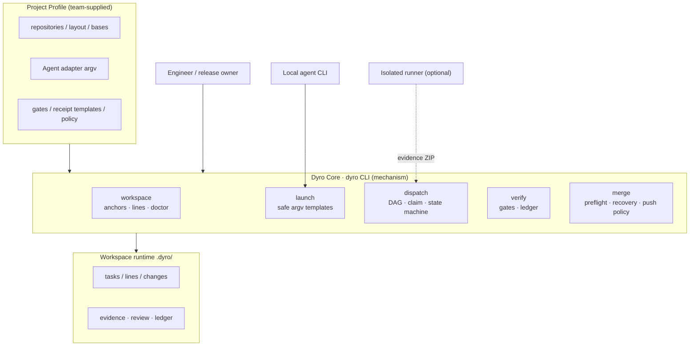
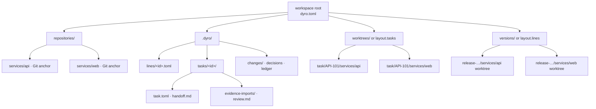
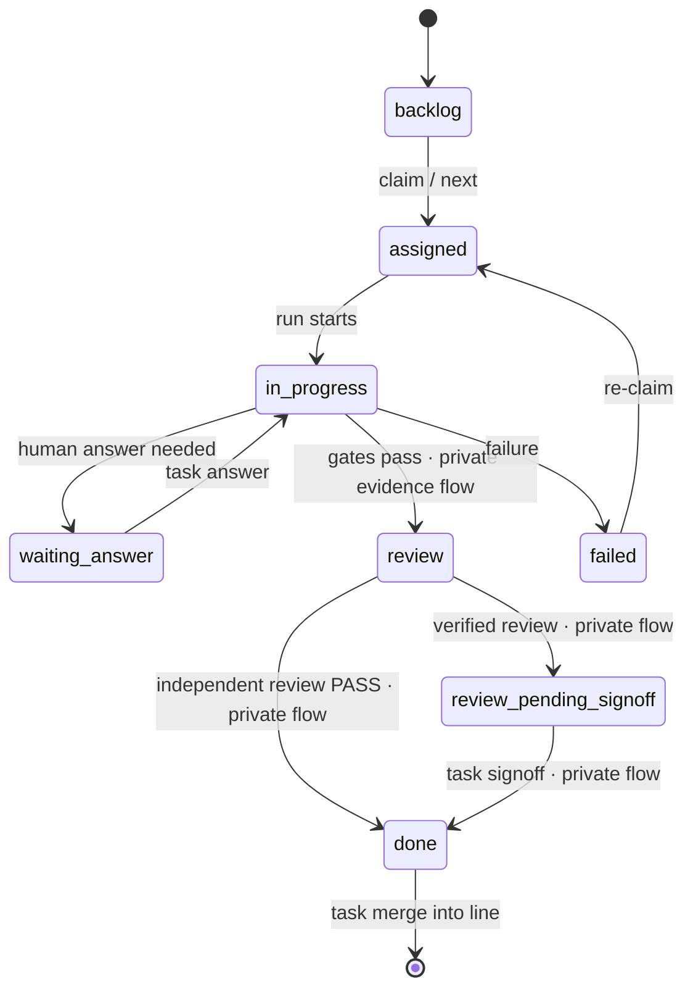
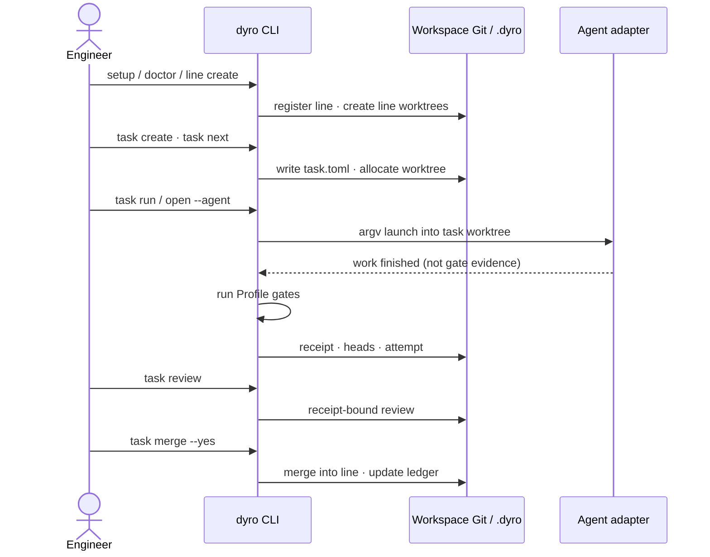
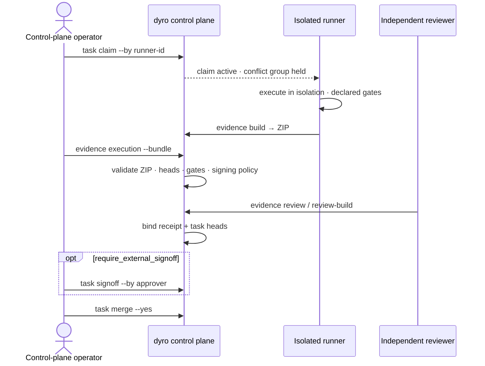
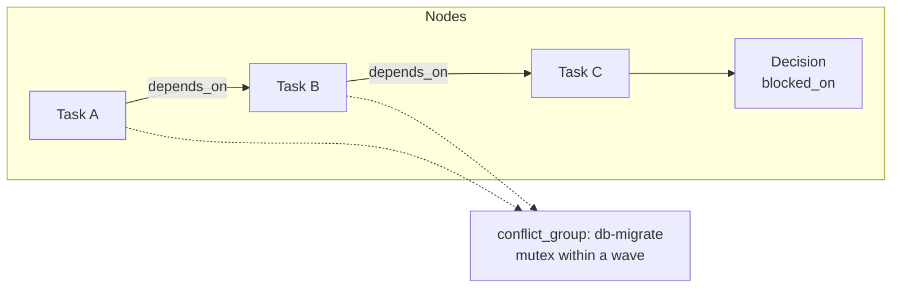
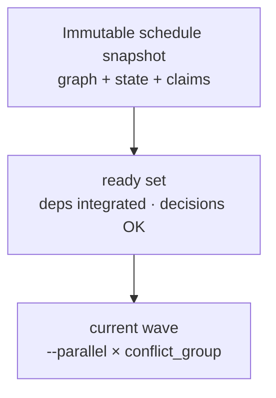
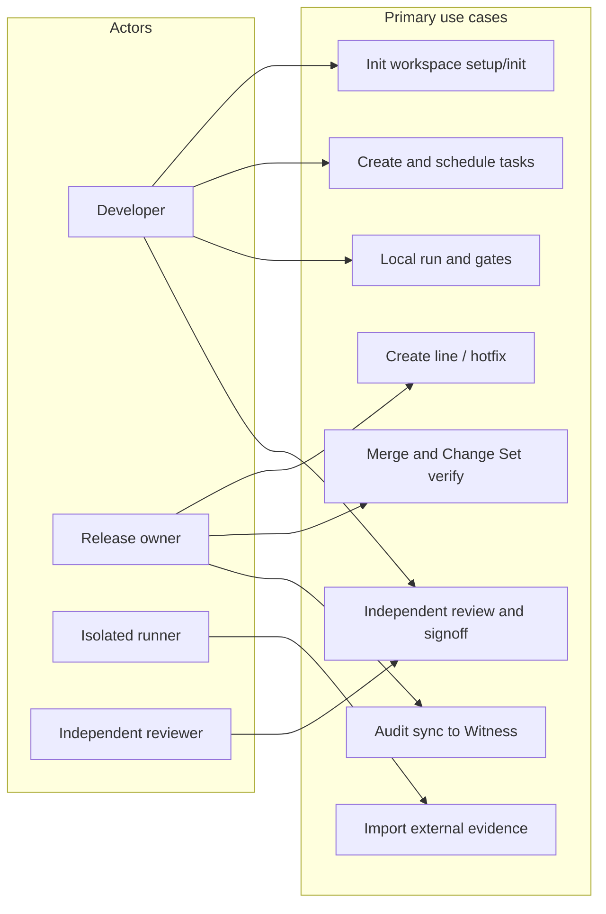
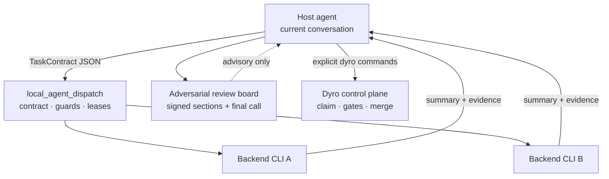
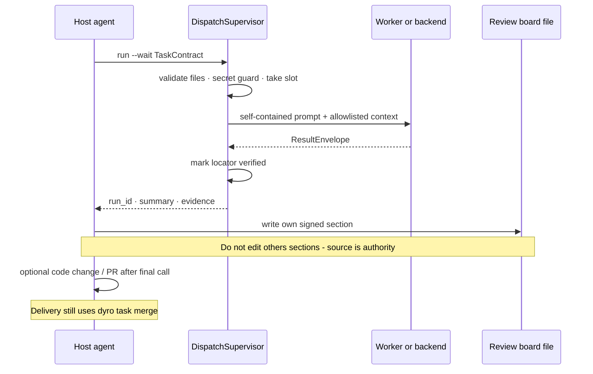

# DyroEngineeringFlow

[English](README.md) | [简体中文](README.zh-CN.md) | [한국어](README.ko.md) | [Español](README.es.md) | [Français](README.fr.md) | [Deutsch](README.de.md) | [Português (Brasil)](README.pt-BR.md) | [Русский](README.ru.md)

**DyroEngineeringFlow · `dyro` CLI** é uma plataforma local-first de automação de engenharia e controle de entrega para equipes multi-repositório. Une linhas de desenvolvimento, Git worktrees, lançadores de agentes, portões de tarefa, revisão independente e auditoria de merge em uma configuração de workspace versionada.

**Manter a engenharia em movimento da tarefa à entrega.**

Não está acoplado a Codex, Claude ou a qualquer domínio de negócio. Cada equipe fornece um Profile `dyro.toml` para repositórios, layouts, adaptadores de agente e política de entrega; regras de negócio, custo de modelos e práticas de release ficam nesse Profile.

## O que impõe

- Uma tarefa pertence a exatamente uma linha de desenvolvimento—nunca um workspace misto de feature e hotfix.
- Cada tarefa roda em seu próprio `git worktree` no branch `task/<id>`.
- Portões são executados pelo orquestrador; o auto-relato de um agente não é evidência de sucesso.
- A revisão liga-se ao recibo de execução e aos HEADs exatos por repositório; deriva de código a invalida.
- É preciso revisão independente antes de `done`; merge e push exigem confirmação explícita por padrão.
- Uma dependência concluída só libera o trabalho a jusante após seus HEADs de tarefa exatos estarem integrados na linha proprietária.
- Configuração executável é arrays argv. O núcleo nunca executa strings shell do TOML.

## Arquitetura e diagramas de fluxo

Os diagramas a seguir renderizam **diretamente no GitHub** como Mermaid (não são links de imagem). O plano de controle separa o **Profile da equipe** do **Dyro Core**. Estado de runtime em `.dyro/`. Rótulos dos diagramas em inglês (alinhados a CLI e chaves de config).

### Arquitetura em camadas



### Layout multi-repositório



### Máquina de estados de tarefas



### Sequência de entrega local



### Sequência de evidência externa



### Grafo de tarefas



### Onda de agendamento



### Visão de casos de uso



### Camadas multi-agente (experimento opcional)



Incluído com `dyro` (`dyro dispatch …`). Dispatch é apenas consultivo; entrega continua via gates/merge Dyro.

### Sequência multi-agente (experimento opcional)



## Início rápido

Para uso diário do CLI, instale `dyro` do PyPI em um ambiente `pipx` isolado (Python 3.11 ou superior):

```bash
python3 -m pip install --user --upgrade pipx
python3 -m pipx ensurepath
# Abra um novo terminal após ensurepath, então:
pipx install dyro
dyro --version
```

Para atualizar, execute `pipx upgrade dyro`. Se a equipe gerencia pacotes Python com `pip`:

```bash
python3 -m pip install --user --upgrade dyro
```

Coloque os repositórios em um workspace e use o caminho de onboarding para descobri-los, criar diretórios de estado seguros e a primeira linha de desenvolvimento em um comando:

```bash
mkdir my-workspace && cd my-workspace
# Clone ou mova primeiro seus repositórios Git sob este diretório.
dyro setup . --name my-workspace --line dev --yes
```

`setup` varre repositórios Git locais, registra caminhos relativos ao workspace, deriva montagens de linha e lê `origin` quando disponível—sem editar TOML. `--yes` só é necessário porque a primeira linha cria Git worktrees. Use `--no-line` se quiser só o Profile. Sem repositórios, use o assistente:

```bash
dyro init . --wizard --name my-workspace
```

Adicione um repositório depois sem abrir `dyro.toml`:

```bash
dyro repo add repositories/services/payments
dyro repo list
```

Gerencie política de entrega comum e adaptadores de Agent sem abrir `dyro.toml`:

```bash
dyro config set policy.execution_mode external
dyro config get policy.execution_mode
dyro agent add ci-runner --preset noop
dyro agent test ci-runner
```

Se o Profile contém remotes, anchors de repositório ausentes podem ser criados com segurança:

```bash
dyro --dry-run bootstrap
dyro bootstrap --yes
dyro doctor
```

Para um novo colega, o ponto de entrada normal é um comando. Ele verifica o workspace e escolhe linha e agente local:

```bash
dyro start
```

## Fluxo de entrega

Use comandos explícitos ao automatizar ou liderar um release:

```bash
dyro doctor
dyro line create release-2026-10 --base origin/main --yes
# Substitua a base verificada apenas nos repositórios que precisarem.
dyro line create release-2026-10 --base origin/main --repo-base web=v2026.10.0 --yes
dyro open release-2026-10 --agent codex
dyro task create API-101 --title "Implement API contract" --line release-2026-10 --repository api
dyro task graph check --line release-2026-10
dyro task graph --line release-2026-10 --format mermaid
dyro task explain API-101
dyro task next
dyro task next --run --yes
dyro task attempts API-101
dyro task binding API-101
dyro task review API-101
dyro task merge API-101 --yes
dyro changeset create release-2026-10-ready --line release-2026-10
dyro changeset verify release-2026-10-ready
```

Um hotfix de produção deve declarar sua base de produção verificada; nunca herda implicitamente um branch padrão:

```bash
dyro hotfix create incident-123 --base v2026.09.7 --repos api,web --yes
```

Se execução e aprovação forem de um sistema confiável separado, defina `policy.execution_mode = "external"` e `policy.require_external_signoff = true`. O Dyro local só permitirá planejamento; a revisão ligada ao recibo e aos HEADs exatos deve ser assinada explicitamente antes de `done`:

```bash
dyro task claim API-101 --by isolated-runner-1 --key-id runner-2026 \
  --output /secure-transfer/API-101.core-claim.json
# Trabalho longo deve renovar o claim limitado antes do vencimento.
dyro task claim-renew API-101 --by isolated-runner-1 --lease-seconds 3600
# No runner isolado: execute os gates declarados e empacote recibo, logs e HEADs exatos.
dyro task evidence build API-101 --workspace /runner/workspace --receipt /runner/out/receipt.md --output /runner/out/API-101.zip
# No plano de controle: valide e importe o único pacote portátil.
dyro task evidence execution API-101 --bundle /runner/out/API-101.zip
dyro task evidence review API-101 --file /review/out/review.md
dyro task signoff API-101 --by release-manager
# Uma atribuição abandonada pode ser liberada explicitamente.
dyro task claim-release API-101 --by isolated-runner-1
```

Novos pacotes de evidência devem incluir `provenance.json`. Importar legado sem provenance é migração deliberada e exige `--allow-legacy`. Se o runner retornar `QUESTION`, registre com `dyro task answer API-101 --text "..."`; o claim é preservado e a tarefa volta a `assigned`.

Inspecione e retenha com segurança gerações imutáveis de evidência:

```bash
dyro task evidence generations API-101
dyro --dry-run task evidence generations API-101 --prune --older-than-days 30 --keep 10
dyro task evidence generations API-101 --prune --older-than-days 30 --keep 10 --yes
```

Para identidade criptográfica de runner e aprovador, gere chaves fora do workspace e instale apenas chaves públicas em trust stores separadas por propósito:

```bash
dyro config set policy.execution_mode external
dyro config set policy.require_signed_execution true
dyro config set policy.require_signed_review true
dyro config set policy.require_external_signoff true
dyro config set policy.require_signed_signoff true

dyro key generate runner-2026 --private-key /secure/runner.pem --public-key /secure/runner.pub.pem
dyro key trust runner-2026 --purpose execution --public-key /secure/runner.pub.pem   --not-after 2027-01-01T00:00:00+00:00
dyro task claim API-101 --by isolated-runner-1 --key-id runner-2026 \
  --output /secure-transfer/API-101.core-claim.json
dyro task evidence build API-101 --workspace /runner/workspace --receipt /runner/out/receipt.md   --output /runner/out/API-101.zip --claim /runner/in/claim.json   --signing-key /secure/runner.pem --key-id runner-2026

dyro key generate reviewer-2026 --private-key /secure/reviewer.pem --public-key /secure/reviewer.pub.pem
dyro key trust reviewer-2026 --purpose review --public-key /secure/reviewer.pub.pem
dyro task evidence review-build API-101 --file /review/out/review.md --reviewer independent-reviewer   --output /review/out/review.json --signing-key /secure/reviewer.pem --key-id reviewer-2026
dyro task evidence review API-101 --file /review/out/review.json

dyro key generate approver-2026 --private-key /secure/approver.pem --public-key /secure/approver.pub.pem
dyro key trust approver-2026 --purpose signoff --public-key /secure/approver.pub.pem
dyro task signoff API-101 --by release-manager --signing-key /secure/approver.pem --key-id approver-2026

dyro key list --purpose execution --show-status
dyro key revoke runner-2026 --purpose execution --reason "runner retired"
dyro key audit
```

Sincronize a cadeia de auditoria de confiança local com um Witness independente:

```bash
dyro key generate audit-client-2026   --private-key /secure/audit-client.pem   --public-key /secure/audit-client.pub.pem
# Instale audit-client.pub.pem no Witness por canal seguro fora de banda.
dyro key trust witness-2026   --purpose audit-receipt   --public-key witness-2026.pub.pem
dyro key trust witness-recovery   --purpose audit-recovery   --public-key witness-recovery.pub.pem

DYRO_AUDIT_TOKEN=... dyro key audit-sync   --witness primary   --endpoint https://audit.example.com/v1/dyro/batches   --signing-key /secure/audit-client.pem   --key-id audit-client-2026   --witness-key-id witness-2026   --witness-recovery-key-id witness-recovery
```

Mesmo sem novos eventos, o comando envia um checkpoint assinado; se a resposta for perdida, o batch pendente já persistido é reenviado como está. O Witness deve recomputar a cadeia, rejeitar forks de sequência ou cabeça, emitir recibo verificável e gravar batches/recibos em armazenamento imutável com retenção. Ver [Audit Witness protocol](docs/audit-witness-protocol.md).

Serviço Witness incluso: `dyro witness serve`. Por padrão exige bearer token e TLS; só avança o checkpoint após `records/<batch-sha256>.json`. Em produção, separe checkpoint mutável de arquivos `records` imutáveis. Ver [Witness deployment](docs/witness-deployment.md).

A obrigatoriedade de assinatura é controlada por `policy.require_signed_execution`, `policy.require_signed_review` e `policy.require_signed_signoff`; apagar todas as chaves de confiança não desativa uma política ativa. Claims de execução assinados ligam `claim_id`, geração, runner e ID de chave. Mensagens e hashes de plano usam RFC 8785 JCS. Revisores independentes geram envelope JSON assinado com `dyro task evidence review-build`. Rotação sem interrupção: confie o novo key ID, mantenha o antigo na sobreposição e revogue pelo processo controlado do workspace.

Um assinador TypeScript de referência e o vetor de interoperabilidade Python/Node estão em `examples/typescript-runner/`.

Toda operação com escrita tem modo de planejamento:

```bash
dyro --dry-run line create release-2026-10 --base origin/main
dyro --dry-run task run API-101
```

## Mapa de comandos

| Comando | Propósito |
| --- | --- |
| `setup` / `init --discover` / `init --wizard` / `repo add/list` / `bootstrap` / `start` | Onboarding sem TOML, gerir anchors e escolher linha e agente. |
| `doctor` / `status` | Validar e exibir o estado do plano de controle. |
| `line create/list` | Criar, registrar e inspecionar linhas de feature. |
| `hotfix create` | Criar linha hotfix a partir de base de produção explícita. |
| `changeset create/list/verify` | Fixar e verificar HEADs Git limpos exatos de uma entrega multi-repo. |
| `config get/set` / `agent list/add/test` / `open` | Gerir política e adaptadores, validar executável ou abrir agente na linha correta. |
| `task create/list/board/status/next/graph/explain/attempts/binding` | Manifestos e estado, grafo, agendamento, provenance e vínculo exato de revisão. |
| `task run/answer/gates/review/signoff` | Executar tarefas, responder, gates, revisão independente e sign-off externo se necessário. |
| `task claim --output` / `task evidence build/execution/review` | Claim único com arquivo de entrega somente-criação, build/import de evidência portátil e import de revisão ligada ao recibo. |
| `task merge` | Mesclar o branch de tarefa revisado na linha proprietária. |
| `task loop/daemon/stats/decisions` | Lotes controlados, agendamento, ledger e portões de decisão. |
| `dispatch` | Despacho multi-agente local opcional (L0–L4); apenas consultivo — não substitui gates/merge. |

Detalhes: [arquitetura e Profile](docs/architecture.md), [diagramas](docs/diagrams.en.md), [migração](docs/migrating-existing-control-planes.md), [publicação PyPI](docs/publishing.md) (maintainers).

## Idiomas e documentação

Este README é mantido em inglês, chinês simplificado, coreano, espanhol, francês, alemão, português do Brasil e russo. Comandos, chaves de configuração, nomes de diretório e regras de segurança são idênticos em todas as traduções. Mensagens do CLI e guias técnicos estendidos são principalmente em chinês; README multilíngue não implica troca de idioma no runtime.

## Limites atuais

DyroEngineeringFlow fornece um fluxo local completo e controles de política para equipes em modo de planejamento. Não cria repositórios remotos, não transporta credenciais SaaS nem provisiona runners externos; mantém um contrato portátil de pacote de evidências para execução externa. O dispatch local opcional de agentes é distribuído como `experiments.local_agent_dispatch` e usado com `dyro dispatch …`; ele é apenas consultivo e nunca substitui gates, review, signoff ou merge. Merges locais multi-repo são pré-validados e recuperados como uma operação; servidores Git remotos não oferecem push atômico multi-repo, portanto uma falha parcial é registrada. O merge automático requer permissão no manifesto da tarefa e na política local. [MIT License](LICENSE) e [`dyro` no PyPI](https://pypi.org/project/dyro/).
