# DyroEngineeringFlow

[English](README.md) | [简体中文](README.zh-CN.md) | [한국어](README.ko.md) | [Español](README.es.md) | [Français](README.fr.md) | [Deutsch](README.de.md) | [Português (Brasil)](README.pt-BR.md) | [Русский](README.ru.md)

**DyroEngineeringFlow · `dyro` CLI** — local-first платформа автоматизации инженерии и контроля поставки для multi-repository команд. Она объединяет линии разработки, Git worktree, запуск агентов, gate задач, независимый review и аудит merge в версионируемой конфигурации workspace.

**Держать инженерию в движении от задачи до поставки.**

Не привязан к Codex, Claude или бизнес-домену. Каждая команда задаёт Profile `dyro.toml` для репозиториев, layout, адаптеров агентов и политики поставки; бизнес-правила, стоимость моделей и практики релиза остаются в Profile.

## Что обеспечивается

- Задача принадлежит ровно одной линии разработки — без смешанного feature/hotfix workspace.
- Каждая задача выполняется в собственном `git worktree` на ветке `task/<id>`.
- Gate выполняет оркестратор; самоотчёт агента не является доказательством успеха.
- Review привязан к execution receipt и точным task HEAD по репозиториям; дрейф исходников аннулирует его.
- Для `done` нужен независимый review; merge и push по умолчанию требуют явного подтверждения.
- Завершённая зависимость освобождает downstream только после интеграции точных task HEAD в линию-владельца.
- Исполняемая конфигурация — argv-массивы. Ядро никогда не выполняет shell-строки из TOML.

## Архитектура и блок-схемы

Диаграммы ниже **рендерятся прямо на GitHub** как Mermaid (это не ссылки на картинки). Control plane разделяет **командный Profile** и **Dyro Core**. Runtime — в `.dyro/`. Подписи на диаграммах на английском (как CLI и ключи конфигурации).

### Многослойная архитектура

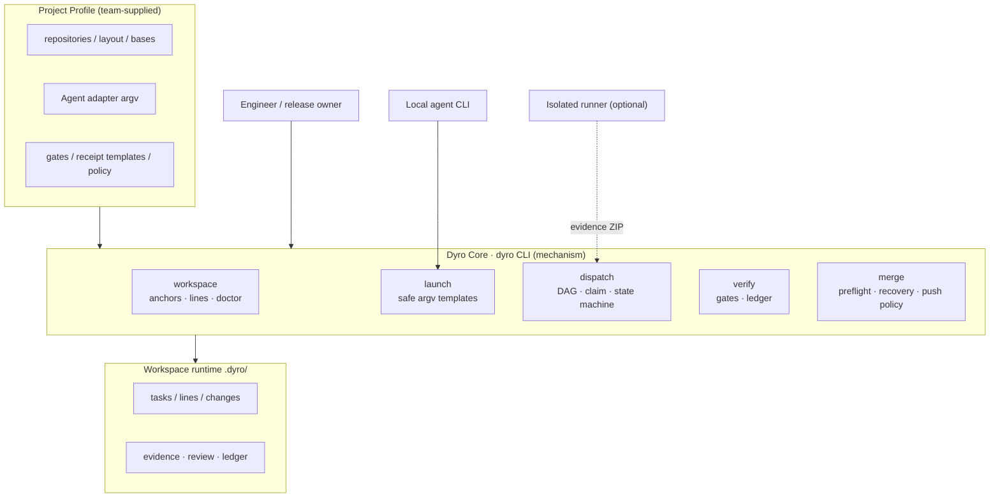

### Layout multi-repo workspace

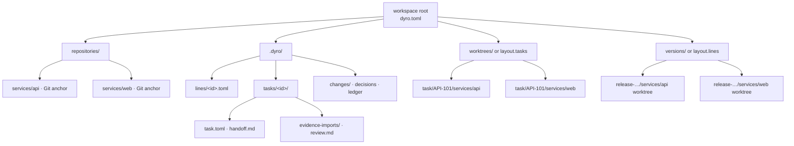

### Автомат состояний задачи

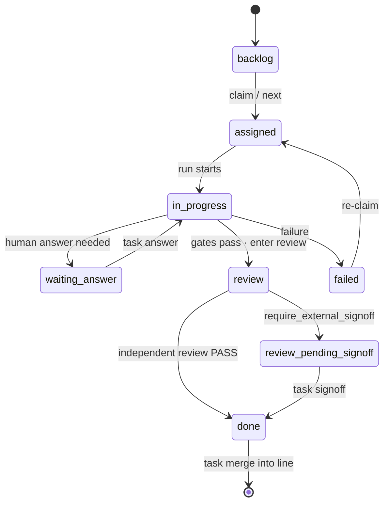

### Локальная последовательность поставки

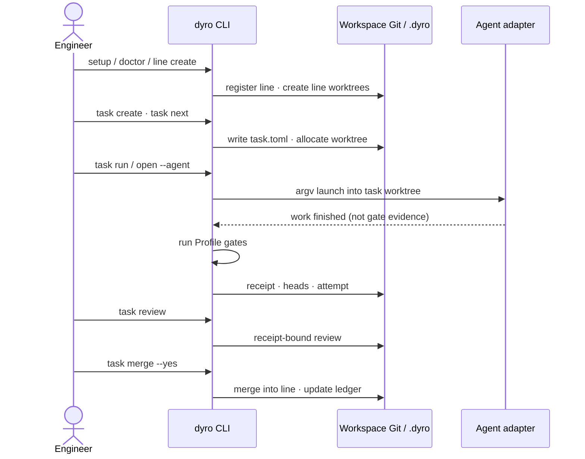

### Последовательность внешней evidence

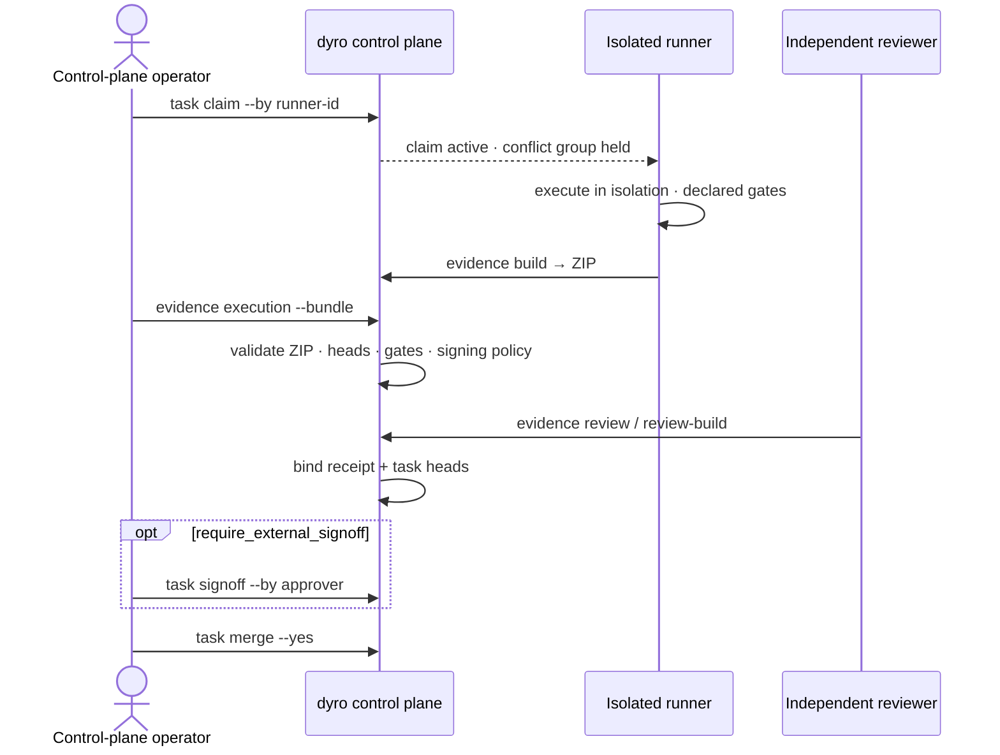

### Граф задач

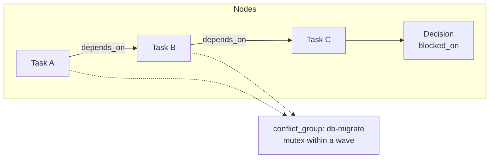

### Волна планирования

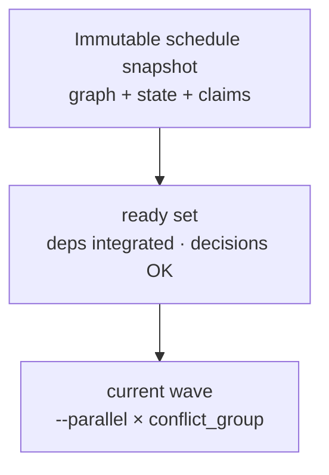

### Обзор use case

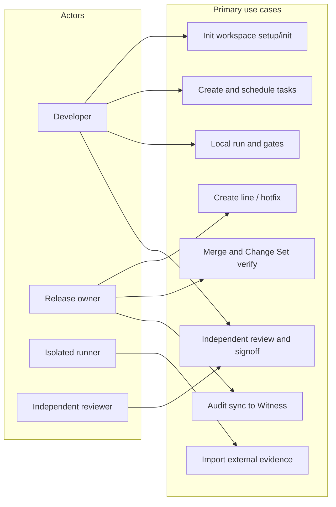

### Слои multi-agent (опциональный эксперимент)

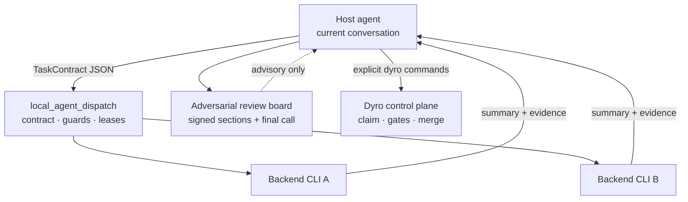

Не входит в установленный пакет `dyro`. Dispatch только рекомендательный.

### Последовательность multi-agent (опциональный эксперимент)

```mermaid
sequenceDiagram
  participant H as Host agent
  participant S as DispatchSupervisor
  participant W as Worker / backend
  participant P as Review board file

  H->>S: run --wait TaskContract
  S->>S: validate files · secret guard · take slot
  S->>W: self-contained prompt + allowlisted context
  W-->>S: ResultEnvelope
  S->>S: mark locator verified
  S-->>H: run_id · summary · evidence
  H->>P: write own signed section
  Note over H,P: Never edit others' sections; source is authority
  H->>H: optional code change / PR after final call
  Note over H: Delivery still goes through dyro task/merge
```

### Внешний semantic runtime (опциональный эксперимент)

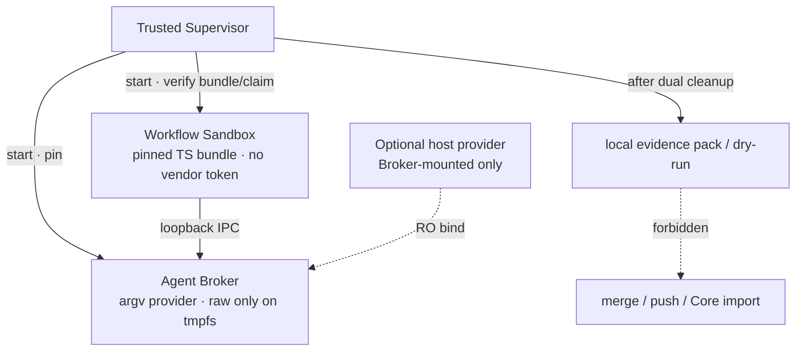

Не Core. `experiments/external_workflow_runner/`. Stage5 `NOT_READY`.

### Последовательность semantic runtime (опциональный эксперимент)

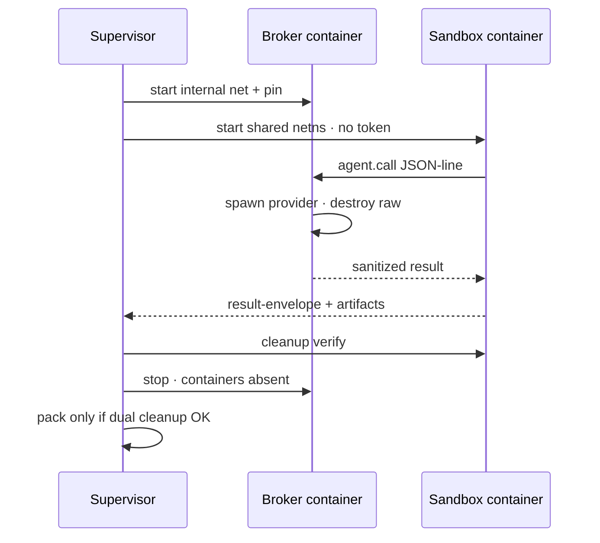

## Быстрый старт

Для повседневного CLI установите `dyro` из PyPI в изолированное окружение `pipx` (Python 3.11+):

```bash
python3 -m pip install --user --upgrade pipx
python3 -m pipx ensurepath
# После ensurepath откройте новый терминал, затем:
pipx install dyro
dyro --version
```

Для обновления: `pipx upgrade dyro`. Если команда использует `pip`:

```bash
python3 -m pip install --user --upgrade dyro
```

Разместите репозитории в workspace и используйте путь для новичков: обнаружение, безопасные каталоги состояния и первая линия разработки одной командой:

```bash
mkdir my-workspace && cd my-workspace
# Сначала клонируйте или перенесите Git-репозитории в этот каталог.
dyro setup . --name my-workspace --line dev --yes
```

`setup` сканирует локальные Git-репозитории, записывает относительные пути, выводит mounts линии и читает `origin` при наличии — без правки TOML. `--yes` нужен только потому, что первая линия создаёт Git worktree. `--no-line` — только Profile. Если репозиториев ещё нет — wizard:

```bash
dyro init . --wizard --name my-workspace
```

Добавить репозиторий позже без открытия `dyro.toml`:

```bash
dyro repo add repositories/services/payments
dyro repo list
```

Управлять общей политикой поставки и Agent-адаптерами без `dyro.toml`:

```bash
dyro config set policy.execution_mode external
dyro config get policy.execution_mode
dyro agent add ci-runner --preset noop
dyro agent test ci-runner
```

Если в Profile есть remotes, отсутствующие anchors репозиториев можно создать безопасно:

```bash
dyro --dry-run bootstrap
dyro bootstrap --yes
dyro doctor
```

Для нового участника обычная точка входа — одна команда. Она проверяет workspace, затем выбирает линию и локального агента:

```bash
dyro start
```

## Поток поставки

Используйте явные команды при скриптах или ведении релиза:

```bash
dyro doctor
dyro line create release-2026-10 --base origin/main --yes
# Переопределяйте проверенную base только для нужных репозиториев.
dyro line create release-2026-10 --base origin/main --repo-base web=v2026.10.0 --yes
dyro open release-2026-10 --agent codex
dyro task create API-101 --title "Implement API contract" --line release-2026-10 --repository api
dyro task graph check --line release-2026-10
dyro task graph --line release-2026-10 --format mermaid
dyro task explain API-101
dyro task next
dyro task next --run --yes
dyro task attempts API-101
dyro task binding API-101
dyro task review API-101
dyro task merge API-101 --yes
dyro changeset create release-2026-10-ready --line release-2026-10
dyro changeset verify release-2026-10-ready
```

Production hotfix должен указать проверенную production base; он никогда не наследует default branch неявно:

```bash
dyro hotfix create incident-123 --base v2026.09.7 --repos api,web --yes
```

Если исполнение и утверждение выполняет отдельная доверенная система, задайте `policy.execution_mode = "external"` и `policy.require_external_signoff = true`. Локальный Dyro разрешит только планирование; review, привязанный к receipt и точным task HEAD, должен быть явно подписан до `done`:

```bash
dyro task claim API-101 --by isolated-runner-1 --key-id runner-2026
# Долгая работа должна продлевать bounded claim до истечения.
dyro task claim-renew API-101 --by isolated-runner-1 --lease-seconds 3600
# В изолированном runner: выполнить заявленные gates и упаковать receipt, логи и точные HEAD.
dyro task evidence build API-101 --workspace /runner/workspace --receipt /runner/out/receipt.md --output /runner/out/API-101.zip
# На control plane: проверить и импортировать один portable-пакет.
dyro task evidence execution API-101 --bundle /runner/out/API-101.zip
dyro task evidence review API-101 --file /review/out/review.md
dyro task signoff API-101 --by release-manager
# Брошенное назначение можно явно освободить.
dyro task claim-release API-101 --by isolated-runner-1
```

Новые evidence-пакеты должны включать `provenance.json`. Импорт legacy без provenance — осознанная миграция (`--allow-legacy`). Если runner вернул `QUESTION`, запишите ответ через `dyro task answer API-101 --text "..."`; claim сохраняется, задача возвращается в `assigned`.

Просматривайте и безопасно храните неизменяемые поколения evidence:

```bash
dyro task evidence generations API-101
dyro --dry-run task evidence generations API-101 --prune --older-than-days 30 --keep 10
dyro task evidence generations API-101 --prune --older-than-days 30 --keep 10 --yes
```

Криптографическая идентичность runner/approver: ключи вне workspace, в trust store по назначению — только публичные ключи:

```bash
dyro config set policy.execution_mode external
dyro config set policy.require_signed_execution true
dyro config set policy.require_signed_review true
dyro config set policy.require_external_signoff true
dyro config set policy.require_signed_signoff true

dyro key generate runner-2026 --private-key /secure/runner.pem --public-key /secure/runner.pub.pem
dyro key trust runner-2026 --purpose execution --public-key /secure/runner.pub.pem   --not-after 2027-01-01T00:00:00+00:00
dyro task claim API-101 --by isolated-runner-1 --key-id runner-2026
dyro task evidence build API-101 --workspace /runner/workspace --receipt /runner/out/receipt.md   --output /runner/out/API-101.zip --claim /runner/in/claim.json   --signing-key /secure/runner.pem --key-id runner-2026

dyro key generate reviewer-2026 --private-key /secure/reviewer.pem --public-key /secure/reviewer.pub.pem
dyro key trust reviewer-2026 --purpose review --public-key /secure/reviewer.pub.pem
dyro task evidence review-build API-101 --file /review/out/review.md --reviewer independent-reviewer   --output /review/out/review.json --signing-key /secure/reviewer.pem --key-id reviewer-2026
dyro task evidence review API-101 --file /review/out/review.json

dyro key generate approver-2026 --private-key /secure/approver.pem --public-key /secure/approver.pub.pem
dyro key trust approver-2026 --purpose signoff --public-key /secure/approver.pub.pem
dyro task signoff API-101 --by release-manager --signing-key /secure/approver.pem --key-id approver-2026

dyro key list --purpose execution --show-status
dyro key revoke runner-2026 --purpose execution --reason "runner retired"
dyro key audit
```

Синхронизируйте локальную trust-audit цепочку с независимым Witness:

```bash
dyro key generate audit-client-2026   --private-key /secure/audit-client.pem   --public-key /secure/audit-client.pub.pem
# Установите audit-client.pub.pem на Witness по защищённому out-of-band каналу.
dyro key trust witness-2026   --purpose audit-receipt   --public-key witness-2026.pub.pem
dyro key trust witness-recovery   --purpose audit-recovery   --public-key witness-recovery.pub.pem

DYRO_AUDIT_TOKEN=... dyro key audit-sync   --witness primary   --endpoint https://audit.example.com/v1/dyro/batches   --signing-key /secure/audit-client.pem   --key-id audit-client-2026   --witness-key-id witness-2026   --witness-recovery-key-id witness-recovery
```

Даже без новых событий команда отправляет подписанный checkpoint; при потере ответа уже сохранённый pending batch переигрывается как есть. Witness должен независимо пересчитать цепочку, отвергать forks последовательности/головы, выдавать проверяемый receipt и писать batch/receipt в immutable storage с retention. См. [Audit Witness protocol](docs/audit-witness-protocol.md).

Встроенный сервис Witness: `dyro witness serve`. По умолчанию: bearer token и TLS; checkpoint двигается только после `records/<batch-sha256>.json`. В production отделяйте mutable checkpoint от immutable `records`. См. [Witness deployment](docs/witness-deployment.md).

Обязательность подписи задаётся `policy.require_signed_execution`, `policy.require_signed_review` и `policy.require_signed_signoff`; удаление всех trusted keys не отключает включённую политику. Подписанные execution claim связывают `claim_id`, generation, runner и execution key ID. Сообщения и хеши плана — RFC 8785 JCS. Независимые ревьюеры создают подписанный JSON envelope через `dyro task evidence review-build`. Ротация без простоя: сначала trust нового key ID, держать старый в окне пересечения, затем revoke через controlled процесс workspace.

Минимальный TypeScript reference signer и Python/Node interop-вектор: `examples/typescript-runner/`.

У каждой операции с записью есть режим планирования:

```bash
dyro --dry-run line create release-2026-10 --base origin/main
dyro --dry-run task run API-101
```

## Карта команд

| Команда | Назначение |
| --- | --- |
| `setup` / `init --discover` / `init --wizard` / `repo add/list` / `bootstrap` / `start` | Онбординг без TOML, anchors, выбор линии и агента. |
| `doctor` / `status` | Проверить и показать состояние control plane. |
| `line create/list` | Создать, зарегистрировать и просмотреть feature-линии. |
| `hotfix create` | Создать hotfix-линию от явной production base. |
| `changeset create/list/verify` | Зафиксировать и проверить точные чистые Git HEAD multi-repo поставки. |
| `config get/set` / `agent list/add/test` / `open` | Безопасно управлять политикой и адаптерами, проверить executable или открыть агента на нужной линии. |
| `task create/list/board/status/next/graph/explain/attempts/binding` | Манифесты и состояние, граф, scheduling, provenance и точная привязка review. |
| `task run/answer/gates/review/signoff` | Запуск задач, ответы, gates, независимый review и external sign-off при необходимости. |
| `task claim` / `task evidence build/execution/review` | Одноразовый claim, portable execution evidence build/import и import review, привязанного к receipt. |
| `task merge` | Слить reviewed task branch в линию-владельца. |
| `task loop/daemon/stats/decisions` | Контролируемые batch, scheduling, ledger и decision gates. |

Подробности: [architecture and Profile](docs/architecture.md), [diagrams](docs/diagrams.en.md), [migration](docs/migrating-existing-control-planes.md), [PyPI publishing](docs/publishing.md) (maintainers).

## Языки и документация

Этот README поддерживается на английском, упрощённом китайском, корейском, испанском, французском, немецком, бразильском португальском и русском. Команды, ключи конфигурации, имена каталогов и правила безопасности одинаковы во всех переводах. Сообщения CLI и расширенные технические гайды сейчас в основном на китайском; мультиязычный README не означает переключение языка runtime.

## Текущие границы

DyroEngineeringFlow даёт полный локальный workflow-контур и policy-контроль для более строгих команд в режиме только планирования на локальной машине. Он не создаёт удалённые репозитории, не несёт SaaS credentials и не provision'ит внешний runner; он даёт portable evidence-package contract. Опциональные эксперименты в `experiments/` (external workflow runner Stage0–5, local agent dispatch L0–L4) **не** входят в установленный пакет `dyro` — см. ADR в `docs/adr/`. Локальные multi-repo merge preflight'ятся и восстанавливаются как одна операция; удалённые Git-серверы не дают атомарный multi-repo push, поэтому частичный сбой push записывается для recovery. Автоматический merge требует разрешения и в task manifest, и в локальной policy. [MIT License](LICENSE) и [`dyro` на PyPI](https://pypi.org/project/dyro/).
