# DyroEngineeringFlow

[English](README.md) | [简体中文](README.zh-CN.md) | [한국어](README.ko.md) | [Español](README.es.md) | [Français](README.fr.md) | [Deutsch](README.de.md) | [Português (Brasil)](README.pt-BR.md) | [Русский](README.ru.md)

**DyroEngineeringFlow · `dyro` CLI** 是面向多仓团队的本地优先工程自动化与交付控制平台。它将开发线、Git worktree、Agent 启动、任务门禁、独立复核和合并审计统一到可版本化的工作区配置中。

**让工程从任务到交付持续流转。**

DyroEngineeringFlow 不绑定 Codex、Claude 或任何业务领域。每个团队通过 `dyro.toml` Profile 定义仓库、目录布局、Agent adapter 与交付策略；业务规则、模型成本和发布实践始终留在各自的 Profile 中。

## 核心约束

- 一个任务只能属于一条开发线，不能混用功能版本与 Hotfix 工作区。
- 每个任务在独立 `git worktree` 的 `task/<id>` 分支中执行。
- 门禁由编排器实际执行，不能只采信 Agent 的口头回执。
- 复核同时绑定执行回执和各仓精确任务 HEAD；源码漂移会使复核失效。
- 任务通过独立复核后才能变为 `done`；默认必须显式确认才能合并或推送。
- 已完成的依赖只有在其精确任务 HEAD 合入所属开发线后，才会释放下游工作。
- 可执行配置使用 argv 数组，核心不会执行来自 TOML 的 shell 字符串。

## 架构与流程图

以下图示在 GitHub 上以 **Mermaid 直接渲染**（不是图片链接）。控制面把**团队 Profile**（仓库、adapter、gates、策略）与 **Dyro Core**（workspace、launch、dispatch、verify、merge）分开；运行态在 `.dyro/`。图例为中文；命令名、配置键与状态名与 CLI 一致。

### 分层架构

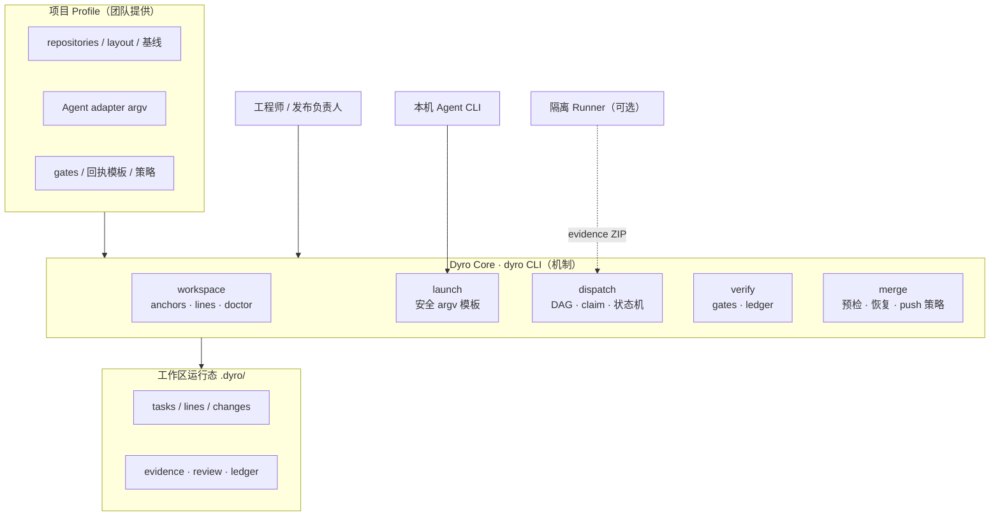

### 多仓工作区目录

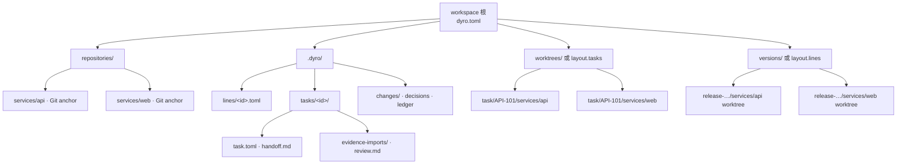

### 任务状态机

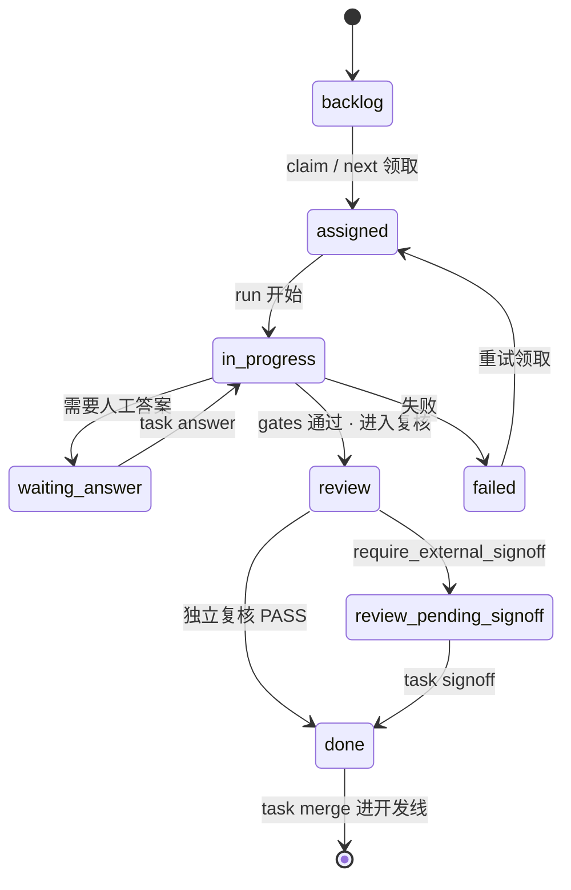

### 本地交付时序

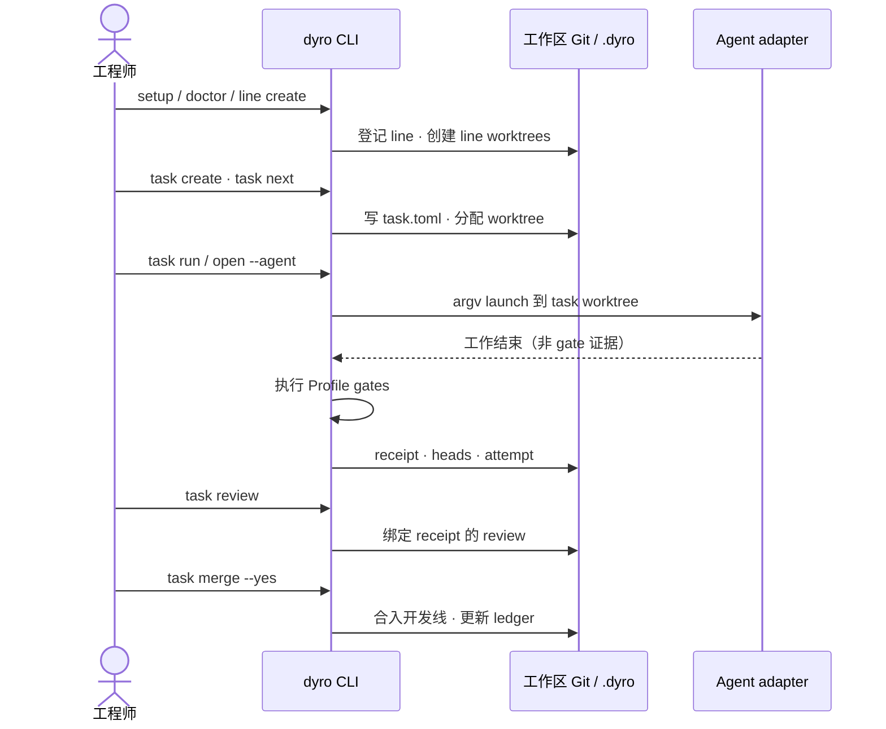

### 外部证据时序

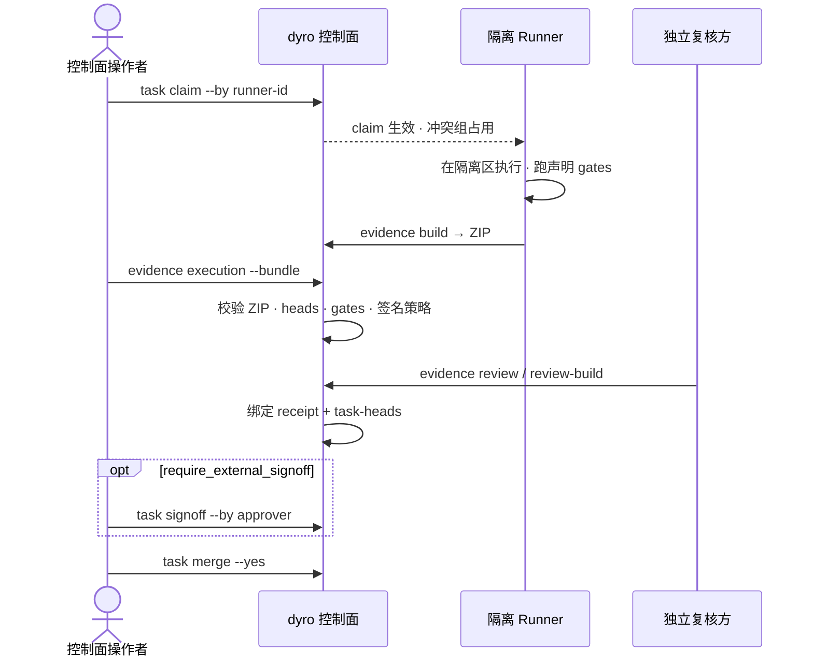

### 任务图

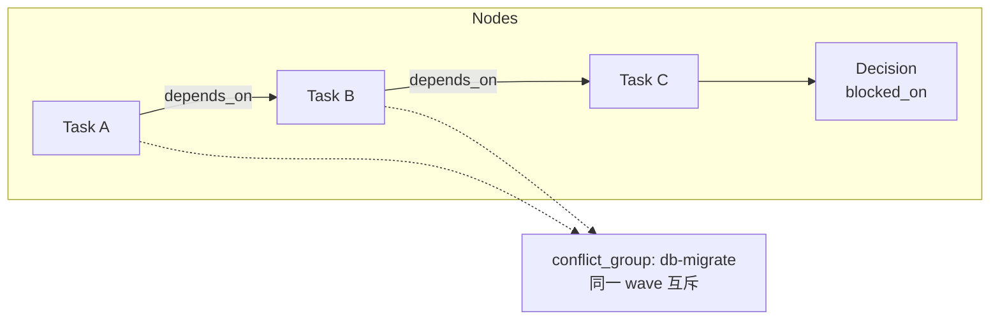

### 调度波次

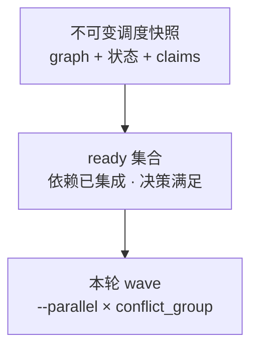

### 用例总览

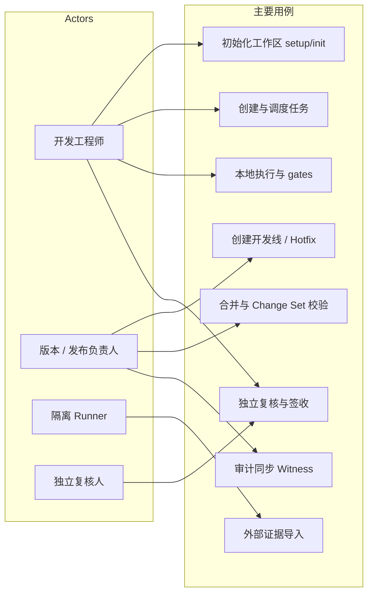

### 多智能体分层（可选实验）

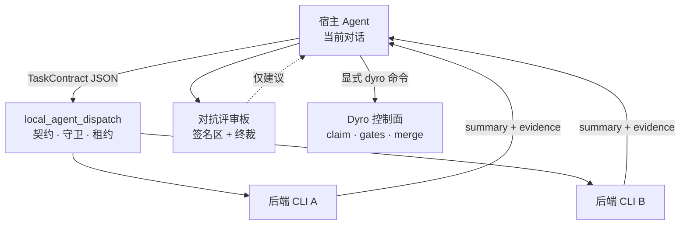

随 `dyro` 安装分发（`dyro dispatch …`）。Dispatch 结果仅为建议；交付仍走 Dyro gates/merge。见 `docs/agent-orchestration-discipline.md`。

### 多智能体时序（可选实验）

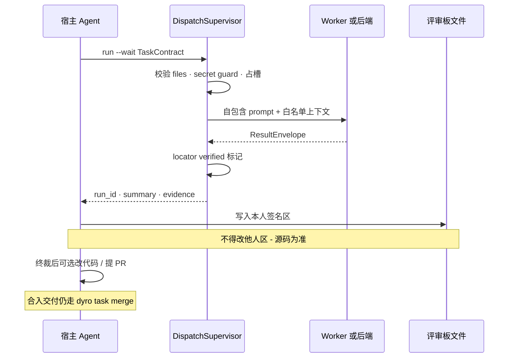

### 外部语义运行时（可选实验）

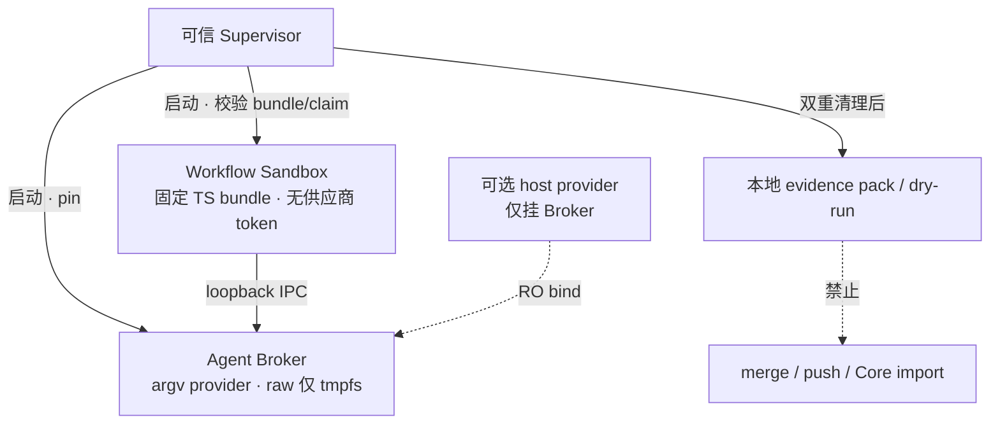

**非 Core。** `experiments/external_workflow_runner/`。生产见 Stage5 `NOT_READY`。

### 语义运行时时序（可选实验）

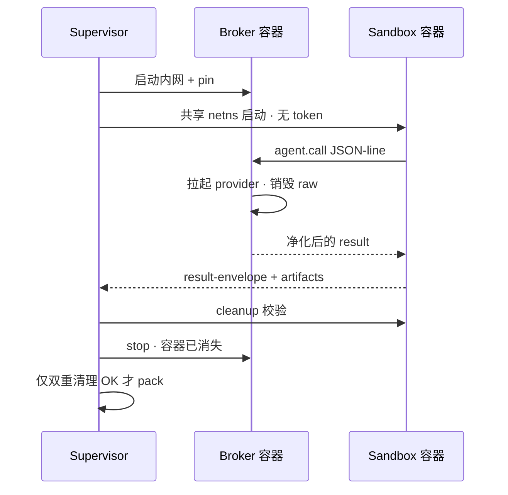

## 快速开始

日常使用 CLI 时，推荐通过隔离的 `pipx` 环境从 PyPI 安装 `dyro`（要求 Python 3.11+）：

```bash
python3 -m pip install --user --upgrade pipx
python3 -m pipx ensurepath
# 执行 ensurepath 后请重新打开终端，再运行：
pipx install dyro
dyro --version
```

升级时运行 `pipx upgrade dyro`。若团队统一使用 `pip` 管理 Python 包，可改用：

```bash
python3 -m pip install --user --upgrade dyro
```

将仓库放入工作区后，使用新人入口一条命令完成仓库发现、状态目录初始化和首条开发线创建：

```bash
mkdir my-workspace && cd my-workspace
# 先将 Git 仓库 clone 或移动到这个目录下。
dyro setup . --name my-workspace --line dev --yes
```

`setup` 会扫描当前目录下的 Git 仓库，自动登记工作区相对路径、推断开发线内挂载位置，并在可用时读取 `origin`，无需手改 TOML。`--yes` 仅用于确认首条开发线会创建 Git worktree；若只想先建立 Profile，可改用 `--no-line`。尚未 clone 仓库时可使用引导式兜底：

```bash
dyro init . --wizard --name my-workspace
```

后续新增仓库也无需打开 `dyro.toml`：

```bash
dyro repo add repositories/services/payments
dyro repo list
```

常用交付策略和 Agent adapter 也无需打开 `dyro.toml`：

```bash
dyro config set policy.execution_mode external
dyro config get policy.execution_mode
dyro agent add ci-runner --preset noop
dyro agent test ci-runner
```

Profile 已配置 remote 时，可以安全补齐缺失仓库 anchor：

```bash
dyro --dry-run bootstrap
dyro bootstrap --yes
dyro doctor
```

新人日常入口只需一条命令：检查工作区后，选择开发线和本机 Agent。

```bash
dyro start
```

## 交付流程

版本负责人或自动化脚本可使用显式命令：

```bash
dyro doctor
dyro line create release-2026-10 --base origin/main --yes
# 仅在某个仓库需要时覆盖它自己的已核实基线。
dyro line create release-2026-10 --base origin/main --repo-base web=v2026.10.0 --yes
dyro open release-2026-10 --agent codex
dyro task create API-101 --title "Implement API contract" --line release-2026-10 --repository api
dyro task graph check --line release-2026-10
dyro task graph --line release-2026-10 --format mermaid
dyro task explain API-101
dyro task next
dyro task next --run --yes
dyro task attempts API-101
dyro task binding API-101
dyro task review API-101
dyro task merge API-101 --yes
dyro changeset create release-2026-10-ready --line release-2026-10
dyro changeset verify release-2026-10-ready
```

线上 Hotfix 必须明确已核实的生产基线，不能隐式继承默认分支：

```bash
dyro hotfix create incident-123 --base v2026.09.7 --repos api,web --yes
```

如果执行与审批由独立受信任系统承担，可在 Profile 设置 `policy.execution_mode = "external"` 和 `policy.require_external_signoff = true`。此时本机 Dyro 仅允许计划核验；复核结论同时绑定回执和精确任务 HEAD 后，仍必须显式签收才能进入 `done`：

```bash
dyro task claim API-101 --by isolated-runner-1 --key-id runner-2026
# 长任务须在租约到期前续期 claim。
dyro task claim-renew API-101 --by isolated-runner-1 --lease-seconds 3600
# 在隔离 runner 中运行声明的门禁，并打包回执、日志和精确 HEAD。
dyro task evidence build API-101 --workspace /runner/workspace --receipt /runner/out/receipt.md --output /runner/out/API-101.zip
# 在控制面导入并校验这一份可移植证据包。
dyro task evidence execution API-101 --bundle /runner/out/API-101.zip
dyro task evidence review API-101 --file /review/out/review.md
dyro task signoff API-101 --by release-manager
# 可显式释放已放弃的领取。
dyro task claim-release API-101 --by isolated-runner-1
```

新证据包必须包含 `provenance.json`。导入无 provenance 的遗留包属于刻意迁移，需要 `dyro task evidence execution API-101 --bundle ... --allow-legacy`。若外部 runner 返回 `QUESTION`，用 `dyro task answer API-101 --text "..."` 记录答案；现有 claim 保留，任务回到 `assigned` 以提交下一次证据。

查看并安全保留不可变证据世代：

```bash
dyro task evidence generations API-101
dyro --dry-run task evidence generations API-101 --prune --older-than-days 30 --keep 10
dyro task evidence generations API-101 --prune --older-than-days 30 --keep 10 --yes
```

加密身份方面：在工作区外生成密钥，只把公钥装入按用途分离的信任库：

```bash
dyro config set policy.execution_mode external
dyro config set policy.require_signed_execution true
dyro config set policy.require_signed_review true
dyro config set policy.require_external_signoff true
dyro config set policy.require_signed_signoff true

dyro key generate runner-2026 --private-key /secure/runner.pem --public-key /secure/runner.pub.pem
dyro key trust runner-2026 --purpose execution --public-key /secure/runner.pub.pem   --not-after 2027-01-01T00:00:00+00:00
dyro task claim API-101 --by isolated-runner-1 --key-id runner-2026
dyro task evidence build API-101 --workspace /runner/workspace --receipt /runner/out/receipt.md   --output /runner/out/API-101.zip --claim /runner/in/claim.json   --signing-key /secure/runner.pem --key-id runner-2026

dyro key generate reviewer-2026 --private-key /secure/reviewer.pem --public-key /secure/reviewer.pub.pem
dyro key trust reviewer-2026 --purpose review --public-key /secure/reviewer.pub.pem
dyro task evidence review-build API-101 --file /review/out/review.md --reviewer independent-reviewer   --output /review/out/review.json --signing-key /secure/reviewer.pem --key-id reviewer-2026
dyro task evidence review API-101 --file /review/out/review.json

dyro key generate approver-2026 --private-key /secure/approver.pem --public-key /secure/approver.pub.pem
dyro key trust approver-2026 --purpose signoff --public-key /secure/approver.pub.pem
dyro task signoff API-101 --by release-manager --signing-key /secure/approver.pem --key-id approver-2026

dyro key list --purpose execution --show-status
dyro key revoke runner-2026 --purpose execution --reason "runner retired"
dyro key audit
```

将本地信任审计链同步到独立 Witness：

```bash
dyro key generate audit-client-2026   --private-key /secure/audit-client.pem   --public-key /secure/audit-client.pub.pem
# 通过带外安全通道把 audit-client.pub.pem 安装到 Witness。
dyro key trust witness-2026   --purpose audit-receipt   --public-key witness-2026.pub.pem
dyro key trust witness-recovery   --purpose audit-recovery   --public-key witness-recovery.pub.pem

DYRO_AUDIT_TOKEN=... dyro key audit-sync   --witness primary   --endpoint https://audit.example.com/v1/dyro/batches   --signing-key /secure/audit-client.pem   --key-id audit-client-2026   --witness-key-id witness-2026   --witness-recovery-key-id witness-recovery
```

即使没有新事件，命令仍会发送已签名检查点；若响应丢失，会按原样重放已持久化的 pending batch。Witness 必须独立重算事件链、拒绝序号或链头分叉、签发可验证回执，并将 batch 与回执写入带保留锁的不可变存储。协议、密钥轮换与部署边界见 [Audit Witness 协议](docs/audit-witness-protocol.md)。

项目提供可部署的标准库 Witness 服务：`dyro witness serve`。默认要求 bearer token 与 TLS，仅在创建 `records/<batch-sha256>.json` 后推进检查点；崩溃恢复会还原未完成记录。生产环境应将可变检查点与不可变 `records` 归档分离：WORM/Object Lock 仅用于 records 归档，检查点使用可持久可变存储。密钥轮换、容器与 S3 Object Lock 见 [Witness 部署指南](docs/witness-deployment.md)。

签名强制由 `policy.require_signed_execution`、`policy.require_signed_review`、`policy.require_signed_signoff` 显式控制；删光所有受信任密钥也不会关闭已开启的策略。已签名执行 claim 绑定 `claim_id`、世代、runner 与执行密钥 ID。签名消息与执行计划哈希使用 RFC 8785 JSON Canonicalization Scheme 字节，非 Python runner 可复现同一载荷。独立复核方用 `dyro task evidence review-build` 产出已签名 JSON 信封。轮换无中断：先信任新 key ID，再切换签名方，重叠窗口保留旧密钥，最后经工作区受控密钥流程吊销。

最小 TypeScript 参考签名器与 Python/Node 互操作向量位于 `examples/typescript-runner/`，演示控制面期望的规范字节、签名域、Ed25519 调用与签名信封。

所有有写入风险的操作都支持先查看计划：

```bash
dyro --dry-run line create release-2026-10 --base origin/main
dyro --dry-run task run API-101
```

## 命令地图

| 命令 | 作用 |
| --- | --- |
| `setup` / `init --discover` / `init --wizard` / `repo add/list` / `bootstrap` / `start` | 无需手改 TOML 地完成新人引导、仓库管理与开发线、Agent 选择。 |
| `doctor` / `status` | 验证和显示控制平面状态。 |
| `line create/list` | 创建、登记和查看功能开发线。 |
| `hotfix create` | 从显式生产基线创建 Hotfix 开发线。 |
| `changeset create/list/verify` | 固化并核验一次多仓交付所包含的干净、精确 Git 提交组合。 |
| `config get/set` / `agent list/add/test` / `open` | 安全管理常用策略与 adapter、校验可执行文件，或在正确开发线启动 Agent。 |
| `task create/list/board/status/next/graph/explain/attempts/binding` | 管理任务清单与状态，编译/校验任务图，解释调度，查看 provenance，输出精确复核绑定。 |
| `task run/answer/gates/review/signoff` | 执行任务、回答追问、运行门禁、申请独立复核；需要时记录外部签收。 |
| `task claim` / `task evidence build/execution/review` | 供隔离执行器一次性领取任务、构建/导入可移植执行证据包，并导入与回执绑定的复核证据。 |
| `task merge` | 将已复核的任务分支合入所属开发线。 |
| `task loop/daemon/stats/decisions` | 受控批处理、调度、台账报表和决策门禁。 |
| `dispatch` | 可选本地多 Agent 派发（L0–L4）；仅建议，不替代 gates/merge。 |
| `runtime` | 可选外部语义运行时状态（Stage5 生产 **NOT_READY**）。 |

实现细节见[架构与 Profile 契约](docs/architecture.md)、[既有控制面迁移指南](docs/migrating-existing-control-planes.md)，以及维护者用的 [PyPI 发布说明](docs/publishing.md)。

## 语言与文档

README 提供英语、简体中文、韩语、西班牙语、法语、德语、巴西葡萄牙语和俄语版本。所有译本共享同一组命令、配置键、目录名和安全规则。当前 CLI 提示与扩展技术文档仍主要为中文；README 多语言支持不代表运行时已支持切换语言。

## 当前边界

DyroEngineeringFlow 已具备完整的本地工作流闭环，以及让高保障团队在本机保持“仅计划”模式的策略控制。它不创建远端仓库、不携带 SaaS 凭证，也不负责供给外部 runner；但内置可移植证据包的构建与校验契约。`experiments/` 下的可选能力（外部 workflow runner Stage0–5、本地 agent dispatch L0–L4）**随 `dyro` 安装包一并分发**（`dyro dispatch …`、`import experiments…`）。它们相对 Core 仍是**可选面**：不替代 gates / 复核 / signoff / merge；语义运行时路径生产仍为 Stage5 `NOT_READY`——见 `docs/adr/`。本地多仓 merge 会统一预检并在失败时恢复；不同 Git 远端无法提供原子跨仓 push，因此部分推送失败会写入台账等待恢复。自动 merge 需要任务清单与本地策略双重许可。本项目采用 [MIT License](LICENSE)，并已发布为 [PyPI `dyro`](https://pypi.org/project/dyro/) 包。
