# Diagram guide (onboarding)

**PNG diagrams** render on GitHub. Mermaid sources live under `docs/images/diagrams/src/*.mmd`.

Regenerate:

```bash
python3 scripts/render_diagrams.py
```

Chinese edition: [`diagrams.md`](diagrams.md)

| Diagram | Image |
| --- | --- |
| 1. Architecture | [01-architecture.png](images/diagrams/01-architecture.png) |
| 2. Workspace layout | [02-workspace-layout.png](images/diagrams/02-workspace-layout.png) |
| 3. Task state machine | [03-task-state-machine.png](images/diagrams/03-task-state-machine.png) |
| 4. Local delivery sequence | [04-local-delivery-sequence.png](images/diagrams/04-local-delivery-sequence.png) |
| 5. External evidence sequence | [05-external-evidence-sequence.png](images/diagrams/05-external-evidence-sequence.png) |
| 6. Task graph / scheduling | [06a](images/diagrams/06a-task-graph.png) · [06b](images/diagrams/06b-scheduling.png) |
| 7. Use cases | [07-use-cases.png](images/diagrams/07-use-cases.png) |
| 8. Multi-agent | [08a](images/diagrams/08a-multi-agent-layers.png) · [08b](images/diagrams/08b-multi-agent-sequence.png) |
| 9. Semantic runtime experiment | [09a](images/diagrams/09a-semantic-runtime.png) · [09b](images/diagrams/09b-semantic-runtime-sequence.png) |

---

## 1. Layered architecture

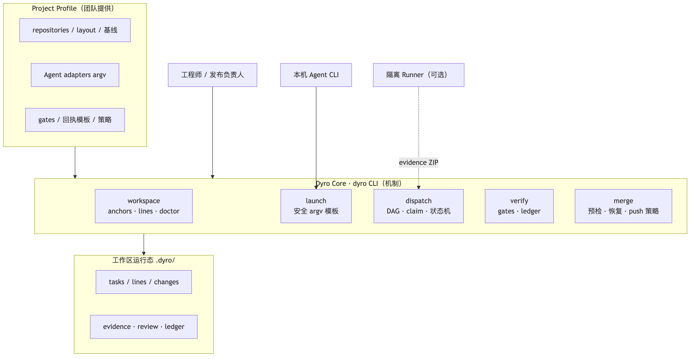

Core does not embed business rules; those live in the Profile.

---

## 2. Multi-repo workspace layout

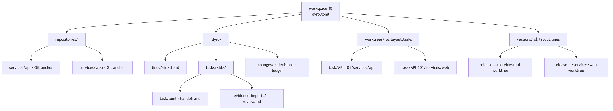

Anchors vs line/task worktrees; control state under `.dyro/`.

---

## 3. Task state machine

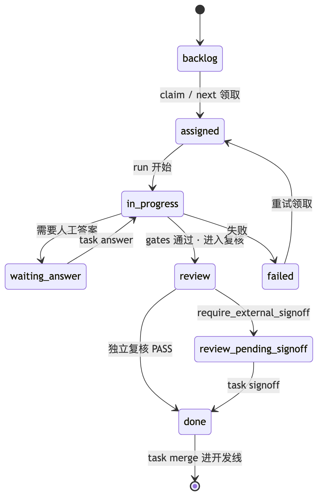


---

## 4. Local delivery sequence

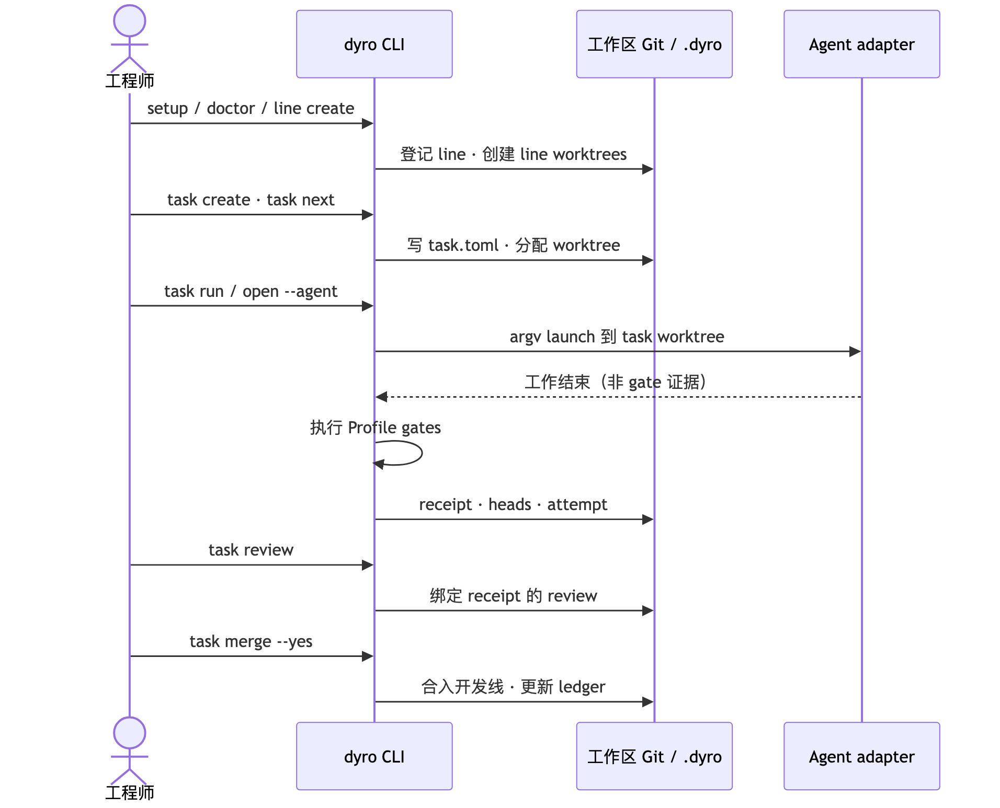


---

## 5. External evidence sequence

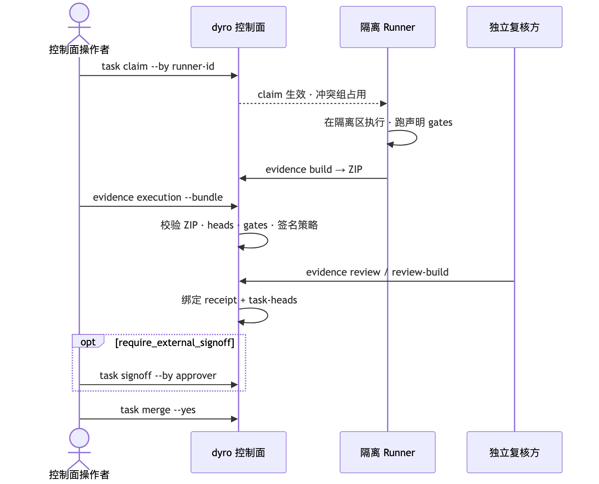

When `execution_mode = external`.

---

## 6. Task graph and scheduling

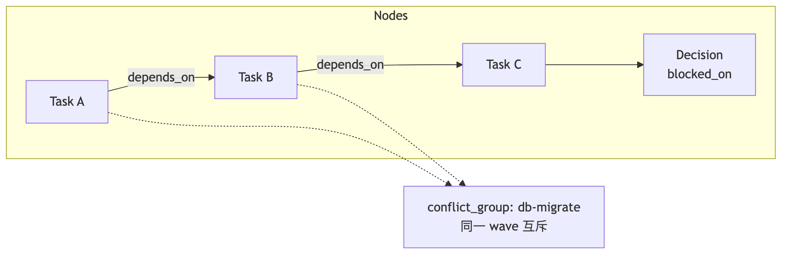

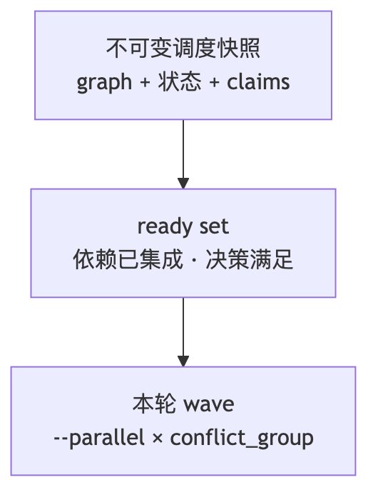

`depends_on` is hard order; `conflict_group` is mutex, not an edge.

---

## 7. Use-case overview

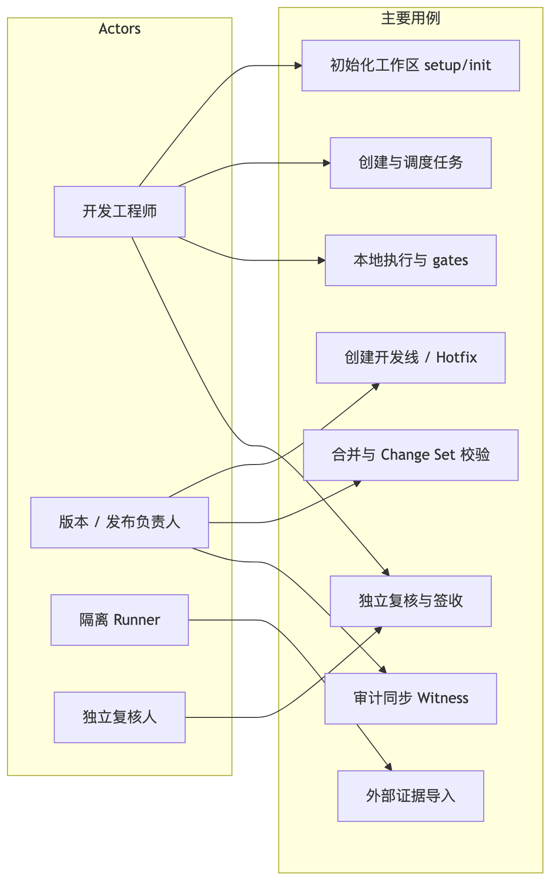


---

## 8. Multi-agent collaboration (dev side)

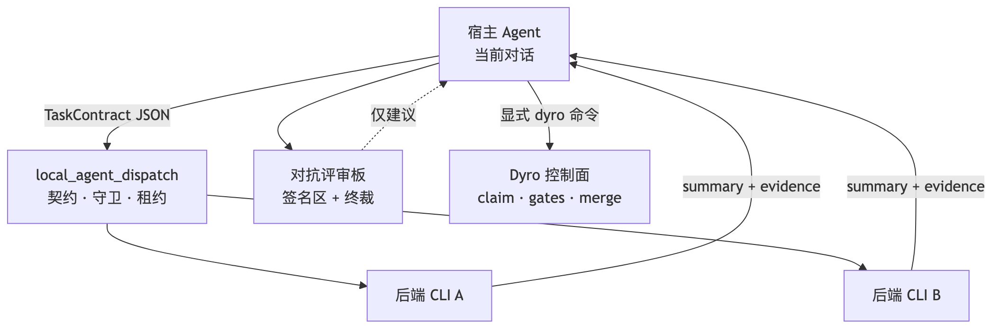

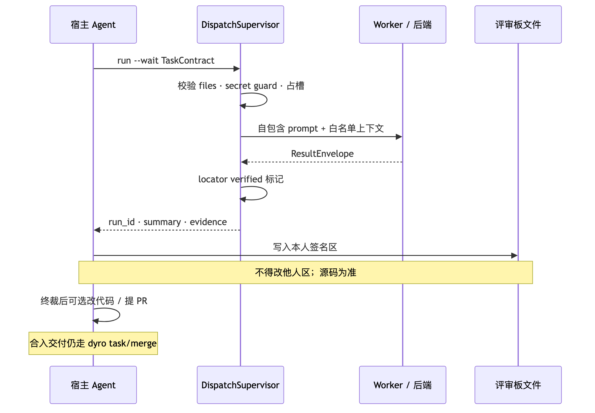

Dispatch results are advisory; delivery uses Dyro.

---

## 9. Optional external semantic runtime

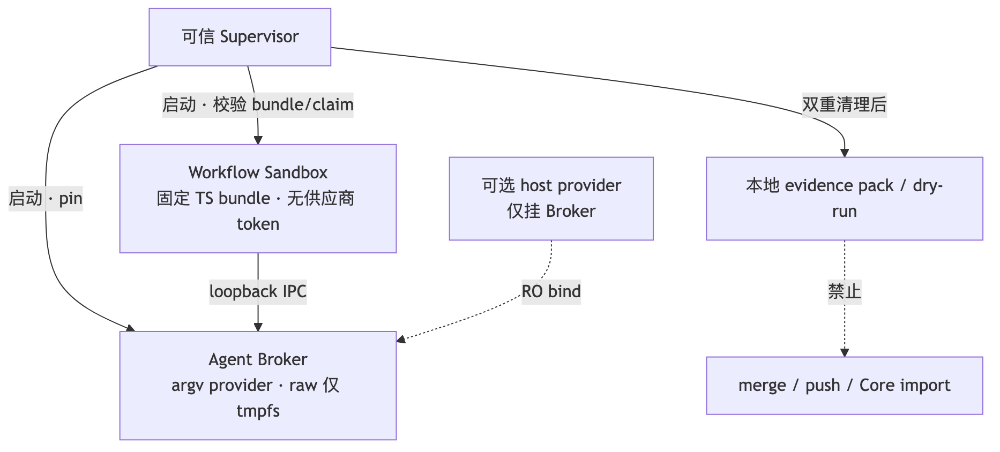

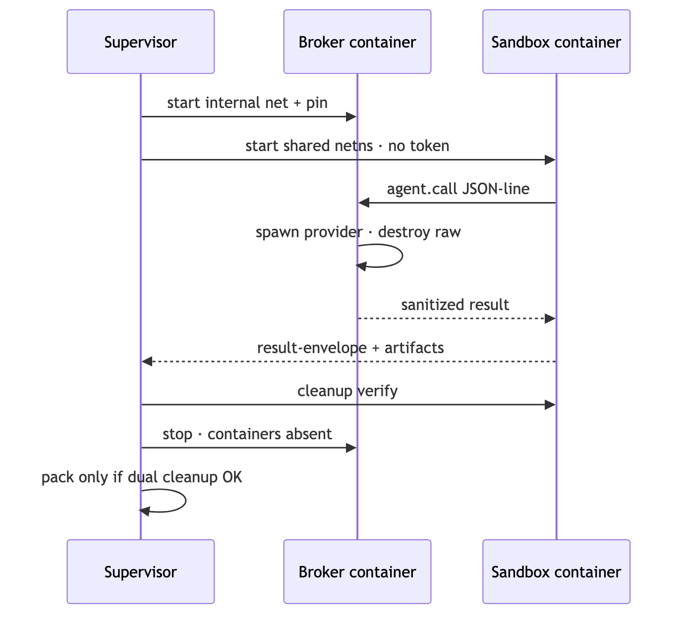

Experiment only; not production-ready.

---

## 15-minute path

1. Skim §1–§2 images.  
2. Run README Quick start.  
3. Walk §4 once.  
4. Treat §8–§9 as optional experiments.
