# Diagram guide (onboarding)

**Primary surface**: root [README](../README.md) embeds all necessary Mermaid diagrams **inline** (GitHub renders them in the README—not image links).

This page mirrors the same sources for standalone browsing.

- **English labels**: `docs/images/diagrams/src/*.mmd` (this page)
- **Chinese labels**: `docs/images/diagrams/src/zh/*.mmd` → [`diagrams.md`](diagrams.md)

PNG exports are **not** tracked. Optional local render:

```bash
python3 scripts/render_diagrams.py          # English labels
python3 scripts/render_diagrams.py --lang zh  # Chinese labels
```

Related: [`architecture.md`](architecture.md) · [`agent-orchestration-discipline.md`](agent-orchestration-discipline.md)

| # | Diagram |
| --- | --- |
| 01 | 1. Layered architecture |
| 02 | 2. Multi-repo workspace layout |
| 03 | 3. Task state machine |
| 04 | 4. Local delivery sequence |
| 05 | 5. External evidence sequence |
| 06a | 6a. Task graph |
| 06b | 6b. Scheduling wave |
| 07 | 7. Use-case overview |
| 08a | 8a. Multi-agent layers (experiment) |
| 08b | 8b. Multi-agent sequence |
| 09a | 9a. External semantic runtime (experiment) |
| 09b | 9b. Semantic runtime sequence |

---

## 1. Layered architecture

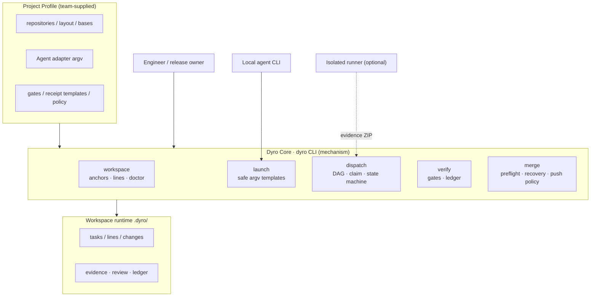

Core does not embed business rules; those live in the Profile.

---

## 2. Multi-repo workspace layout

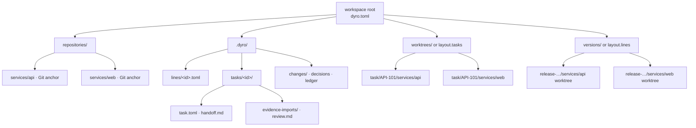

Anchors vs line/task worktrees; control state under `.dyro/`.

---

## 3. Task state machine

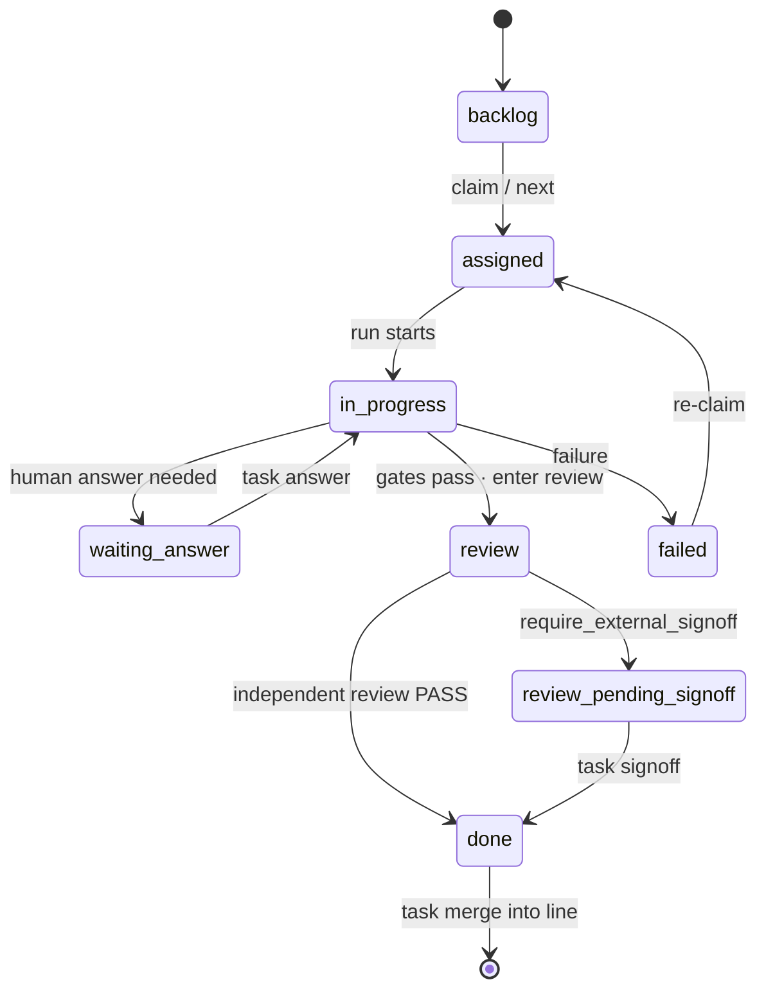

Illegal transitions are rejected; forced overrides need explicit `--force` (see architecture).

---

## 4. Local delivery sequence

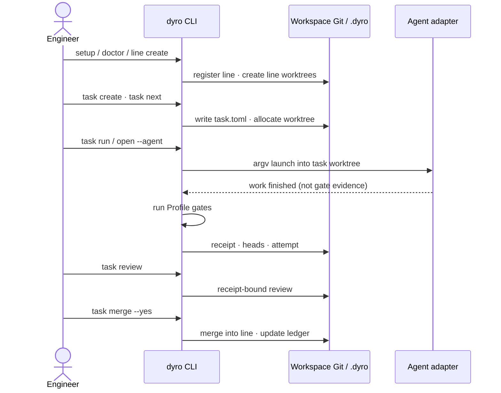

Local path: setup → task → run → gates → review → merge.

---

## 5. External evidence sequence

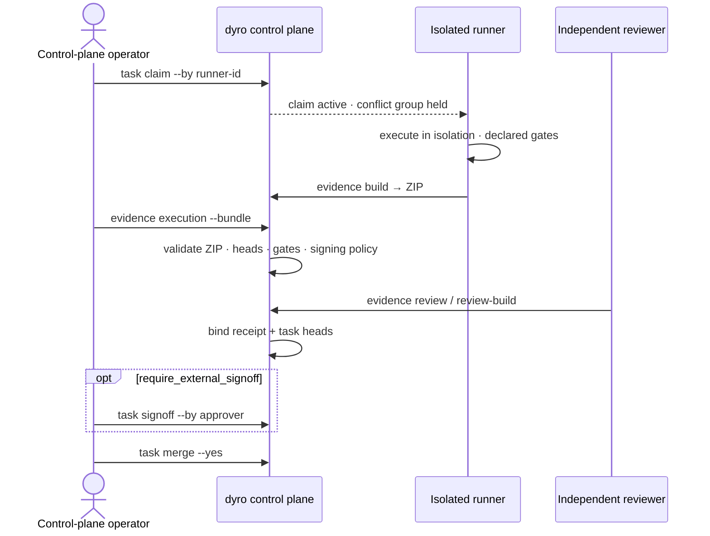

When `policy.execution_mode = "external"`, the control machine does not run the agent or gates.

---

## 6a. Task graph

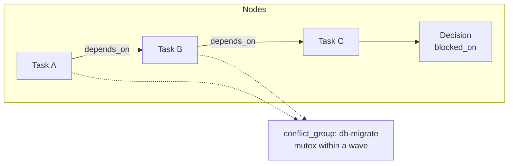

`depends_on` is hard order; `conflict_group` is resource mutex, not an edge; downstream unlocks only after merge into the line.

---

## 6b. Scheduling wave

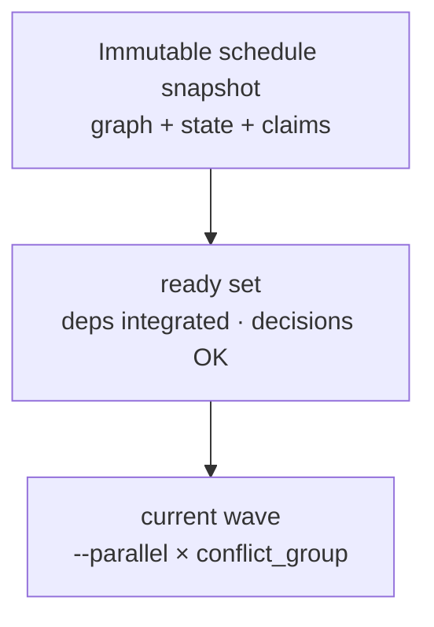

Immutable snapshot → ready set → wave with parallelism and conflict groups.

---

## 7. Use-case overview

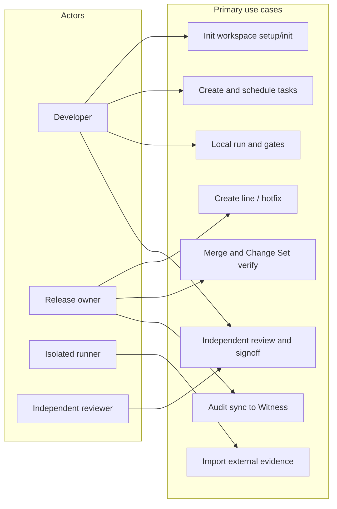

Primary actors and control-plane use cases.

---

## 8a. Multi-agent layers (experiment)

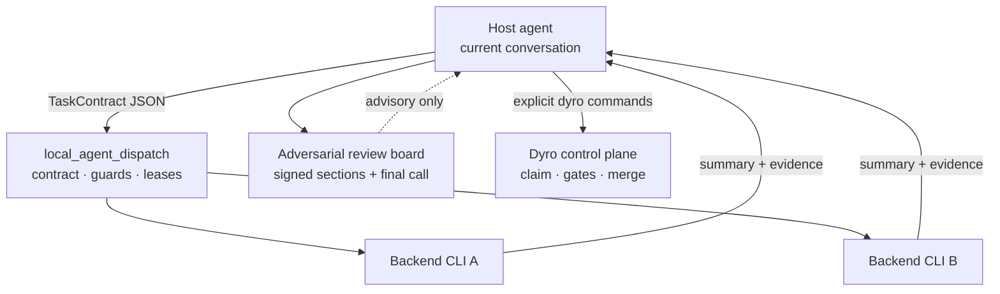

See `docs/agent-orchestration-discipline.md`. Experiment under `experiments/local_agent_dispatch/` (not in the installed package).

---

## 8b. Multi-agent sequence

```mermaid
sequenceDiagram
  participant H as Host agent
  participant S as DispatchSupervisor
  participant W as Worker / backend
  participant P as Review board file

  H->>S: run --wait TaskContract
  S->>S: validate files · secret guard · take slot
  S->>W: self-contained prompt + allowlisted context
  W-->>S: ResultEnvelope
  S->>S: mark locator verified
  S-->>H: run_id · summary · evidence
  H->>P: write own signed section
  Note over H,P: Never edit others' sections; source is authority
  H->>H: optional code change / PR after final call
  Note over H: Delivery still goes through dyro task/merge
```

Dispatch output is advisory; delivery still uses Dyro gates/merge.

---

## 9a. External semantic runtime (experiment)

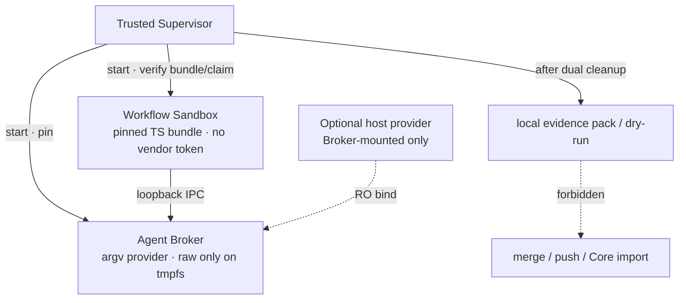

Not Core. Tree: `experiments/external_workflow_runner/`. Production status: Stage5 `NOT_READY`.

---

## 9b. Semantic runtime sequence

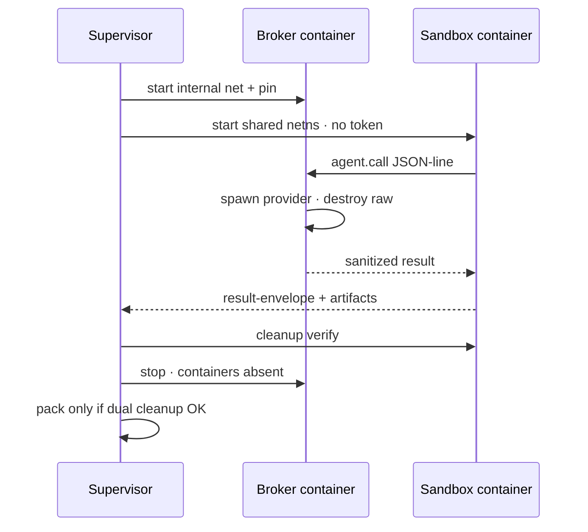

Supervisor dual-cleanup before any local pack.

---

## Newcomer 15-minute path

1. Skim §1–§2 on this page.
2. Follow [README](../README.md) Quick start (`setup` / `doctor`).
3. Walk §4: `task create → run → review → merge`.
4. For external mode, read §5.
5. Multi-agent: read §8 only; never treat dispatch output as a gate.

## Maintenance

- Edit `docs/images/diagrams/src/*.mmd` (English) or `src/zh/*.mmd` (Chinese), then refresh the matching guide / README embeds.
- On conflict with code, code and `architecture.md` win.
