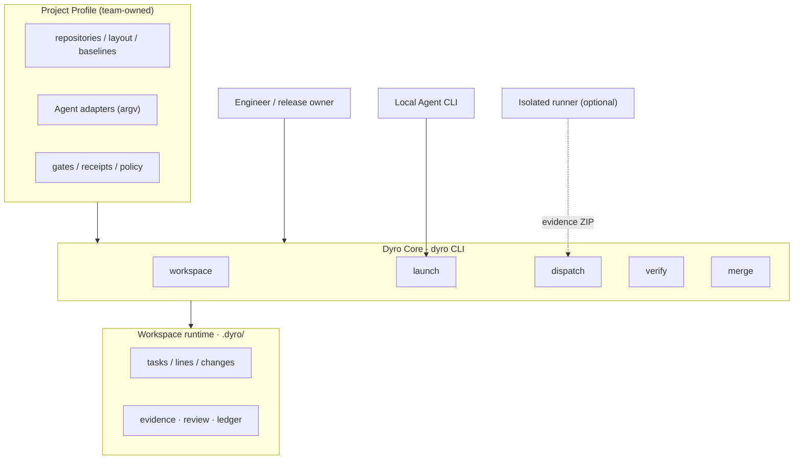
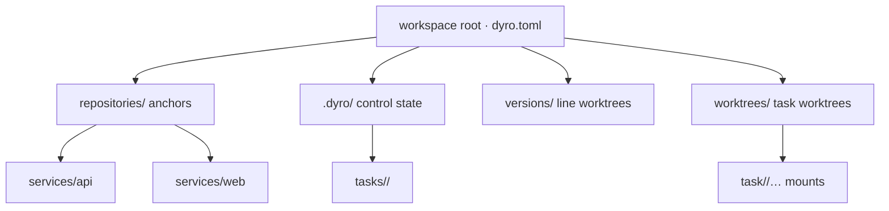
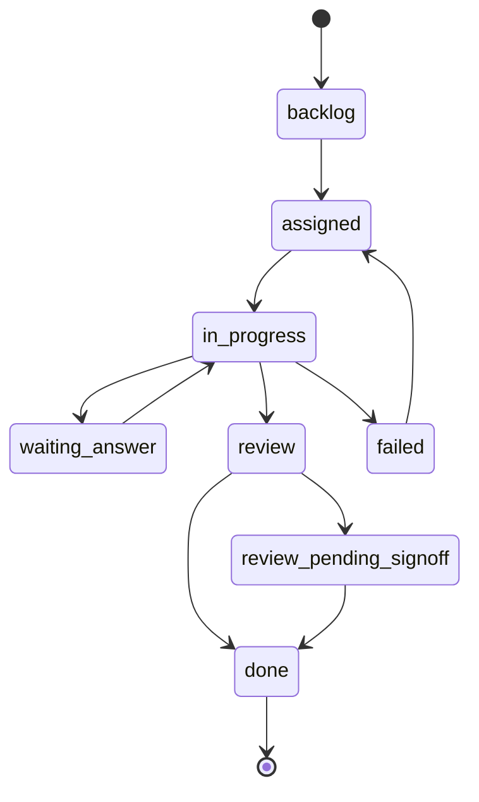
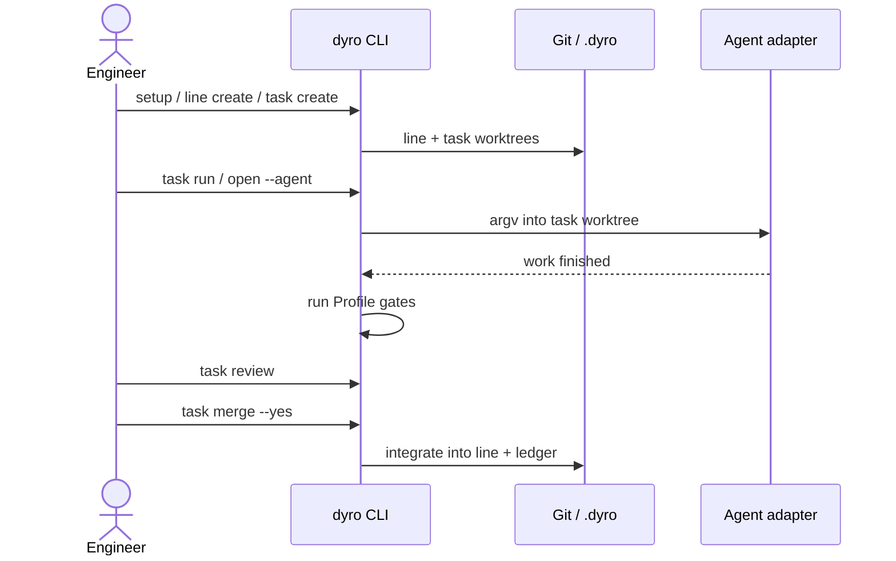
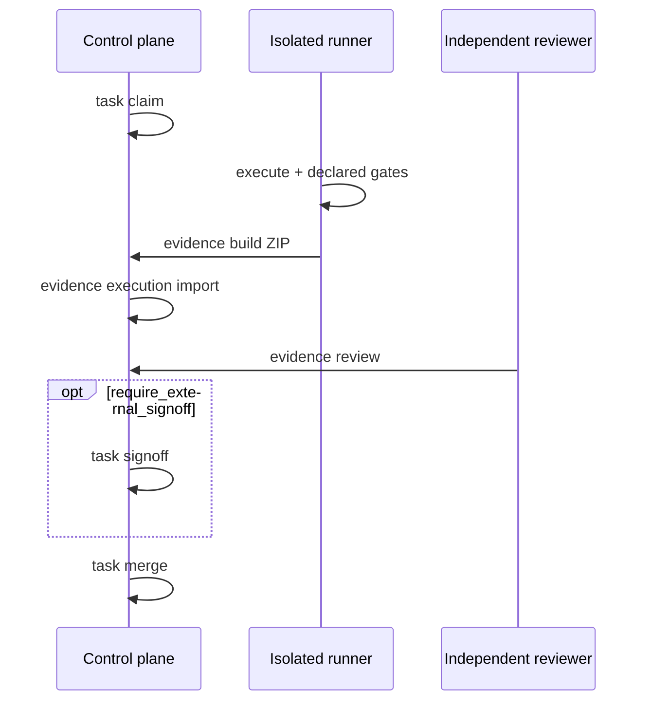
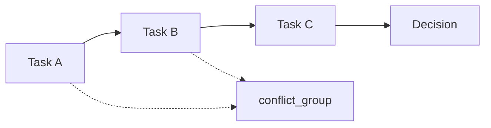
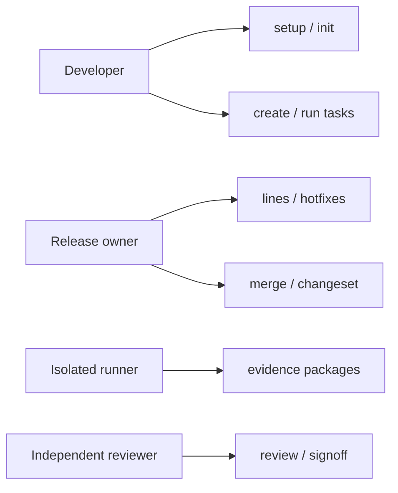
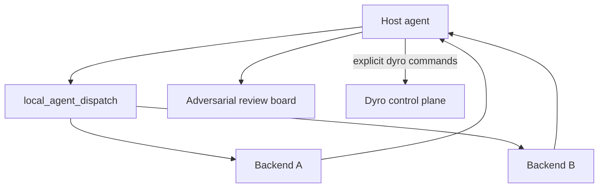
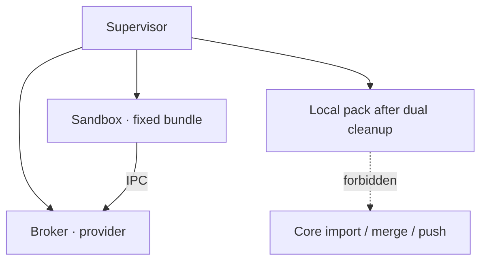

# Diagram guide (onboarding)

Mermaid diagrams for DyroEngineeringFlow. Rendered natively on GitHub.

Chinese edition: [`diagrams.md`](diagrams.md)

| Diagram | Purpose |
| --- | --- |
| [1. Layered architecture](#1-layered-architecture) | Core vs Profile |
| [2. Multi-repo workspace layout](#2-multi-repo-workspace-layout) | On-disk structure |
| [3. Task state machine](#3-task-state-machine) | Legal transitions |
| [4. Local delivery sequence](#4-local-delivery-sequence) | Line → merge |
| [5. External evidence sequence](#5-external-evidence-sequence) | Claim → import → signoff |
| [6. Task graph and scheduling](#6-task-graph-and-scheduling) | depends_on / conflict_group |
| [7. Use-case overview](#7-use-case-overview) | Actors and main uses |
| [8. Multi-agent collaboration](#8-multi-agent-collaboration-dev-side) | Dispatch / review board / control plane |
| [9. Optional external semantic runtime](#9-optional-external-semantic-runtime-experiment) | Sandbox / Broker / Supervisor |

See also: [`architecture.md`](architecture.md) (Chinese technical detail).

---

## 1. Layered architecture



---

## 2. Multi-repo workspace layout



```text
workspace/
  dyro.toml
  repositories/…
  versions/<line>/…
  worktrees/task-<id>/…
  .dyro/lines|tasks|changes|ledger.jsonl
```

---

## 3. Task state machine



---

## 4. Local delivery sequence



---

## 5. External evidence sequence



---

## 6. Task graph and scheduling



Hard edges: `depends_on`. Mutex resource: `conflict_group` (not an edge). Downstream unlocks only after dependency is `done` **and** merged into the line.

---

## 7. Use-case overview



---

## 8. Multi-agent collaboration (dev side)

Optional experiment: `experiments/local_agent_dispatch/` (not installed with `dyro`).



Dispatch results are **advisory**. Delivery still goes through Dyro gates and merge.

---

## 9. Optional external semantic runtime (experiment)



Not production-ready; see Stage5 `NOT_READY` docs under the experiment tree.

---

## 15-minute path

1. Skim §1–§2 here.  
2. Run README Quick start (`setup`, `doctor`).  
3. Walk §4 with a noop adapter if available.  
4. Read `architecture.md` for policy details.  
5. Treat §8–§9 as optional experiments only.
