# 图示导览（新人上手）

**主入口**：根目录 [README 中文](../README.zh-CN.md) 已**直接内嵌**全部必要 Mermaid 图（打开 README 即可在页面里看到图，不是图片链接）。

本页与 README 同源，便于单独浏览。

- **中文图例**：`docs/images/diagrams/src/zh/*.mmd`（本页）
- **英文图例**：`docs/images/diagrams/src/*.mmd` → [`diagrams.en.md`](diagrams.en.md)

仓库**不**跟踪 PNG。可选本机导出：

```bash
python3 scripts/render_diagrams.py --lang zh  # 中文图例
python3 scripts/render_diagrams.py            # 英文图例
```

关联：[`architecture.md`](architecture.md) · [`agent-orchestration-discipline.md`](agent-orchestration-discipline.md)

| # | 图 |
| --- | --- |
| 01 | 1. 系统分层架构 |
| 02 | 2. 多仓工作区目录结构 |
| 03 | 3. 任务状态机 |
| 04 | 4. 本地交付主流程（时序） |
| 05 | 5. 外部证据交接（时序） |
| 06a | 6a. 任务图 |
| 06b | 6b. 调度波次 |
| 07 | 7. 用例总览 |
| 08a | 8a. 多智能体分层（实验） |
| 08b | 8b. 多智能体时序 |
| 09a | 9a. 外部语义运行时（实验） |
| 09b | 9b. 语义运行时时序 |

---

## 1. 系统分层架构

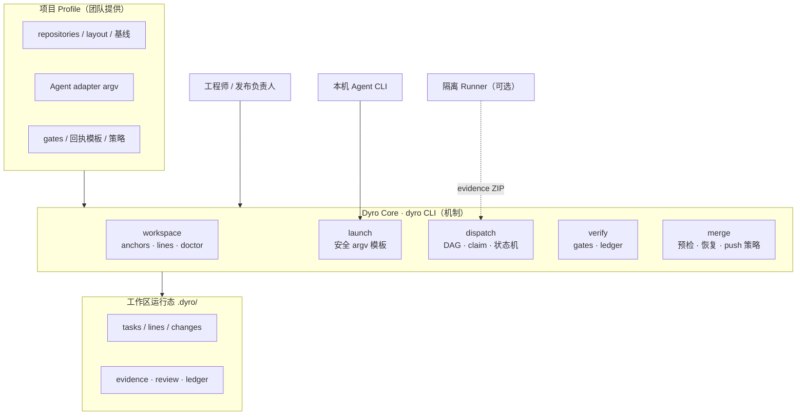

Core **不**内嵌客户仓库名、模型价目或业务规则；这些在 Profile。Agent 只通过 adapter argv 启动；gates 由编排器执行。

---

## 2. 多仓工作区目录结构

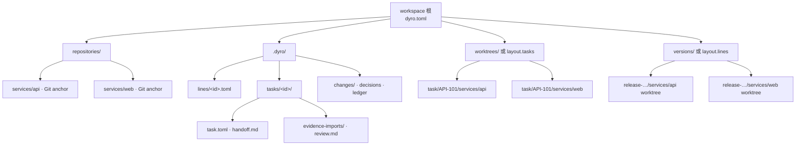

**Anchor**（`repositories/*`）是登记源；**line worktree** 与 **task worktree** 是隔离检出。任务状态与证据在 **`.dyro/tasks/`**。

---

## 3. 任务状态机

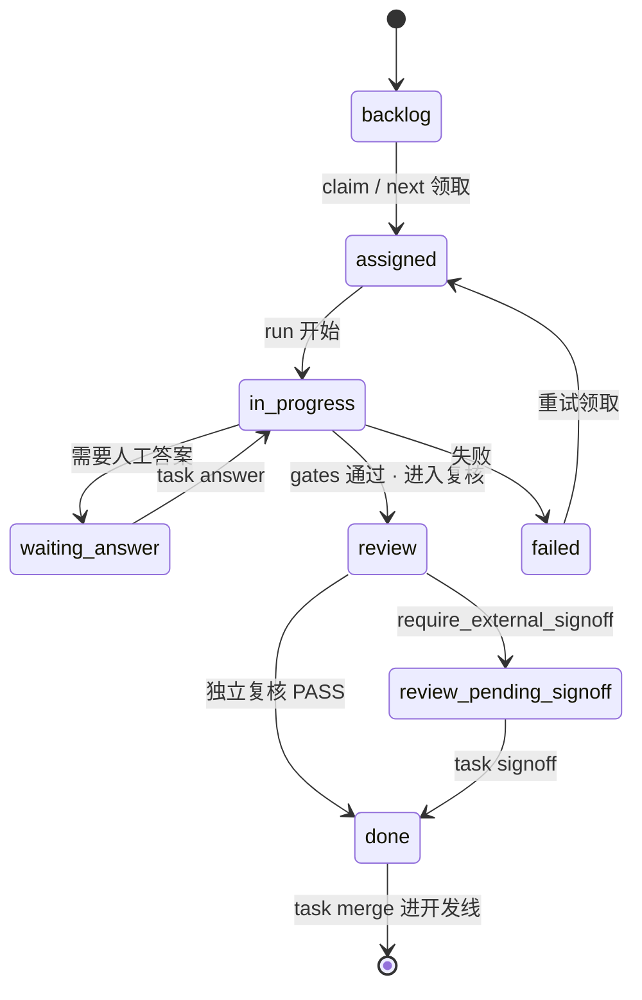

非法跳转被拒绝；人工越权需显式 `--force`（见架构文档）。

---

## 4. 本地交付主流程（时序）

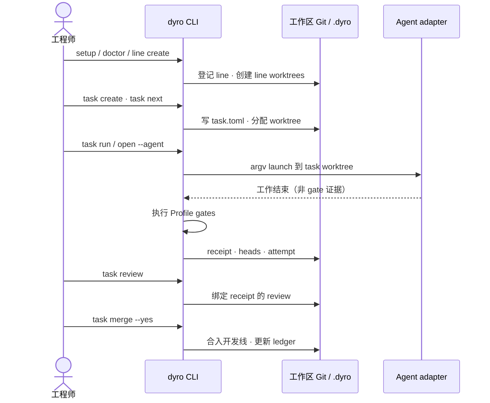

本机路径：setup → task → run → gates → review → merge。

---

## 5. 外部证据交接（时序）

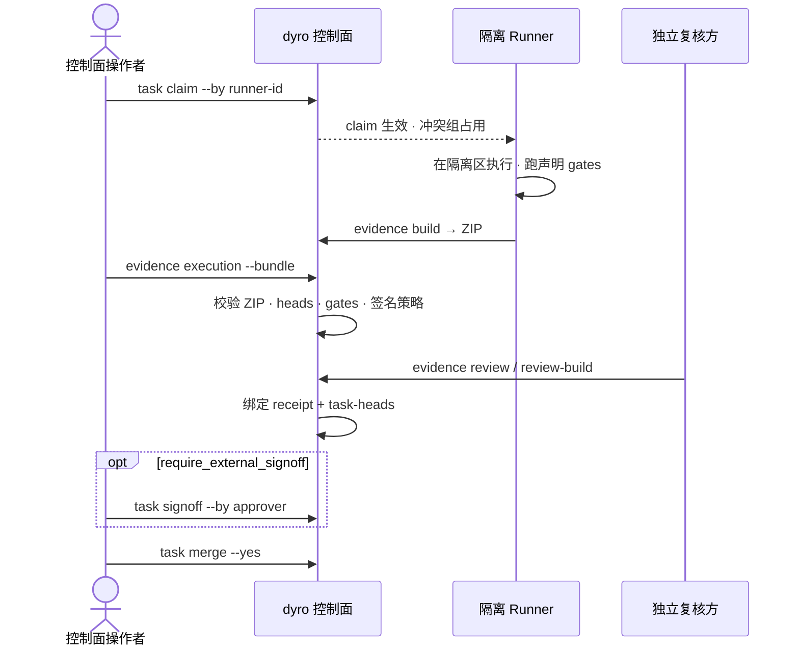

`policy.execution_mode = "external"` 时，控制机不跑 Agent/gates。

---

## 6a. 任务图

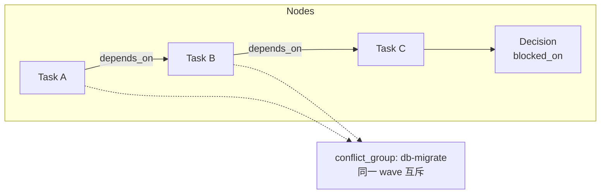

`depends_on`：硬先后。`conflict_group`：资源互斥，**不是**边。`done` 且 **已 merge 进线** 才释放下游。

---

## 6b. 调度波次

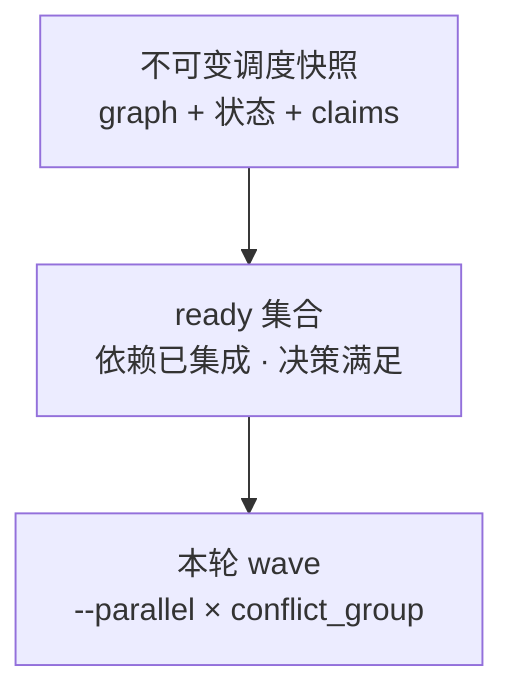

不可变快照 → ready 集合 → 带并行与 conflict_group 的 wave。

---

## 7. 用例总览

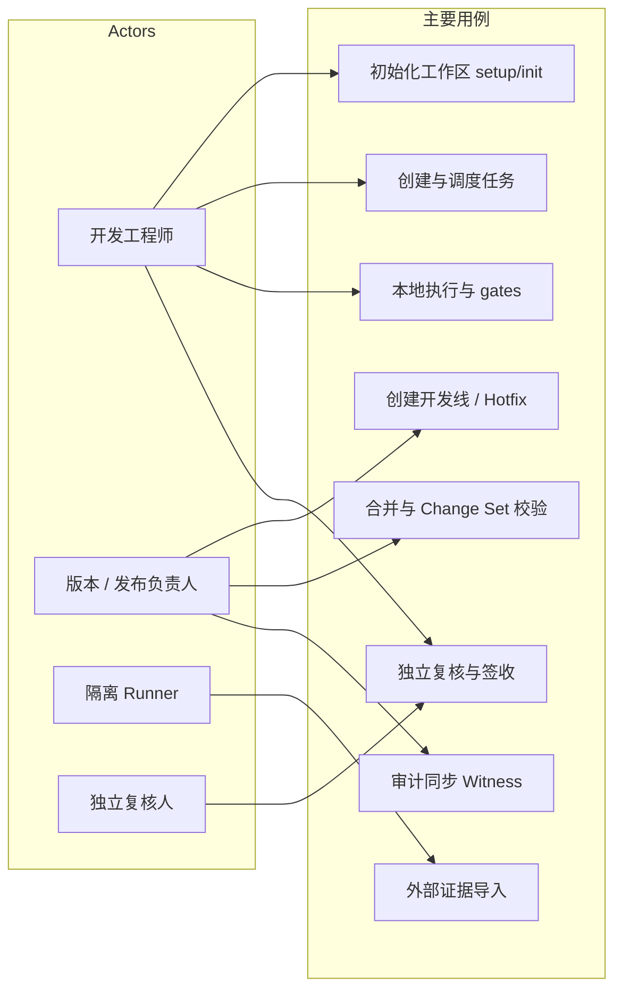

主要角色与控制面用例。

---

## 8a. 多智能体分层（实验）

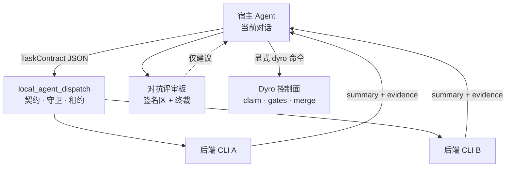

见 [`agent-orchestration-discipline.md`](agent-orchestration-discipline.md)。能力：`dyro dispatch` / `experiments.local_agent_dispatch`（随 `dyro` 安装；**不**替代 gates/merge）。

---

## 8b. 多智能体时序

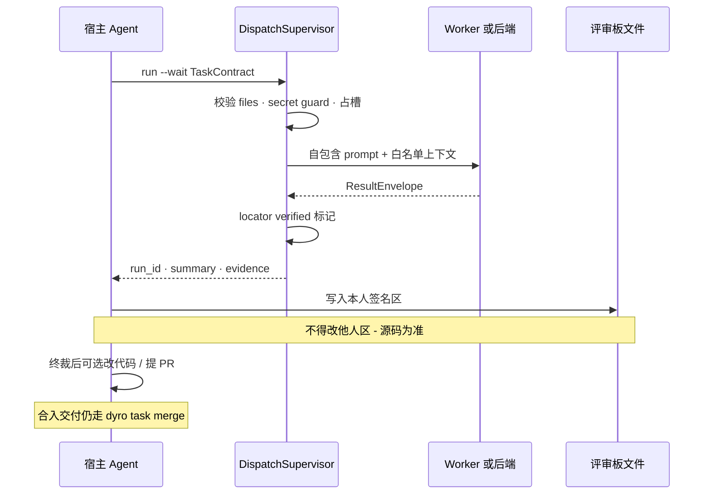

Dispatch 结果仅为**建议**；交付仍走 Dyro gates / merge。

---

## 9a. 外部语义运行时（实验）

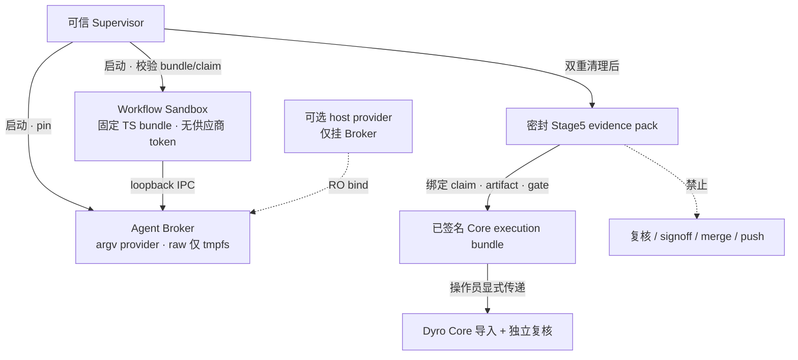

**非 Core。** `experiments/external_workflow_runner/`。当前为 Production
Candidate；生产仍为 `NOT_READY`，开放阻断项为 `PROD-01/02/09`。

---

## 9b. 语义运行时时序

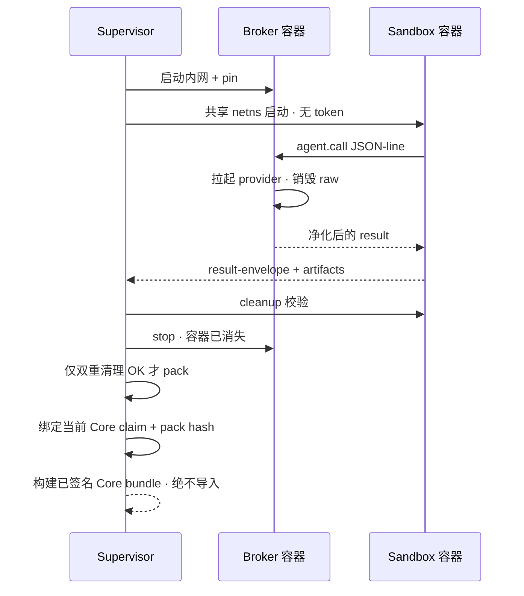

Supervisor 双重清理后才允许 pack；可信 handoff 只构建 bundle，Core 仍独占
import、review、signoff、merge 与 push。

---

## 新人 15 分钟路径

1. 浏览本页 **§1–§2**。
2. 按 [README 中文](../README.zh-CN.md) 快速开始跑通 `setup` / `doctor`。
3. 对照 **§4** 走 `task create → run → review → merge`。
4. external 模式再看 **§5**。
5. 多 Agent 只读 **§8**；勿把派发结果当 gate。

## 维护

- 改中文图：编辑 `docs/images/diagrams/src/zh/*.mmd`，并同步本页与 `README.zh-CN.md` 中嵌入的 Mermaid。
- 改英文图：编辑 `docs/images/diagrams/src/*.mmd`，同步 `diagrams.en.md` 与 `README.md`。
- 图与代码冲突时，以代码与 `architecture.md` 为准。
